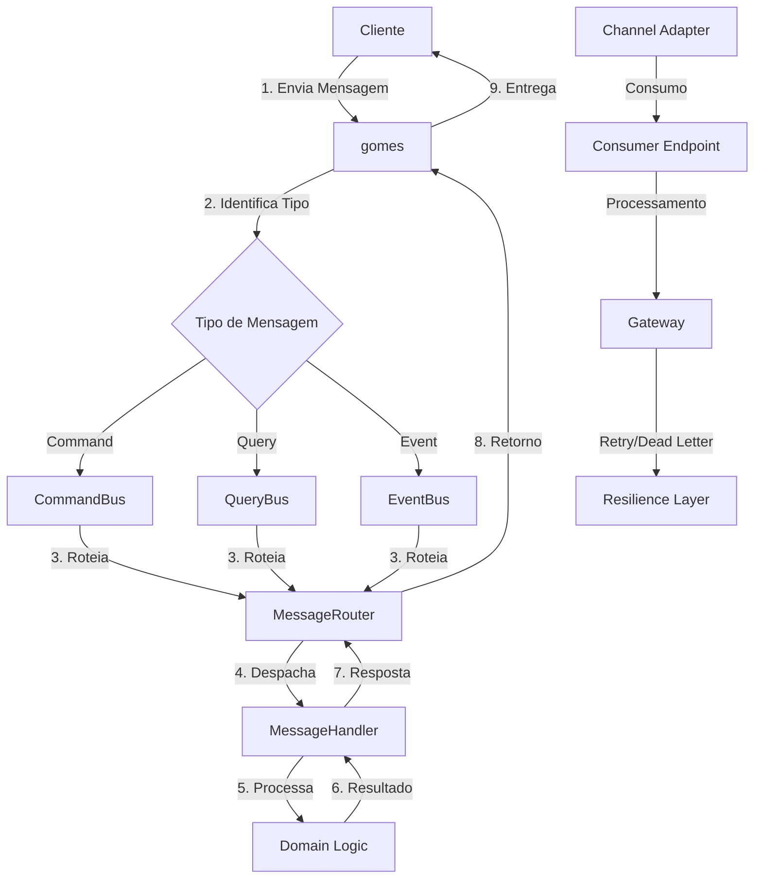
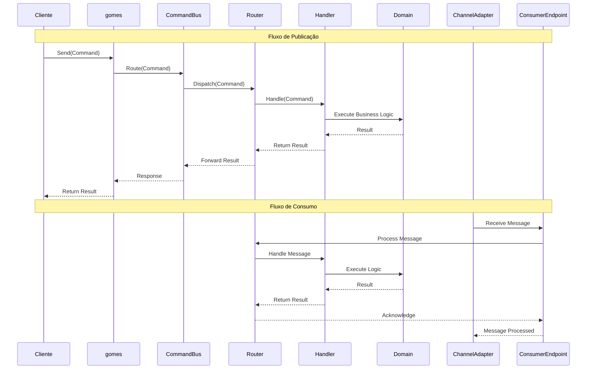
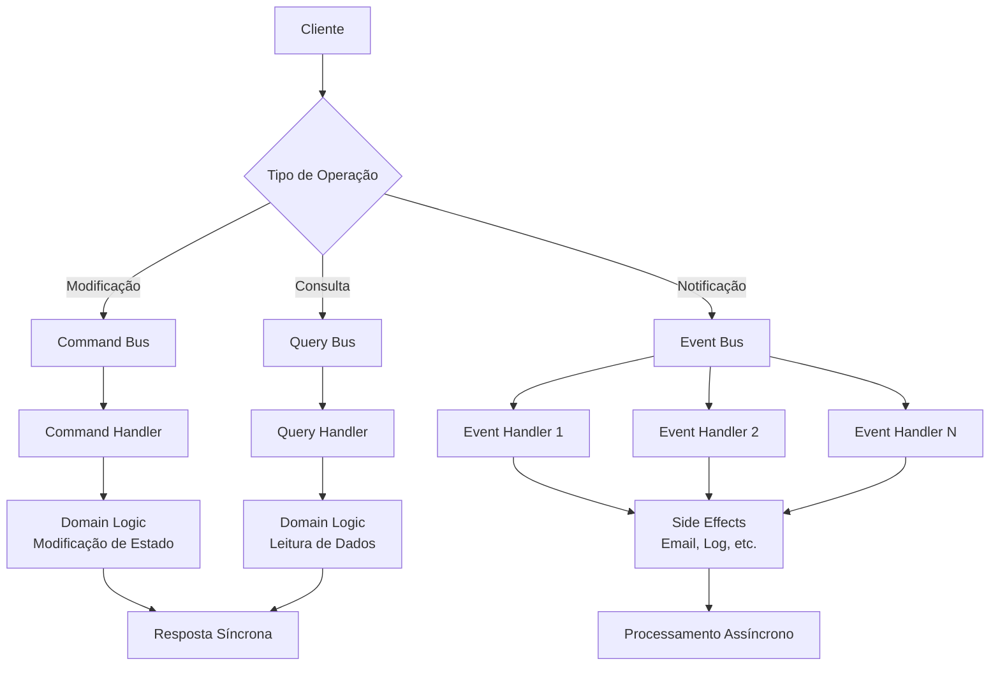
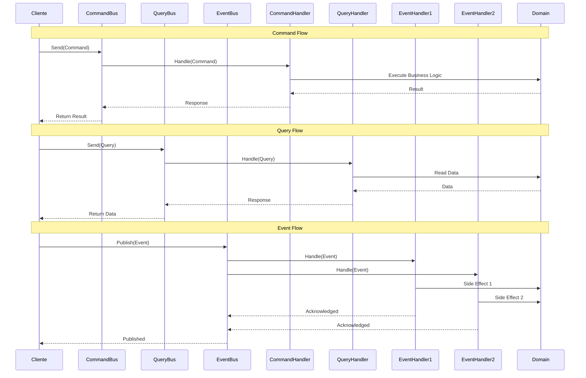
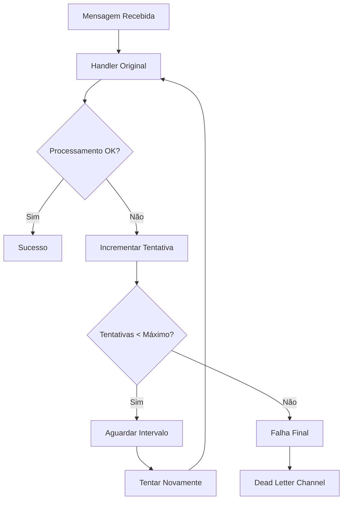
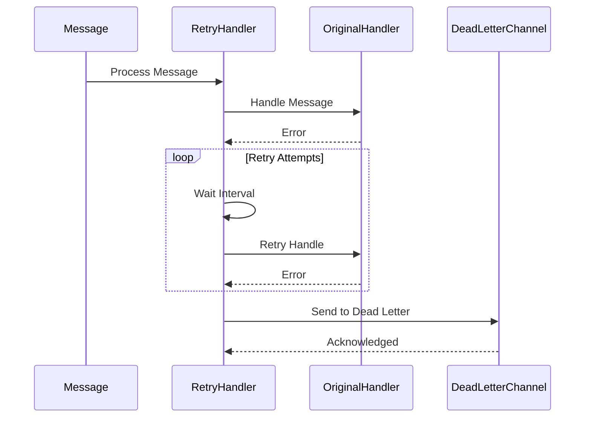
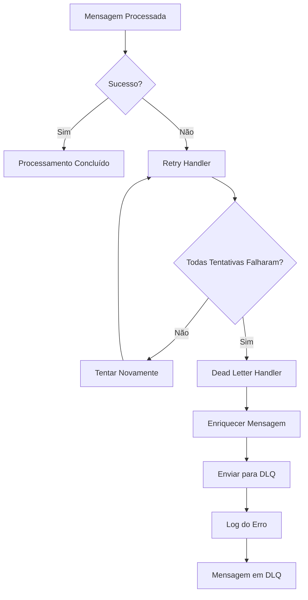
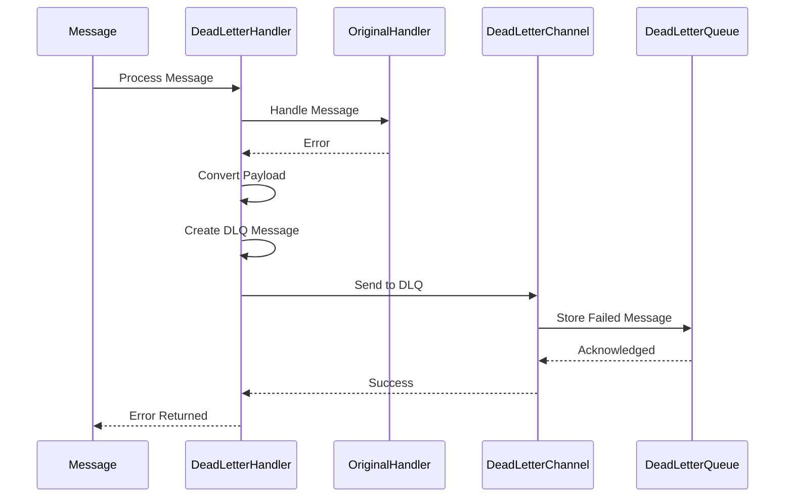
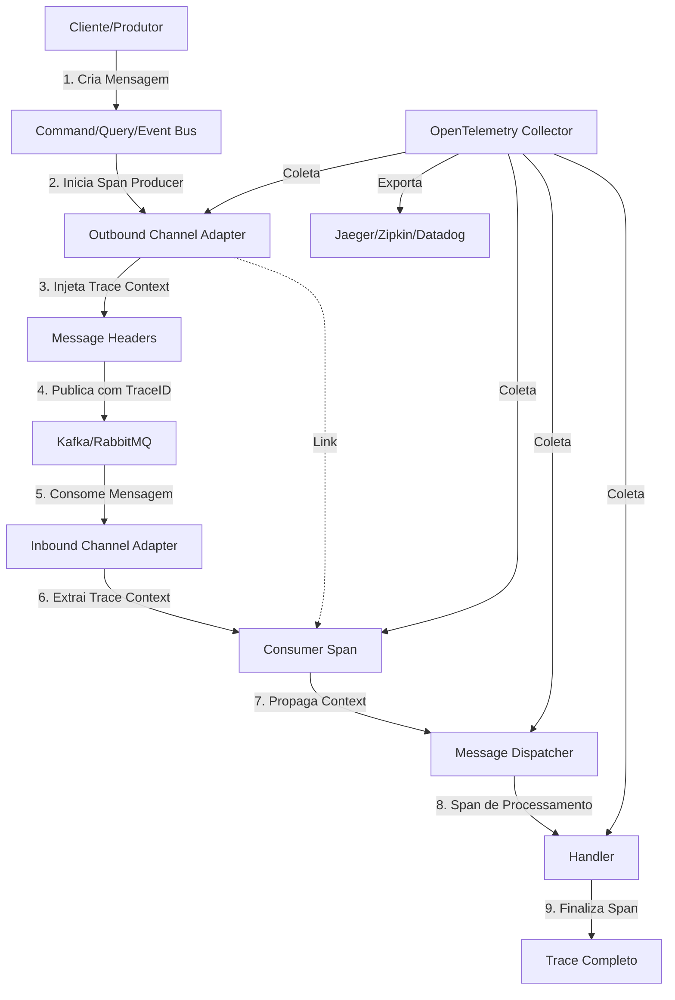
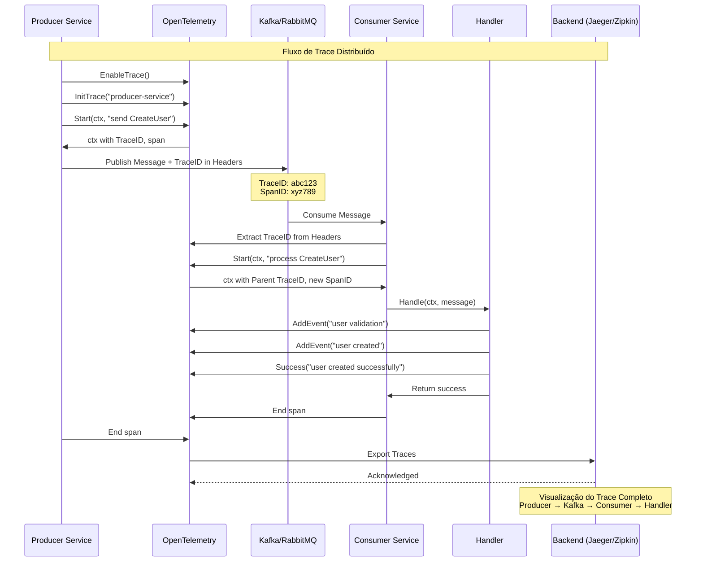

# 📦 gomes - Sistema de Mensagens para Arquitetura Hexagonal

## 📋 Índice

- [Visão Geral](#-visão-geral)
- [Bootstrap](#-bootstrap)
- [Componentes Principais](#-componentes-principais)
- [CQRS](#-cqrs)
- [Processamento Assíncrono](#-async-processing)
  - [Padrões de Publicação](#-padrões-de-publicação)
  - [Padrões de Consumo](#-padrões-de-consumo)
  - [Resiliência](#-resiliência)
  - [Kafka](#-kafka)
  - [RabbitMQ](#-rabbitmq)
- [Observabilidade](#-observabilidade)

## 🎯 Visão Geral

O **gomes** é um plugin robusto e flexível para sistemas de mensagens em arquitetura hexagonal, implementando padrões de Enterprise Integration Patterns (EIP) e Command Query Responsibility Segregation (CQRS). Este sistema oferece uma abstração completa para comunicação assíncrona entre componentes, facilitando a construção de aplicações distribuídas e escaláveis.

### Características Principais

- **Arquitetura Hexagonal**: Separação clara entre domínio, aplicação e infraestrutura
- **Padrão CQRS**: Separação entre comandos (modificação) e queries (consulta)
- **Event-Driven Architecture**: Processamento assíncrono baseado em eventos
- **Enterprise Integration Patterns**: Implementação de padrões consolidados da indústria
- **Resiliência**: Suporte a retry automático e dead letter channels
- **Múltiplos Drivers**: Suporte a diferentes sistemas de mensagens (Kafka, RabbitMQ, etc.)
- **Processamento Paralelo**: Suporte a múltiplos processadores concorrentes

### Padrões e Abordagens Utilizadas

- **Message Channel**: Comunicação entre componentes através de canais
- **Message Router**: Roteamento inteligente de mensagens baseado em conteúdo
- **Dead Letter Channel**: Gerenciamento de mensagens que falharam no processamento
- **Message Dispatcher**: Distribuição de mensagens para handlers apropriados
- **Event-Driven Consumer**: Consumo assíncrono com processamento paralelo
- **Polling Consumer**: Consumo periódico para processamento em lote

### Estrutura de Pastas do Plugin

```
pkg/core/infrastructure/gomes/
├── bus/                    # Implementações CQRS
│   ├── command_bus.go      # Processamento de comandos
│   ├── query_bus.go        # Processamento de queries
│   └── event_bus.go        # Processamento de eventos
├── channel/                # Implementações de canais
│   ├── kafka/              # Driver Kafka
│   │   ├── connection.go   # Gerenciamento de conexões
│   │   ├── inbound_channel_adapter.go  # Consumo de mensagens
│   │   ├── outbound_channel_adapter.go # Publicação de mensagens
│   │   └── message_translator.go       # Tradução de mensagens
│   ├── rabbitmq/           # Driver RabbitMQ
│   │   ├── connection.go   # Gerenciamento de conexões
│   │   ├── inbound_channel_adapter.go  # Consumo de mensagens
│   │   ├── outbound_channel_adapter.go # Publicação de mensagens
│   │   └── message_translator.go       # Tradução de mensagens
│   ├── pubsub_channel.go   # Canal publish-subscribe
│   └── point_to_point.go   # Canal point-to-point
├── container/              # Gerenciamento de dependências
│   └── generic_container.go
├── message/                # Core do sistema
│   ├── message.go          # Estrutura base de mensagens
│   ├── message_builder.go  # Builder para construção de mensagens
│   ├── channel/            # Canais de mensagens
│   │   └── adapter/        # Adaptadores de canal
│   ├── endpoint/           # Endpoints de processamento
│   │   ├── event_driven_consumer.go  # Consumer event-driven
│   │   ├── polling_consumer.go       # Consumer polling
│   │   ├── gateway.go                # Gateway de processamento
│   │   ├── message_dispatcher.go     # Dispatcher de mensagens
│   │   └── interfaces.go             # Interfaces dos endpoints
│   ├── handler/            # Handlers de mensagens
│   │   ├── dead_letter.go           # Handler para dead letter
│   │   ├── retry_handler.go         # Handler para retry
│   │   ├── context_handler.go       # Handler de contexto
│   │   ├── acknowledge_handler.go   # Handler de acknowledge
│   │   └── action_handler_activator.go # Ativador de handlers
│   └── router/             # Roteamento de mensagens
│       ├── message_filter.go        # Filtro de mensagens
│       ├── recipient_list_router.go # Router de lista de destinatários
│       └── router_composite.go      # Router composto
├── otel/                   # Observabilidade
│   ├── otel.go             # Interface e tipos do OpenTelemetry
│   └── trace.go            # Implementação de tracing
├── examples/               # Exemplos de uso
│   ├── cqrs/               # Exemplo CQRS
│   ├── event_driven_consumer/  # Exemplo de consumer
│   └── message_publisher/      # Exemplo de publisher
└── gomes.go                # Entry point principal e API pública
```

## 🚀 Bootstrap

O Bootstrap é o processo de inicialização do gomes, onde todos os componentes são registrados e configurados antes do sistema começar a processar mensagens. Este processo é fundamental para garantir que o sistema funcione corretamente.

### Exemplo

```go
package main

import (
    "context"
    "log/slog"
    "os/signal"
    "syscall"
    "time"

    "github.com/jeffersonbrasilino/gomes"
    kafka "github.com/jeffersonbrasilino/gomes/channel/kafka"
)

func main() {
    // Configurar contexto para graceful shutdown
    ctx, stop := signal.NotifyContext(context.Background(), syscall.SIGINT, syscall.SIGTERM)
    defer stop()

    slog.Info("Iniciando gomes...")

    // 1. HABILITAR OBSERVABILIDADE (Opcional)
    // Habilite o tracing do OpenTelemetry se configurado
    gomes.EnableOtelTrace()

    // 2. REGISTRAR HANDLERS
    // Registre todos os handlers de comandos, queries e eventos
    gomes.AddActionHandler(&CreateUserHandler{})
    gomes.AddActionHandler(&GetUserHandler{})
    gomes.AddActionHandler(&UserCreatedEventHandler{})

    // 3. CONFIGURAR CONEXÕES
    // Configure conexões com sistemas de mensagens (Kafka, RabbitMQ, etc.)
    gomes.AddChannelConnection(
        kafka.NewConnection("defaultConKafka", []string{"localhost:9093"}),
    )

    // 4. CONFIGURAR CANAIS DE PUBLICAÇÃO
    // Configure canais para envio de mensagens
    publisherChannel := kafka.NewPublisherChannelAdapterBuilder(
        "defaultConKafka",
        "gomes.topic",
    )
    gomes.AddPublisherChannel(publisherChannel)

    // Configure canal de Dead Letter Queue
    dlqPublisherChannel := kafka.NewPublisherChannelAdapterBuilder(
        "defaultConKafka",
        "gomes.dlq",
    )
    gomes.AddPublisherChannel(dlqPublisherChannel)

    // 5. CONFIGURAR CANAIS DE CONSUMO
    // Configure canais para recebimento de mensagens
    consumerChannel := kafka.NewConsumerChannelAdapterBuilder(
        "defaultConKafka",
        "gomes.topic",
        "test_consumer",
    )
    // Configure resiliência
    consumerChannel.WithRetryTimes(2_000, 3_000)
    consumerChannel.WithDeadLetterChannelName("gomes.dlq")

    gomes.AddConsumerChannel(consumerChannel)

    // 6. INICIAR O SISTEMA
    // Inicie o gomes - este passo é obrigatório
    gomes.Start()
    slog.Info("gomes iniciado com sucesso!")

    // 7. CONFIGURAR CONSUMERS
    // Configure e inicie os consumers
    consumer, err := gomes.EventDrivenConsumer("test_consumer")
    if err != nil {
        slog.Error("Erro ao criar consumer", "error", err)
        return
    }

    // Execute consumer com configurações específicas
    go consumer.WithAmountOfProcessors(2).
        WithMessageProcessingTimeout(30000).
        WithStopOnError(false).
        Run(ctx)

    // 8. SISTEMA OPERACIONAL
    // Aqui o sistema está pronto para processar mensagens
    slog.Info("Sistema operacional - processando mensagens...")

    // Exemplo de uso dos buses
    go publishMessages(ctx)

    // 9. GRACEFUL SHUTDOWN
    // Aguarde sinal de interrupção
    <-ctx.Done()
    slog.Info("Iniciando shutdown gracioso...")

    // Encerre o sistema graciosamente
    gomes.Shutdown()
    slog.Info("gomes encerrado com sucesso!")
}

func publishMessages(ctx context.Context) {
    ticker := time.NewTicker(5 * time.Second)
    defer ticker.Stop()

    for {
        select {
        case <-ctx.Done():
            return
        case <-ticker.C:
            // Publique comandos
            commandBus := gomes.CommandBusByChannel("gomes.topic")
            commandBus.SendAsync(ctx, &CreateUserCommand{
                Username: "user_" + time.Now().Format("20060102150405"),
                Password: "secure_password",
            })

            // Publique queries
            queryBus := gomes.QueryBusByChannel("gomes.topic")
            queryBus.SendAsync(ctx, &GetUserQuery{
                UserID: "123",
            })

            // Publique eventos
            eventBus := gomes.EventBusByChannel("gomes.topic")
            eventBus.Publish(ctx, &UserCreatedEvent{
                UserID:    "123",
                Username:  "john_doe",
                Timestamp: time.Now(),
            })
        }
    }
}
```

### Métodos de Bootstrap

#### Habilitação de Funcionalidades

- **`EnableOtelTrace()`**: Habilita rastreamento distribuído com OpenTelemetry
  - Deve ser chamado antes de `Start()` se você deseja observabilidade
  - Requer configuração prévia do TracerProvider do OpenTelemetry
  - Opcional, mas recomendado para ambientes de produção

#### Registro de Componentes

- **`AddActionHandler(handler)`**: Registra handlers de comandos, queries e eventos
  - Suporta qualquer tipo que implemente `ActionHandler[T, U]`
  - Um handler por tipo de ação (Command, Query ou Event)
  - Retorna erro se handler já existir para a mesma ação

- **`AddChannelConnection(connection)`**: Registra conexões com sistemas de mensagens
  - Suporta Kafka, RabbitMQ e outros drivers
  - Usa singleton pattern - conexões com mesmo nome retornam a mesma instância
  - Retorna erro se conexão com mesmo nome já existir

- **`AddPublisherChannel(channel)`**: Registra canais de publicação
  - Usado para enviar mensagens (Commands, Queries, Events)
  - Pode ter múltiplos publishers para canais diferentes
  - Retorna erro se canal com mesmo nome já existir

- **`AddConsumerChannel(channel)`**: Registra canais de consumo
  - Usado para receber e processar mensagens
  - Suporta configuração de retry e dead letter
  - Retorna erro se consumer com mesmo nome já existir

#### Controle do Sistema

- **`Start()`**: Inicia o gomes (obrigatório)
  - Constrói todos os componentes registrados
  - Estabelece conexões com sistemas de mensagens
  - Registra endpoints padrão para Command e Query Bus
  - Deve ser chamado após registrar todos os componentes

- **`Shutdown()`**: Encerra o sistema graciosamente
  - Para todos os consumers ativos
  - Fecha todos os canais (inbound e outbound)
  - Desconecta de sistemas de mensagens
  - Sempre use em conjunto com defer ou signal handling

- **`ShowActiveEndpoints()`**: Mostra endpoints ativos para debug
  - Lista todos os endpoints registrados
  - Mostra tipo de cada endpoint (Command-Bus, Query-Bus, Event-Bus, Consumer)
  - Útil para verificar configuração durante desenvolvimento

#### Acesso aos Buses

- **`CommandBus()`**: Retorna o Command Bus padrão
  - Usa canal padrão interno
  - Ideal para uso local sem necessidade de sistema de mensagens

- **`QueryBus()`**: Retorna o Query Bus padrão
  - Usa canal padrão interno
  - Ideal para uso local sem necessidade de sistema de mensagens

- **`CommandBusByChannel(channelName)`**: Retorna Command Bus para canal específico
  - Cria bus se não existir
  - Permite múltiplos buses para diferentes canais
  - Retorna erro se canal existir mas não for do tipo Command

- **`QueryBusByChannel(channelName)`**: Retorna Query Bus para canal específico
  - Cria bus se não existir
  - Permite múltiplos buses para diferentes canais
  - Retorna erro se canal existir mas não for do tipo Query

- **`EventBusByChannel(channelName)`**: Retorna Event Bus para canal específico
  - Cria bus se não existir
  - Permite múltiplos buses para diferentes canais
  - Retorna erro se canal existir mas não for do tipo Event

#### Criação de Consumers

- **`EventDrivenConsumer(consumerName)`**: Cria consumer assíncrono event-driven
  - Processa mensagens em tempo real
  - Suporta processamento paralelo com múltiplos processadores
  - Retorna erro se consumer com mesmo nome já existir
  - Deve ser iniciado com `.Run(ctx)` após criação

### Fluxo de Inicialização

O gomes segue uma ordem específica de inicialização interna:

1. **Registro de Endpoints Padrão**: Command Bus e Query Bus internos
2. **Build de Action Handlers**: Constrói todos os handlers registrados
3. **Build de Conexões**: Estabelece conexões com sistemas de mensagens
4. **Build de Outbound Channels**: Cria canais de publicação
5. **Build de Inbound Channels**: Cria canais de consumo

### Boas Práticas de Bootstrap

1. **Ordem Importante**: Sempre registre handlers antes de iniciar o sistema
2. **Habilite Observabilidade Primeiro**: Chame `EnableOtelTrace()` antes de `Start()`
3. **Conexões Únicas**: Use o mesmo nome de conexão para reutilizar instâncias
4. **Graceful Shutdown**: Sempre configure graceful shutdown para produção
5. **Error Handling**: Trate erros durante a inicialização - todos os métodos `Add*` retornam erro
6. **Logging**: Use logging adequado para monitorar o processo
7. **Separação de Canais**: Use canais diferentes para Commands, Queries e Events se necessário
8. **Nomeação Clara**: Use nomes descritivos para canais e consumers

### Exemplo Completo de Tratamento de Erros

```go
package main

import (
    "log"
    "log/slog"

    "github.com/jeffersonbrasilino/gomes"
    kafka "github.com/jeffersonbrasilino/gomes/channel/kafka"
)

func main() {
    // 1. Habilitar observabilidade
    gomes.EnableOtelTrace()

    // 2. Registrar handlers com tratamento de erro
    if err := gomes.AddActionHandler(&CreateUserHandler{}); err != nil {
        log.Fatalf("Failed to register CreateUserHandler: %v", err)
    }

    // 3. Registrar conexões com tratamento de erro
    if err := gomes.AddChannelConnection(
        kafka.NewConnection("defaultConKafka", []string{"localhost:9093"}),
    ); err != nil {
        log.Fatalf("Failed to add channel connection: %v", err)
    }

    // 4. Registrar canais com tratamento de erro
    publisherChannel := kafka.NewPublisherChannelAdapterBuilder(
        "defaultConKafka",
        "gomes.topic",
    )
    if err := gomes.AddPublisherChannel(publisherChannel); err != nil {
        log.Fatalf("Failed to add publisher channel: %v", err)
    }

    consumerChannel := kafka.NewConsumerChannelAdapterBuilder(
        "defaultConKafka",
        "gomes.topic",
        "test_consumer",
    )
    if err := gomes.AddConsumerChannel(consumerChannel); err != nil {
        log.Fatalf("Failed to add consumer channel: %v", err)
    }

    // 5. Iniciar sistema com tratamento de erro
    if err := gomes.Start(); err != nil {
        log.Fatalf("Failed to start gomes: %v", err)
    }

    slog.Info("gomes started successfully")

    // 6. Criar consumer com tratamento de erro
    consumer, err := gomes.EventDrivenConsumer("test_consumer")
    if err != nil {
        log.Fatalf("Failed to create consumer: %v", err)
    }

    // 7. Mostrar endpoints ativos para debug
    gomes.ShowActiveEndpoints()

    // ... resto da aplicação ...
}
```

## 🔧 Componentes Principais

### Diagrama de Fluxo



### Diagrama de Execução



## ⚡ CQRS

O gomes implementa o padrão **Command Query Responsibility Segregation (CQRS)** de forma nativa, separando claramente as operações de modificação (Commands) das operações de consulta (Queries), além de incluir o processamento de eventos (Events) para notificações assíncronas.

### Arquitetura CQRS no gomes



### Diagrama de Execução CQRS



### Implementação dos Buses

#### Command Bus

O Command Bus é responsável por processar comandos que modificam o estado do sistema. Cada comando tem exatamente um handler e retorna uma resposta síncrona.

```go
// Definição de um Command
type CreateUserCommand struct {
    Username string `json:"username"`
    Email    string `json:"email"`
    Password string `json:"password"`
}

func (c *CreateUserCommand) Name() string {
    return "CreateUser"
}

// Handler do Command
type CreateUserHandler struct {
    userRepository UserRepository
}

func (h *CreateUserHandler) Handle(ctx context.Context, cmd *CreateUserCommand) (*UserCreatedResult, error) {
    // Validação
    if cmd.Username == "" || cmd.Email == "" {
        return nil, errors.New("username and email are required")
    }

    // Criação do usuário
    user := &User{
        ID:       uuid.New().String(),
        Username: cmd.Username,
        Email:    cmd.Email,
        Password: hashPassword(cmd.Password),
    }

    // Persistência
    err := h.userRepository.Save(ctx, user)
    if err != nil {
        return nil, fmt.Errorf("failed to save user: %w", err)
    }

    // Retorno do resultado
    return &UserCreatedResult{
        UserID:   user.ID,
        Username: user.Username,
        Email:    user.Email,
    }, nil
}

// Uso do Command Bus
func createUser() {
    commandBus := gomes.CommandBus()

    result, err := commandBus.Send(context.Background(), &CreateUserCommand{
        Username: "john_doe",
        Email:    "john@example.com",
        Password: "secure_password",
    })

    if err != nil {
        log.Printf("Erro ao criar usuário: %v", err)
        return
    }

    log.Printf("Usuário criado: %+v", result)
}
```

#### Query Bus

O Query Bus é responsável por processar consultas que leem dados do sistema. Cada query tem exatamente um handler e retorna dados síncronos.

```go
// Definição de uma Query
type GetUserByIDQuery struct {
    UserID string `json:"user_id"`
}

func (q *GetUserByIDQuery) Name() string {
    return "GetUserByID"
}

// Handler da Query
type GetUserByIDHandler struct {
    userRepository UserRepository
}

func (h *GetUserByIDHandler) Handle(ctx context.Context, query *GetUserByIDQuery) (*User, error) {
    // Busca o usuário
    user, err := h.userRepository.FindByID(ctx, query.UserID)
    if err != nil {
        return nil, fmt.Errorf("failed to find user: %w", err)
    }

    if user == nil {
        return nil, errors.New("user not found")
    }

    // Retorna os dados (sem informações sensíveis)
    return &User{
        ID:       user.ID,
        Username: user.Username,
        Email:    user.Email,
        // Password não é retornado por segurança
    }, nil
}

// Uso do Query Bus
func getUser() {
    queryBus := gomes.QueryBus()

    user, err := queryBus.SendAsync(context.Background(), &GetUserByIDQuery{
        UserID: "123",
    })

    if err != nil {
        log.Printf("Erro ao buscar usuário: %v", err)
        return
    }

    log.Printf("Usuário encontrado: %+v", user)
}
```

#### Event Bus

O Event Bus é responsável por processar eventos que notificam sobre mudanças no sistema. Um evento pode ter múltiplos handlers e é processado de forma assíncrona.

```go
// Definição de um Event
type UserCreatedEvent struct {
    UserID    string    `json:"user_id"`
    Username  string    `json:"username"`
    Email     string    `json:"email"`
    Timestamp time.Time `json:"timestamp"`
}

func (e *UserCreatedEvent) Name() string {
    return "UserCreated"
}

// Handler 1: Envio de Email
type UserCreatedEmailHandler struct {
    emailService EmailService
}

func (h *UserCreatedEmailHandler) Handle(ctx context.Context, evt *UserCreatedEvent) error {
    // Enviar email de boas-vindas
    email := &Email{
        To:      evt.Email,
        Subject: "Bem-vindo!",
        Body:    fmt.Sprintf("Olá %s, sua conta foi criada com sucesso!", evt.Username),
    }

    return h.emailService.Send(ctx, email)
}

// Handler 2: Log de Auditoria
type UserCreatedAuditHandler struct {
    auditLogger AuditLogger
}

func (h *UserCreatedAuditHandler) Handle(ctx context.Context, evt *UserCreatedEvent) error {
    // Registrar no log de auditoria
    return h.auditLogger.Log(ctx, &AuditEntry{
        Action:    "USER_CREATED",
        UserID:    evt.UserID,
        Timestamp: evt.Timestamp,
        Details:   fmt.Sprintf("User %s created with email %s", evt.Username, evt.Email),
    })
}

// Handler 3: Notificação Push
type UserCreatedNotificationHandler struct {
    notificationService NotificationService
}

func (h *UserCreatedNotificationHandler) Handle(ctx context.Context, evt *UserCreatedEvent) error {
    // Enviar notificação push
    notification := &Notification{
        UserID:  evt.UserID,
        Title:   "Conta Criada",
        Message: "Sua conta foi criada com sucesso!",
        Type:    "SUCCESS",
    }

    return h.notificationService.Send(ctx, notification)
}

// Uso do Event Bus
func publishUserCreated(user *User) {
    eventBus := gomes.EventBus()

    err := eventBus.Publish(context.Background(), &UserCreatedEvent{
        UserID:    user.ID,
        Username:  user.Username,
        Email:     user.Email,
        Timestamp: time.Now(),
    })

    if err != nil {
        log.Printf("Erro ao publicar evento: %v", err)
    }
}
```

### Benefícios da Implementação CQRS

1. **Separação de Responsabilidades**: Commands modificam, Queries leem, Events notificam
2. **Escalabilidade Independente**: Cada tipo pode ser escalado separadamente
3. **Otimização de Performance**: Queries podem usar views otimizadas
4. **Flexibilidade**: Handlers podem ser adicionados/removidos independentemente
5. **Testabilidade**: Cada handler pode ser testado isoladamente
6. **Manutenibilidade**: Código mais organizado e fácil de manter

### Métodos dos Buses

#### Command Bus

- **`SendAsync(ctx, command)`**: Envia comando de forma assíncrona
- **`SendRawAsync(ctx, route, payload, headers)`**: Envia comando com payload e headers customizados

#### Query Bus

- **`SendAsync(ctx, query)`**: Envia query de forma assíncrona
- **`SendRawAsync(ctx, route, payload, headers)`**: Envia query com payload customizado e headers customizados

#### Event Bus

- **`Publish(ctx, event)`**: Publica evento de forma assíncrona
- **`PublishRaw(ctx, route, payload, headers)`**: Publica evento com payload customizado e headers customizados

## ⏱ Processamento assíncrono

### 📤 Padrões de Publicação

#### Comandos

Os comandos representam ações que modificam o estado do sistema. Eles são processados de forma síncrona e devem retornar uma resposta.

##### Exemplo de Uso

```go
// 1. Defina seu comando
type CreateUserCommand struct {
    Username string `json:"username"`
    Password string `json:"password"`
}

func (c *CreateUserCommand) Name() string {
    return "createUser"
}

// 2. Implemente o handler
type CreateUserHandler struct{}

func (h *CreateUserHandler) Handle(ctx context.Context, cmd *CreateUserCommand) (*ResultCm, error) {
    // Implemente a lógica de negócio
    fmt.Println("process command ok")
    return &ResultCm{"User created successfully"}, nil
}

// 3. Configure e use o sistema
func main() {
    // Configure conexão Kafka
    gomes.AddChannelConnection(
        kafka.NewConnection("defaultConKafka", []string{"localhost:9093"}),
    )

    // Configure canal de publicação
    publisherChannel := kafka.NewPublisherChannelAdapterBuilder(
        "defaultConKafka",
        "gomes.topic",
    )
    gomes.AddPublisherChannel(publisherChannel)

    // Registre o handler
    gomes.AddActionHandler(&CreateUserHandler{})

    // Inicie o sistema
    gomes.Start()

    // Use o command bus
    commandBus := gomes.CommandBusByChannel("gomes.topic")
    commandBus.SendAsync(context.Background(), &CreateUserCommand{
        Username: "teste",
        Password: "123",
    })
}
```

##### Métodos do Fluxo de Comando

- **`SendAsync(ctx, command)`**: Envia comando de forma assíncrona
- **`SendRawAsync(ctx, route, payload, headers)`**: Envia comando com payload customizado
- **`Handle(ctx, command)`**: Processa o comando no handler
- **`Route(command)`**: Roteia o comando para o handler apropriado

#### Queries

As queries representam consultas que não modificam o estado do sistema. Elas são processadas de forma síncrona e retornam dados.

##### Exemplo de Uso

```go
// 1. Defina sua query
type GetUserQuery struct {
    UserID string `json:"user_id"`
}

func (q *GetUserQuery) Name() string {
    return "getUser"
}

// 2. Implemente o handler
type GetUserHandler struct{}

func (h *GetUserHandler) Handle(ctx context.Context, query *GetUserQuery) (*User, error) {
    // Implemente a lógica de consulta
    return &User{ID: query.UserID, Name: "John Doe"}, nil
}

// 3. Use o query bus
func getUser() {
    queryBus := gomes.QueryBusByChannel("gomes.topic")
    user, err := queryBus.SendAsync(context.Background(), &GetUserQuery{
        UserID: "123",
    })
}
```

##### Métodos do Fluxo de Query

- **`SendAsync(ctx, query)`**: Envia query de forma assíncrona
- **`SendRawAsync(ctx, route, payload, headers)`**: Envia query com payload customizado
- **`Handle(ctx, query)`**: Processa a query no handler
- **`Route(query)`**: Roteia a query para o handler apropriado

#### Eventos

Os eventos representam notificações sobre mudanças no sistema. Eles são processados de forma assíncrona e podem ter múltiplos handlers.

##### Exemplo de Uso

```go
// 1. Defina seu evento
type UserCreatedEvent struct {
    UserID    string    `json:"user_id"`
    Username  string    `json:"username"`
    Timestamp time.Time `json:"timestamp"`
}

func (e *UserCreatedEvent) Name() string {
    return "userCreated"
}

// 2. Implemente handlers do evento
type EmailNotificationHandler struct{}

func (h *EmailNotificationHandler) Handle(ctx context.Context, evt *UserCreatedEvent) error {
    // Enviar email de boas-vindas
    fmt.Printf("Sending welcome email to user %s\n", evt.Username)
    return nil
}

type AuditLogHandler struct{}

func (h *AuditLogHandler) Handle(ctx context.Context, evt *UserCreatedEvent) error {
    // Registrar no log de auditoria
    fmt.Printf("Audit log: User %s created at %s\n", evt.Username, evt.Timestamp)
    return nil
}

// 3. Use o event bus
func publishUserCreated() {
    eventBus := gomes.EventBusByChannel("gomes.topic")
    eventBus.Publish(context.Background(), &UserCreatedEvent{
        UserID:    "123",
        Username:  "john_doe",
        Timestamp: time.Now(),
    })
}
```

##### Métodos do Fluxo de Evento

- **`Publish(ctx, event)`**: Publica evento de forma assíncrona
- **`PublishRaw(ctx, route, payload, headers)`**: Publica evento com payload customizado
- **`Handle(ctx, event)`**: Processa o evento em todos os handlers registrados
- **`Route(event)`**: Roteia o evento para todos os handlers apropriados

### 📥 Padrões de Consumo

#### Event-Driven Consumer

O Event-Driven Consumer processa mensagens de forma assíncrona e em tempo real, ideal para sistemas que precisam de baixa latência e alta throughput.

##### Características

- **Processamento Assíncrono**: Mensagens são processadas assim que chegam
- **Múltiplos Processadores**: Suporte a processamento paralelo
- **Baixa Latência**: Processamento imediato das mensagens
- **Alto Throughput**: Capacidade de processar muitas mensagens simultaneamente

##### Exemplo de Uso

```go
func main() {
    // Configure conexão e canais
    gomes.AddChannelConnection(
        kafka.NewConnection("defaultConKafka", []string{"localhost:9093"}),
    )

    // Configure consumer channel com resiliência
    topicConsumerChannel := kafka.NewConsumerChannelAdapterBuilder(
        "defaultConKafka",
        "gomes.topic",
        "test_consumer",
    )
    topicConsumerChannel.WithRetryTimes(2_000, 3_000)
    topicConsumerChannel.WithDeadLetterChannelName("gomes.dlq")

    // Registre canais e handlers
    gomes.AddConsumerChannel(topicConsumerChannel)
    gomes.AddActionHandler(&CreateUserHandler{})

    // Inicie o sistema
    gomes.Start()

    // Configure event-driven consumer
    consumer, err := gomes.EventDrivenConsumer("test_consumer")
    if err != nil {
        panic(err)
    }

    // Execute com configurações específicas
    go consumer.WithAmountOfProcessors(1).
        WithMessageProcessingTimeout(50000).
        WithStopOnError(false).
        Run(ctx)
}
```

##### Métodos do Event-Driven Consumer

- **`WithAmountOfProcessors(count)`**: Define número de processadores paralelos
- **`WithMessageProcessingTimeout(timeout)`**: Define timeout para processamento
- **`WithStopOnError(stop)`**: Define se deve parar em caso de erro
- **`Run(ctx)`**: Inicia o processamento assíncrono

#### Polling Consumer

O Polling Consumer processa mensagens de forma periódica, ideal para processamento em lote e sistemas que não precisam de tempo real.

##### Características

- **Processamento Periódico**: Verifica mensagens em intervalos definidos
- **Processamento em Lote**: Ideal para operações que processam múltiplas mensagens
- **Controle de Recursos**: Menor uso de recursos do sistema
- **Maior Latência**: Processamento não é imediato

##### Exemplo de Uso

```go
func main() {
    // Configure consumer polling
    consumer := gomes.NewPollingConsumer("batch-consumer")

    // Configure parâmetros
    consumer.WithPollIntervalMilliseconds(5000)      // Poll a cada 5 segundos
    consumer.WithProcessingDelayMilliseconds(1000)  // Delay de 1 segundo entre processamentos
    consumer.WithProcessingTimeoutMilliseconds(30000) // Timeout de 30 segundos
    consumer.WithStopOnError(false)                  // Não parar em caso de erro

    // Inicie o polling
    go consumer.Run(ctx)
}
```

##### Métodos do Polling Consumer

- **`WithPollIntervalMilliseconds(interval)`**: Define intervalo de polling
- **`WithProcessingDelayMilliseconds(delay)`**: Define delay entre processamentos
- **`WithProcessingTimeoutMilliseconds(timeout)`**: Define timeout para processamento
- **`WithStopOnError(stop)`**: Define se deve parar em caso de erro
- **`Run(ctx)`**: Inicia o polling periódico

#### Comparação: Event-Driven vs Polling

| Aspecto             | Event-Driven          | Polling                      |
| ------------------- | --------------------- | ---------------------------- |
| **Latência**        | Baixa (tempo real)    | Alta (periódica)             |
| **Throughput**      | Alto                  | Médio                        |
| **Uso de Recursos** | Alto                  | Baixo                        |
| **Complexidade**    | Média                 | Baixa                        |
| **Escalabilidade**  | Excelente             | Boa                          |
| **Casos de Uso**    | Tempo real, streaming | Batch processing, relatórios |

##### Prós e Contras

**Event-Driven Consumer:**

✅ **Prós:**

- Processamento em tempo real
- Alta eficiência para streaming
- Escalabilidade horizontal
- Baixa latência

❌ **Contras:**

- Maior complexidade de configuração
- Maior uso de recursos
- Pode causar backpressure se não configurado adequadamente

**Polling Consumer:**

✅ **Prós:**

- Simplicidade de implementação
- Baixo uso de recursos
- Controle preciso sobre quando processar
- Ideal para batch processing

❌ **Contras:**

- Maior latência
- Menor throughput
- Pode perder mensagens se o intervalo for muito longo

### 🛡️ Resiliência

#### Retry Pattern

O padrão de retry permite que o sistema tente processar uma mensagem novamente em caso de falha temporária, aumentando a robustez do sistema.

##### Como Funciona

O sistema implementa um handler de retry que envolve o handler original e tenta reprocessar a mensagem em caso de erro, com intervalos configuráveis entre as tentativas.

##### Diagrama de Fluxo do Retry



##### Diagrama de Execução do Retry



##### Exemplo de Configuração

```go
// Configure retry com intervalos específicos
topicConsumerChannel := kafka.NewConsumerChannelAdapterBuilder(
    "defaultConKafka",
    "gomes.topic",
    "test_consumer",
)

// Configure retry: [2000ms, 3000ms] - duas tentativas com intervalos de 2s e 3s
topicConsumerChannel.WithRetryTimes(2_000, 3_000)

// Configure dead letter channel
topicConsumerChannel.WithDeadLetterChannelName("gomes.dlq")
```

##### Métodos do Retry Handler

- **`NewRetryHandler(attemptsTime, handler)`**: Cria handler com tentativas configuradas
- **`Handle(ctx, msg)`**: Processa mensagem com retry automático
- **`WithRetryTimes(intervals...)`**: Configura intervalos de retry no consumer

#### Dead Letter Channel

O Dead Letter Channel é um padrão que captura mensagens que falharam no processamento após todas as tentativas de retry, permitindo análise posterior e recuperação manual.

##### Como Funciona

Quando uma mensagem falha após todas as tentativas de retry, ela é enviada para um canal especial (Dead Letter Channel) com informações sobre o erro e o payload original.

##### Diagrama de Fluxo do Dead Letter



##### Diagrama de Execução do Dead Letter



##### Exemplo de Configuração

```go
// 1. Configure canal de dead letter
publisherDlqChannel := kafka.NewPublisherChannelAdapterBuilder(
    "defaultConKafka",
    "gomes.dlq",
)

// 2. Registre o canal de dead letter
gomes.AddPublisherChannel(publisherDlqChannel)

// 3. Configure consumer com dead letter
topicConsumerChannel := kafka.NewConsumerChannelAdapterBuilder(
    "defaultConKafka",
    "gomes.topic",
    "test_consumer",
)
topicConsumerChannel.WithDeadLetterChannelName("gomes.dlq")
```

##### Estrutura da Mensagem Dead Letter

```go
type DeadLetterMessage struct {
    ReasonError string                 `json:"reason_error"`
    Payload     any                    `json:"payload"`
    Headers     map[string]string      `json:"headers"`
}
```

##### Métodos do Dead Letter Handler

- **`NewDeadLetter(channel, handler)`**: Cria handler com dead letter
- **`Handle(ctx, msg)`**: Processa mensagem e envia para DLQ em caso de erro
- **`convertMessagePayload(msg)`**: Converte payload para formato DLQ
- **`makeDeadLetterMessage(ctx, msg, payload)`**: Cria mensagem DLQ enriquecida

### 🚀 Kafka

O driver Kafka implementa a integração com Apache Kafka oferecendo adaptadores e tradutores que conectam o modelo de mensagens do `gomes` ao `kafka-go` de forma segura, observável e resiliente.

#### Principais conceitos

- Conexões: gerenciadas por `kafka.NewConnection(name, brokers)` e registradas via `gomes.AddChannelConnection`.
- Publishers: criados com `kafka.NewPublisherChannelAdapterBuilder(connectionName, topic)`.
- Consumers: criados com `kafka.NewConsumerChannelAdapterBuilder(connectionName, topic, groupId)`.
- Resiliência: suporte a retries e Dead Letter Queue (DLQ) configuráveis nos builders.

#### Configuração de Conexão

Exemplo mínimo:

```go
conn := kafka.NewConnection("defaultConKafka", []string{"localhost:9093"})
gomes.AddChannelConnection(conn)
// opcional: conn.Connect() é chamado internamente durante o build do gomes
```

Configurações comuns:

- Use múltiplos brokers para alta disponibilidade: `NewConnection("prod", []string{"k1:9092","k2:9092"})`.
- É possível fornecer TLS via `WithTlsConfig` no builder de conexão.

#### Publisher (Publicação)

Criar um publisher e registrar:

```go
publisher := kafka.NewPublisherChannelAdapterBuilder("defaultConKafka", "gomes.topic")
// opções úteis:
// publisher.WithAsync(true)
// publisher.WithBatchSize(100).WithBatchBytes(1_000_000)
gomes.AddPublisherChannel(publisher)
```

Comportamento:

- O publisher usa `kafka.Writer` do `kafka-go` e converte `message.Message` em `kafka.Message` usando `MessageTranslator.FromMessage`.
- Suporta envio síncrono e assíncrono, batching e controle de acks através de opções do builder.

#### Consumer (Consumo)

Criar um consumer com resiliência:

```go
consumer := kafka.NewConsumerChannelAdapterBuilder("defaultConKafka", "gomes.topic", "test_consumer")
consumer.WithRetryTimes(2000, 3000) // tentativa + backoff simples
consumer.WithDeadLetterChannelName("gomes.dlq")
gomes.AddConsumerChannel(consumer)
```

Comportamento:

- O consumer cria um `kafka.Reader` por `groupId` e lê mensagens em loop.
- Cada mensagem é traduzida com `MessageTranslator.ToMessage` e entregue ao `EventDrivenConsumer` do `gomes`.
- Em caso de falha no processamento, aplica-se a política de retry configurada; se esgotadas as tentativas, a mensagem pode ser enviada para a DLQ configurada.

#### Tradução de Mensagens

FromMessage (interno → kafka.Message):

- Serializa o payload como JSON no `Value`.
- Mapeia `message.Message` headers para `kafka.Header`.
- Usa `MessageId` como `Key` e `ChannelName` como `Topic`.

ToMessage (kafka.Message → interno):

- Converte `kafka.Header` para headers internos (map[string]string).
- Preserva `Topic`, `Key` (como MessageId) e `Value` (payload JSON — decodificar conforme o tipo esperado).
- Propaga cabeçalhos de trace (`traceparent`) quando presentes para integração com OpenTelemetry.

Exemplo rápido de uso do tradutor:

```go
mt := kafka.NewMessageTranslator()
internal := mt.ToMessage(kafkaMsg)
kmsg := mt.FromMessage(internal)
```

#### Resiliência e DLQ

- `WithRetryTimes(initialMs, maxMs)` no consumer config permite retries com backoff simples.
- `WithDeadLetterChannelName(name)` define o canal onde mensagens com falha persistente serão publicadas.
- Recomendação: use um tópico DLQ separado por ambiente/serviço para facilitar triagem.

Fluxo típico em erro:

1. Mensagem lida do Kafka.
2. `ToMessage` traduz e envia ao handler do `gomes`.
3. Se o handler falhar, aplica-se retry local (conforme configuração).
4. Se exceder tentativas, constrói-se uma `DeadLetterMessage` enriquecida e publica-se no tópico DLQ.

#### Boas práticas

- Configure `GroupID` por serviço/ambiente para garantir paralelismo seguro.
- Evite usar `MaxBytes` muito alto; prefira mensagens pequenas e compactas.
- Habilite tracing (`gomes.EnableOtelTrace()`) para propagar contexto entre produtores/consumidores.
- Separe tópicos de produção e DLQ; monitore DLQ para identificar problemas.

#### Referência rápida de API

- `kafka.NewConnection(name string, brokers []string)` → cria/retorna conexão (singleton por nome).
- `(*Connection).Connect() error` → estabelece conexões (opcional manual).
- `kafka.NewPublisherChannelAdapterBuilder(connectionName, topic string)` → builder de publisher.
- `kafka.NewConsumerChannelAdapterBuilder(connectionName, topic, groupId string)` → builder de consumer.
- `(*publisherBuilder).WithAsync(bool)` → habilita envio assíncrono.
- `(*publisherBuilder).WithBatchSize(int)` / `WithBatchBytes(int)` → controla batching.
- `(*consumerBuilder).WithRetryTimes(initialMs, maxMs int)` → configura retry/backoff.
- `(*consumerBuilder).WithDeadLetterChannelName(name string)` → define DLQ.
- `MessageTranslator.FromMessage(*message.Message) *kafka.Message` → converte para kafka.Message.
- `MessageTranslator.ToMessage(*kafka.Message) *message.Message` → converte para message.Message.

---

O restante da documentação do `Processamento Assíncrono` segue com a seção RabbitMQ.

````

### 🐰 RabbitMQ

O driver RabbitMQ implementa a integração completa com RabbitMQ (Advanced Message Queuing Protocol), fornecendo adaptadores para publicação e consumo de mensagens com suporte a todas as funcionalidades do gomes. O driver suporta tanto o padrão de filas (Work Queues) quanto o padrão de exchanges com routing keys.

#### Configuração da Conexão

##### Exemplo de Configuração Básica

```go
// Crie uma conexão RabbitMQ (singleton pattern)
connection := rabbitmq.NewConnection("defaultConRabbitMQ", "localhost:5672")

// Registre a conexão no sistema
gomes.AddChannelConnection(connection)

// Conecte ao RabbitMQ
err := connection.Connect()
if err != nil {
    log.Fatal("Failed to connect to RabbitMQ:", err)
}
````

##### Configurações Avançadas

```go
// Configuração com credenciais e virtual host
connection := rabbitmq.NewConnection(
    "production-rabbitmq",
    "user:password@rabbitmq.example.com:5672/vhost",
)

// Ou apenas com host
connection := rabbitmq.NewConnection(
    "defaultConRabbitMQ",
    "localhost:5672",
)
```

#### Publisher Channel (Publicação)

O driver RabbitMQ suporta dois padrões de publicação:

1. **ProducerQueue**: Publica diretamente para uma fila (Work Queues pattern)
2. **ProducerExchange**: Publica para uma exchange com routing keys (Pub/Sub pattern)

##### Configuração do Publisher - Work Queues (Padrão)

```go
// Crie um publisher channel para fila (padrão)
publisherChannel := rabbitmq.NewPublisherChannelAdapterBuilder(
    "defaultConRabbitMQ",        // Nome da conexão
    "gomes.queue",               // Nome da fila de destino
)

// Registre o canal
gomes.AddPublisherChannel(publisherChannel)

// Use o canal através dos buses
commandBus := gomes.CommandBusByChannel("gomes.queue")
queryBus := gomes.QueryBusByChannel("gomes.queue")
eventBus := gomes.EventBusByChannel("gomes.queue")
```

##### Configuração do Publisher - Exchange (Pub/Sub)

```go
// Crie um publisher channel para exchange
publisherChannel := rabbitmq.NewPublisherChannelAdapterBuilder(
    "defaultConRabbitMQ",        // Nome da conexão
    "gomes.exchange",            // Nome da exchange
)

// Configure como exchange
publisherChannel.WithChannelType(rabbitmq.ProducerExchange)

// Configure o tipo de exchange (Direct, Fanout, Topic, Headers)
publisherChannel.WithExchangeType(rabbitmq.ExchangeTopic)

// Configure a routing key para roteamento de mensagens
publisherChannel.WithExchangeRoutingKeys("user.created")

// Registre o canal
gomes.AddPublisherChannel(publisherChannel)

// Use o canal através dos buses
eventBus := gomes.EventBusByChannel("gomes.exchange")
```

##### Tipos de Exchange Disponíveis

O driver RabbitMQ suporta os seguintes tipos de exchange:

- **ExchangeDirect**: Roteamento direto baseado na routing key exata
- **ExchangeFanout**: Distribui mensagens para todas as filas conectadas (broadcast)
- **ExchangeTopic**: Roteamento baseado em padrões de routing key (wildcards)
- **ExchangeHeaders**: Roteamento baseado em headers da mensagem

```go
// Exemplo: Exchange Fanout (broadcast)
publisherChannel := rabbitmq.NewPublisherChannelAdapterBuilder(
    "defaultConRabbitMQ",
    "notifications.exchange",
)
publisherChannel.WithChannelType(rabbitmq.ProducerExchange)
publisherChannel.WithExchangeType(rabbitmq.ExchangeFanout)
// Não precisa de routing key para Fanout

// Exemplo: Exchange Topic (roteamento por padrões)
publisherChannel := rabbitmq.NewPublisherChannelAdapterBuilder(
    "defaultConRabbitMQ",
    "events.exchange",
)
publisherChannel.WithChannelType(rabbitmq.ProducerExchange)
publisherChannel.WithExchangeType(rabbitmq.ExchangeTopic)
publisherChannel.WithExchangeRoutingKeys("user.*.created") // Wildcard pattern
```

##### Tradução de Mensagens

O sistema automaticamente traduz mensagens internas para o formato RabbitMQ:

```go
// Mensagem interna
message := message.NewMessageBuilder().
    WithMessageType(message.Command).
    WithPayload(CreateUserCommand{Username: "john", Password: "123"}).
    WithHeaders(map[string]string{"correlationId": "123"}).
    Build()

// Tradução automática para RabbitMQ
rabbitmqMessage := translator.FromMessage(message)
// Resultado: amqp.Publishing com headers, content-type e body JSON
```

#### Consumer Channel (Consumo)

##### Configuração do Consumer

```go
// Crie um consumer channel para fila
consumerChannel := rabbitmq.NewConsumerChannelAdapterBuilder(
    "defaultConRabbitMQ",        // Nome da conexão
    "gomes.queue",               // Nome da fila de origem
    "test_consumer",             // Nome do consumer (opcional)
)

// Configure resiliência
consumerChannel.WithRetryTimes(2_000, 3_000)  // Retry com intervalos
consumerChannel.WithDeadLetterChannelName("gomes.dlq")  // DLQ

// Registre o canal
gomes.AddConsumerChannel(consumerChannel)
```

##### Consumo de Filas com Exchange

Para consumir mensagens de uma fila que está vinculada a uma exchange:

1. Configure a exchange e as filas no RabbitMQ (via código ou management UI)
2. Configure o consumer apontando para a fila específica:

```go
// Consome da fila "user.created.notifications" que está vinculada à exchange
consumerChannel := rabbitmq.NewConsumerChannelAdapterBuilder(
    "defaultConRabbitMQ",
    "user.created.notifications",  // Nome da fila (não da exchange)
    "notification_consumer",
)
consumerChannel.WithRetryTimes(2_000, 3_000)
gomes.AddConsumerChannel(consumerChannel)
```

#### Gerenciamento de Conexões

##### Singleton Pattern

O driver RabbitMQ usa singleton pattern para reutilizar conexões:

```go
// Primeira chamada cria a conexão
conn1 := rabbitmq.NewConnection("defaultConRabbitMQ", "localhost:5672")

// Segunda chamada retorna a mesma instância
conn2 := rabbitmq.NewConnection("defaultConRabbitMQ", "localhost:5672")

// conn1 == conn2 (mesma instância)
```

##### Métodos da Conexão

- **`Connect()`**: Estabelece conexão com o broker RabbitMQ
- **`Producer(channelName, channelType, exchangeType)`**: Cria producer para fila ou exchange
- **`Consumer(queueName)`**: Cria consumer para fila específica
- **`Disconnect()`**: Fecha conexão e libera recursos
- **`ReferenceName()`**: Retorna nome de referência da conexão

#### Tradução de Mensagens

##### FromMessage (Interna → RabbitMQ)

```go
func (m *MessageTranslator) FromMessage(msg *message.Message) (*amqp.Publishing, error) {
    // Serializa headers
    headersMap, err := msg.GetHeaders().ToMap()
    if err != nil {
        return nil, err
    }

    // Converte headers para formato RabbitMQ Table
    headers := amqp.Table{}
    for k, v := range headersMap {
        headers[k] = v
    }

    // Serializa payload
    payload, err := json.Marshal(msg.GetPayload())
    if err != nil {
        return nil, err
    }

    return &amqp.Publishing{
        ContentType: "application/json",
        Headers:     headers,
        Body:        payload,
    }, nil
}
```

##### ToMessage (RabbitMQ → Interna)

```go
func (m *MessageTranslator) ToMessage(msg amqp.Delivery) (*message.Message, error) {
    // Converte headers RabbitMQ para headers internos
    headers := map[string]string{}
    for k, h := range msg.Headers {
        if strVal, ok := h.(string); ok {
            headers[k] = strVal
        }
    }

    // Cria mensagem interna a partir dos headers
    messageBuilder, err := message.NewMessageBuilderFromHeaders(headers)
    if err != nil {
        return nil, err
    }

    // Adiciona payload e mensagem raw
    messageBuilder.WithPayload(msg.Body)
    messageBuilder.WithRawMessage(msg)

    return messageBuilder.Build(), nil
}
```

#### Exemplo Completo de Uso - Work Queues

```go
func main() {
    ctx, cancel := context.WithCancel(context.Background())
    defer cancel()

    // 1. Configure conexão RabbitMQ
    gomes.AddChannelConnection(
        rabbitmq.NewConnection("defaultConRabbitMQ", "localhost:5672"),
    )

    // 2. Configure publisher para fila
    publisherChannel := rabbitmq.NewPublisherChannelAdapterBuilder(
        "defaultConRabbitMQ",
        "gomes.queue",
    )
    gomes.AddPublisherChannel(publisherChannel)

    // 3. Configure DLQ publisher
    dlqPublisherChannel := rabbitmq.NewPublisherChannelAdapterBuilder(
        "defaultConRabbitMQ",
        "gomes.dlq",
    )
    gomes.AddPublisherChannel(dlqPublisherChannel)

    // 4. Configure consumer com resiliência
    consumerChannel := rabbitmq.NewConsumerChannelAdapterBuilder(
        "defaultConRabbitMQ",
        "gomes.queue",
        "test_consumer",
    )
    consumerChannel.WithRetryTimes(2_000, 3_000)
    consumerChannel.WithDeadLetterChannelName("gomes.dlq")

    gomes.AddConsumerChannel(consumerChannel)

    // 5. Registre handlers
    gomes.AddActionHandler(&CreateUserHandler{})

    // 6. Inicie o sistema
    gomes.Start()

    // 7. Configure event-driven consumer
    consumer, err := gomes.EventDrivenConsumer("test_consumer")
    if err != nil {
        panic(err)
    }

    // 8. Execute consumer
    go consumer.WithAmountOfProcessors(2).
        WithMessageProcessingTimeout(30000).
        WithStopOnError(false).
        Run(ctx)

    // 9. Publique mensagens
    commandBus := gomes.CommandBusByChannel("gomes.queue")
    commandBus.SendAsync(ctx, &CreateUserCommand{
        Username: "john_doe",
        Password: "secure_password",
    })

    // 10. Graceful shutdown
    <-ctx.Done()
    gomes.Shutdown()
}
```

#### Exemplo Completo de Uso - Exchange (Pub/Sub)

```go
func main() {
    ctx, cancel := context.WithCancel(context.Background())
    defer cancel()

    // 1. Configure conexão RabbitMQ
    gomes.AddChannelConnection(
        rabbitmq.NewConnection("defaultConRabbitMQ", "localhost:5672"),
    )

    // 2. Configure publisher para exchange (Topic)
    publisherChannel := rabbitmq.NewPublisherChannelAdapterBuilder(
        "defaultConRabbitMQ",
        "events.exchange",
    )
    publisherChannel.WithChannelType(rabbitmq.ProducerExchange)
    publisherChannel.WithExchangeType(rabbitmq.ExchangeTopic)
    publisherChannel.WithExchangeRoutingKeys("user.created")

    gomes.AddPublisherChannel(publisherChannel)

    // 3. Configure DLQ publisher
    dlqPublisherChannel := rabbitmq.NewPublisherChannelAdapterBuilder(
        "defaultConRabbitMQ",
        "events.dlq",
    )
    gomes.AddPublisherChannel(dlqPublisherChannel)

    // 4. Configure consumer para fila vinculada à exchange
    // Nota: A fila deve estar criada e vinculada à exchange no RabbitMQ
    consumerChannel := rabbitmq.NewConsumerChannelAdapterBuilder(
        "defaultConRabbitMQ",
        "user.created.notifications",  // Nome da fila (não da exchange)
        "notification_consumer",
    )
    consumerChannel.WithRetryTimes(2_000, 3_000)
    consumerChannel.WithDeadLetterChannelName("events.dlq")

    gomes.AddConsumerChannel(consumerChannel)

    // 5. Registre handlers
    gomes.AddActionHandler(&UserCreatedNotificationHandler{})

    // 6. Inicie o sistema
    gomes.Start()

    // 7. Configure event-driven consumer
    consumer, err := gomes.EventDrivenConsumer("notification_consumer")
    if err != nil {
        panic(err)
    }

    // 8. Execute consumer
    go consumer.WithAmountOfProcessors(2).
        WithMessageProcessingTimeout(30000).
        WithStopOnError(false).
        Run(ctx)

    // 9. Publique eventos na exchange
    eventBus := gomes.EventBusByChannel("events.exchange")
    eventBus.Publish(ctx, &UserCreatedEvent{
        UserID:    "123",
        Username:  "john_doe",
        Timestamp: time.Now(),
    })

    // 10. Graceful shutdown
    <-ctx.Done()
    gomes.Shutdown()
}
```

#### Diferenças entre RabbitMQ e Kafka

| Aspecto                    | RabbitMQ                  | Kafka                        |
| -------------------------- | ------------------------- | ---------------------------- |
| **Modelo de Comunicação**  | Filas e Exchanges         | Tópicos e Partições          |
| **Routing**                | Routing keys e bindings   | Partições e consumer groups  |
| **Delivery Semântica**     | At-least-once por padrão  | At-least-once / Exactly-once |
| **Mensagens Persistentes** | Opcional (durable queues) | Sempre persistentes          |
| **Padrões Suportados**     | Work Queues, Pub/Sub      | Pub/Sub, Stream Processing   |
| **Conexão**                | String única (host:port)  | Array de brokers             |
| **Complexidade**           | Menor para casos simples  | Maior, mas mais poderoso     |

#### Considerações de Performance

- **Connection Pooling**: Reutilização de conexões para melhor performance
- **Channel Reuse**: Canais RabbitMQ são reutilizados quando possível
- **Message Acknowledgments**: Gerenciamento automático de ACKs para garantia de entrega
- **Durable Queues/Exchanges**: Suporte a filas e exchanges duráveis para persistência
- **Prefetch Count**: Configuração automática para controle de throughput

### Monitoramento e Debug

```go
// Visualize conexões ativas
gomes.ShowActiveEndpoints()

// Saída exemplo:
// ---[Message System] Active Endpoints ---
// Endpoint Name                  | Type
// -------------------------------------------
// gomes.topic            | [outbound] Command-Bus
// gomes.topic            | [outbound] Query-Bus
// gomes.topic            | [outbound] Event-Bus
// gomes.topic            | [inbound] Event-Driven
// gomes.dlq              | [outbound] Dead-Letter
```

## 🔍 Observabilidade

O **gomes** possui suporte integrado para observabilidade através do **OpenTelemetry**, permitindo rastreamento distribuído (distributed tracing) de mensagens em sistemas assíncronos. Isso facilita a identificação de gargalos, análise de performance e debugging de fluxos complexos de mensagens.

### Características Principais

- **Distributed Tracing**: Rastreamento completo de mensagens através de múltiplos serviços
- **Context Propagation**: Propagação automática de contexto de trace entre mensagens
- **Span Management**: Criação e gerenciamento de spans para operações
- **Events e Attributes**: Registro de eventos e atributos customizados nos spans
- **Status Tracking**: Marcação de sucesso ou erro em operações
- **Integration with Message Systems**: Suporte nativo para Kafka, RabbitMQ e outros sistemas

### Arquitetura de Observabilidade



### Diagrama de Execução do Trace



### Habilitando Observabilidade

#### Passo 1: Configurar OpenTelemetry Provider

Primeiro, configure o OpenTelemetry provider com um exporter apropriado (Jaeger, Zipkin, OTLP, etc):

```go
package main

import (
    "context"
    "log"

    "go.opentelemetry.io/otel"
    "go.opentelemetry.io/otel/exporters/jaeger"
    "go.opentelemetry.io/otel/propagation"
    "go.opentelemetry.io/otel/sdk/resource"
    sdktrace "go.opentelemetry.io/otel/sdk/trace"
    semconv "go.opentelemetry.io/otel/semconv/v1.4.0"
)

// InitOtelTraceProvider inicializa o provider do OpenTelemetry
func InitOtelTraceProvider(serviceName string) (*sdktrace.TracerProvider, error) {
    // Configure o exporter (Jaeger neste exemplo)
    exporter, err := jaeger.New(
        jaeger.WithCollectorEndpoint(
            jaeger.WithEndpoint("http://localhost:14268/api/traces"),
        ),
    )
    if err != nil {
        return nil, err
    }

    // Configure o resource com informações do serviço
    resource := resource.NewWithAttributes(
        semconv.SchemaURL,
        semconv.ServiceNameKey.String(serviceName),
        semconv.ServiceVersionKey.String("1.0.0"),
    )

    // Crie o TracerProvider
    tp := sdktrace.NewTracerProvider(
        sdktrace.WithBatcher(exporter),
        sdktrace.WithResource(resource),
    )

    // Configure o provider global
    otel.SetTracerProvider(tp)

    // Configure o propagator para injetar/extrair contexto de trace
    otel.SetTextMapPropagator(
        propagation.NewCompositeTextMapPropagator(
            propagation.TraceContext{},
            propagation.Baggage{},
        ),
    )

    return tp, nil
}
```

#### Passo 2: Habilitar Tracing no gomes

```go
package main

import (
    "context"
    "log"

    "github.com/jeffersonbrasilino/gomes"
)

func main() {
    // 1. Inicialize o OpenTelemetry Provider
    tp, err := InitOtelTraceProvider("user-service")
    if err != nil {
        log.Fatal("Failed to initialize tracer provider:", err)
    }
    defer tp.Shutdown(context.Background())

    // 2. Habilite tracing no gomes (OBRIGATÓRIO)
    gomes.EnableOtelTrace()

    // 3. Configure o gomes normalmente
    // ... configuração de handlers, canais, etc ...

    gomes.Start()

    // O tracing agora está ativo automaticamente
}
```

### Uso Automático vs Manual

#### Uso Automático (Recomendado)

O gomes automaticamente cria e gerencia spans para todas as operações de mensagens quando o tracing está habilitado. Não é necessário nenhum código adicional nos handlers:

```go
// Handler sem código de trace - tracing é automático
type CreateUserHandler struct {
    userRepository UserRepository
}

func (h *CreateUserHandler) Handle(ctx context.Context, cmd *CreateUserCommand) (*UserCreatedResult, error) {
    // O contexto já contém o span ativo
    // Toda operação será rastreada automaticamente

    user := &User{
        ID:       uuid.New().String(),
        Username: cmd.Username,
        Email:    cmd.Email,
    }

    err := h.userRepository.Save(ctx, user)
    if err != nil {
        return nil, err
    }

    return &UserCreatedResult{
        UserID:   user.ID,
        Username: user.Username,
    }, nil
}
```

**Spans Criados Automaticamente:**

- Span do Producer ao publicar mensagem
- Span do Consumer ao receber mensagem
- Span do Message Dispatcher ao rotear mensagem
- Span do Handler ao processar mensagem

#### Uso Manual (Spans Customizados)

Para criar spans adicionais dentro dos handlers ou adicionar eventos/atributos customizados:

```go
type CreateUserHandler struct {
    userRepository UserRepository
    tracer         otel.OtelTrace
}

func NewCreateUserHandler(repo UserRepository) *CreateUserHandler {
    return &CreateUserHandler{
        userRepository: repo,
        tracer:         otel.InitTrace("user-handler"),
    }
}

func (h *CreateUserHandler) Handle(ctx context.Context, cmd *CreateUserCommand) (*UserCreatedResult, error) {
    // Cria um span customizado para validação
    ctx, validationSpan := h.tracer.Start(
        ctx,
        "validate-user-data",
        otel.WithSpanKind(otel.SpanKindInternal),
        otel.WithAttributes(
            otel.NewOtelAttr("username", cmd.Username),
            otel.NewOtelAttr("email", cmd.Email),
        ),
    )
    defer validationSpan.End()

    // Adiciona evento de validação iniciada
    validationSpan.AddEvent("validation-started")

    // Validação
    if cmd.Username == "" || cmd.Email == "" {
        validationSpan.Error(
            fmt.Errorf("validation failed"),
            "username and email are required",
        )
        return nil, errors.New("username and email are required")
    }

    // Marca validação como sucesso
    validationSpan.Success("validation completed successfully")
    validationSpan.End()

    // Cria span para operação de banco de dados
    ctx, dbSpan := h.tracer.Start(
        ctx,
        "save-user-to-database",
        otel.WithSpanKind(otel.SpanKindClient),
        otel.WithAttributes(
            otel.NewOtelAttr("db.operation", "insert"),
            otel.NewOtelAttr("db.table", "users"),
        ),
    )
    defer dbSpan.End()

    user := &User{
        ID:       uuid.New().String(),
        Username: cmd.Username,
        Email:    cmd.Email,
    }

    dbSpan.AddEvent("executing-insert")

    err := h.userRepository.Save(ctx, user)
    if err != nil {
        dbSpan.Error(err, "failed to save user to database")
        return nil, fmt.Errorf("failed to save user: %w", err)
    }

    dbSpan.AddEvent("insert-completed")
    dbSpan.Success("user saved successfully")

    return &UserCreatedResult{
        UserID:   user.ID,
        Username: user.Username,
    }, nil
}
```

### Exemplo Completo com CQRS e Tracing

```go
package main

import (
    "context"
    "log"
    "time"

    "github.com/jeffersonbrasilino/gomes"
    "github.com/jeffersonbrasilino/gomes/otel"
    kafka "github.com/jeffersonbrasilino/gomes/channel/kafka"
)

// Command
type CreateUserCommand struct {
    Username string `json:"username"`
    Email    string `json:"email"`
    Password string `json:"password"`
}

func (c *CreateUserCommand) Name() string {
    return "CreateUser"
}

// Query
type GetUserQuery struct {
    UserID string `json:"user_id"`
}

func (q *GetUserQuery) Name() string {
    return "GetUser"
}

// Event
type UserCreatedEvent struct {
    UserID    string    `json:"user_id"`
    Username  string    `json:"username"`
    Email     string    `json:"email"`
    Timestamp time.Time `json:"timestamp"`
}

func (e *UserCreatedEvent) Name() string {
    return "UserCreated"
}

// Handlers
type CreateUserHandler struct {
    tracer otel.OtelTrace
}

func (h *CreateUserHandler) Handle(ctx context.Context, cmd *CreateUserCommand) (*UserCreatedResult, error) {
    // Span customizado para lógica de negócio
    ctx, businessSpan := h.tracer.Start(
        ctx,
        "create-user-business-logic",
        otel.WithSpanKind(otel.SpanKindInternal),
    )
    defer businessSpan.End()

    businessSpan.AddEvent("validating-user-data")

    if cmd.Username == "" || cmd.Email == "" {
        businessSpan.Error(
            fmt.Errorf("validation failed"),
            "username and email are required",
        )
        return nil, errors.New("username and email are required")
    }

    businessSpan.AddEvent("creating-user-entity")

    user := &User{
        ID:       uuid.New().String(),
        Username: cmd.Username,
        Email:    cmd.Email,
    }

    businessSpan.AddEvent("user-created",
        otel.NewOtelAttr("user_id", user.ID),
        otel.NewOtelAttr("username", user.Username),
    )

    businessSpan.Success("user created successfully")

    return &UserCreatedResult{
        UserID:   user.ID,
        Username: user.Username,
        Email:    user.Email,
    }, nil
}

type GetUserHandler struct {
    tracer otel.OtelTrace
}

func (h *GetUserHandler) Handle(ctx context.Context, query *GetUserQuery) (*User, error) {
    ctx, querySpan := h.tracer.Start(
        ctx,
        "get-user-query",
        otel.WithSpanKind(otel.SpanKindInternal),
        otel.WithAttributes(
            otel.NewOtelAttr("user_id", query.UserID),
        ),
    )
    defer querySpan.End()

    querySpan.AddEvent("fetching-user-from-database")

    // Simulação de busca no banco
    user := &User{
        ID:       query.UserID,
        Username: "john_doe",
        Email:    "john@example.com",
    }

    querySpan.Success("user retrieved successfully")

    return user, nil
}

type UserCreatedEventHandler struct {
    tracer otel.OtelTrace
}

func (h *UserCreatedEventHandler) Handle(ctx context.Context, evt *UserCreatedEvent) error {
    ctx, eventSpan := h.tracer.Start(
        ctx,
        "process-user-created-event",
        otel.WithSpanKind(otel.SpanKindInternal),
    )
    defer eventSpan.End()

    eventSpan.AddEvent("sending-welcome-email",
        otel.NewOtelAttr("email", evt.Email),
    )

    // Lógica de envio de email
    log.Printf("Sending welcome email to %s", evt.Email)

    eventSpan.Success("welcome email sent successfully")

    return nil
}

func main() {
    ctx, cancel := context.WithCancel(context.Background())
    defer cancel()

    // 1. Inicialize o OpenTelemetry Provider
    tp, err := InitOtelTraceProvider("user-service")
    if err != nil {
        log.Fatal("Failed to initialize tracer provider:", err)
    }
    defer tp.Shutdown(context.Background())

    // 2. Habilite tracing no gomes
    gomes.EnableOtelTrace()

    // 3. Configure conexão Kafka
    gomes.AddChannelConnection(
        kafka.NewConnection("defaultConKafka", []string{"localhost:9093"}),
    )

    // 4. Configure canais
    publisherChannel := kafka.NewPublisherChannelAdapterBuilder(
        "defaultConKafka",
        "gomes.topic",
    )
    gomes.AddPublisherChannel(publisherChannel)

    consumerChannel := kafka.NewConsumerChannelAdapterBuilder(
        "defaultConKafka",
        "gomes.topic",
        "user_consumer",
    )
    gomes.AddConsumerChannel(consumerChannel)

    // 5. Registre handlers com tracing
    gomes.AddActionHandler(&CreateUserHandler{
        tracer: otel.InitTrace("create-user-handler"),
    })
    gomes.AddActionHandler(&GetUserHandler{
        tracer: otel.InitTrace("get-user-handler"),
    })
    gomes.AddActionHandler(&UserCreatedEventHandler{
        tracer: otel.InitTrace("user-created-event-handler"),
    })

    // 6. Inicie o sistema
    gomes.Start()

    // 7. Configure consumer
    consumer, _ := gomes.EventDrivenConsumer("user_consumer")
    go consumer.WithAmountOfProcessors(2).Run(ctx)

    // 8. Publique mensagens - cada uma será rastreada
    go func() {
        time.Sleep(2 * time.Second)

        commandBus := gomes.CommandBusByChannel("gomes.topic")

        // Este comando gerará um trace completo:
        // Producer Span → Kafka → Consumer Span → Dispatcher Span → Handler Span
        commandBus.SendAsync(ctx, &CreateUserCommand{
            Username: "john_doe",
            Email:    "john@example.com",
            Password: "secure_password",
        })

        queryBus := gomes.QueryBusByChannel("gomes.topic")
        queryBus.SendAsync(ctx, &GetUserQuery{
            UserID: "123",
        })

        eventBus := gomes.EventBusByChannel("gomes.topic")
        eventBus.Publish(ctx, &UserCreatedEvent{
            UserID:    "123",
            Username:  "john_doe",
            Email:     "john@example.com",
            Timestamp: time.Now(),
        })
    }()

    // 9. Aguarde
    <-ctx.Done()
    gomes.Shutdown()
}
```

### Configurações de Span

#### Tipos de Span Kind

```go
// SpanKindInternal - operações internas (default)
otel.WithSpanKind(otel.SpanKindInternal)

// SpanKindServer - operação de servidor (recebe requisição)
otel.WithSpanKind(otel.SpanKindServer)

// SpanKindClient - operação de cliente (faz requisição)
otel.WithSpanKind(otel.SpanKindClient)

// SpanKindProducer - produção de mensagem
otel.WithSpanKind(otel.SpanKindProducer)

// SpanKindConsumer - consumo de mensagem
otel.WithSpanKind(otel.SpanKindConsumer)
```

#### Tipos de Operação de Mensagem

```go
// Operação de envio de mensagem
otel.WithSpanOperation(otel.SpanOperationSend)

// Operação de recebimento de mensagem
otel.WithSpanOperation(otel.SpanOperationReceive)

// Operação de processamento de mensagem
otel.WithSpanOperation(otel.SpanOperationProcess)

// Operação de criação de mensagem
otel.WithSpanOperation(otel.SpanOperationCreate)

// Operação de confirmação de mensagem
otel.WithSpanOperation(otel.SpanOperationSettle)
```

#### Tipos de Sistema de Mensagens

```go
// Sistemas suportados
otel.WithMessagingSystemType(otel.MessageSystemTypeKafka)
otel.WithMessagingSystemType(otel.MessageSystemTypeRabbitMQ)
otel.WithMessagingSystemType(otel.MessageSystemTypeActiveMQ)
otel.WithMessagingSystemType(otel.MessageSystemTypeSQS)
otel.WithMessagingSystemType(otel.MessageSystemTypeSNS)
otel.WithMessagingSystemType(otel.MessageSystemTypeGCPPubSub)
otel.WithMessagingSystemType(otel.MessageSystemTypePulsar)
otel.WithMessagingSystemType(otel.MessageSystemTypeRocketMQ)
```

### Métodos da Interface OtelTrace

- **`Start(ctx, name, options...)`**: Inicia um novo span
- **`End()`**: Finaliza o span
- **`AddEvent(message, attributes...)`**: Adiciona evento ao span
- **`SetStatus(status, description)`**: Define status do span
- **`Success(message)`**: Marca span como sucesso
- **`Error(err, message)`**: Marca span como erro

### Atributos Automáticos em Mensagens

Quando você usa `otel.WithMessage(message)`, os seguintes atributos são automaticamente adicionados:

- `messaging.message.id`: ID único da mensagem
- `messaging.message.correlationId`: ID de correlação
- `command.name`: Nome do comando/query/evento
- `messaging.type`: Tipo de mensagem (Command, Query, Event)
- `command.version`: Versão da mensagem
- `messaging.destination.name`: Nome do canal de destino
- `messaging.system`: Sistema de mensagens (kafka, rabbitmq, etc)
- `messaging.operation.type`: Tipo de operação (send, receive, process)

### Propagação de Contexto

O gomes automaticamente propaga o contexto de trace através dos headers das mensagens:

```go
// Ao publicar uma mensagem, o TraceID é automaticamente injetado nos headers
commandBus.SendAsync(ctx, command)
// Headers incluem: traceparent, tracestate

// Ao consumir, o TraceID é automaticamente extraído e o contexto restaurado
// O handler recebe um context com o trace parent configurado
```

### Integração com Backends

#### Jaeger

```go
import "go.opentelemetry.io/otel/exporters/jaeger"

exporter, err := jaeger.New(
    jaeger.WithCollectorEndpoint(
        jaeger.WithEndpoint("http://localhost:14268/api/traces"),
    ),
)
```

#### Zipkin

```go
import "go.opentelemetry.io/otel/exporters/zipkin"

exporter, err := zipkin.New(
    "http://localhost:9411/api/v2/spans",
)
```

#### OTLP (OpenTelemetry Protocol)

```go
import "go.opentelemetry.io/otel/exporters/otlp/otlptrace/otlptracegrpc"

exporter, err := otlptracegrpc.New(
    context.Background(),
    otlptracegrpc.WithEndpoint("localhost:4317"),
    otlptracegrpc.WithInsecure(),
)
```

### Visualização de Traces

Após configurar um backend como Jaeger, você pode visualizar:

- **Trace completo**: Da publicação até o processamento final
- **Latência**: Tempo gasto em cada etapa
- **Erros**: Onde e quando ocorreram falhas
- **Dependências**: Relacionamento entre serviços
- **Gargalos**: Identificação de componentes lentos

**Exemplo de Trace no Jaeger:**

```
user-service: send CreateUser (10ms)
  └─> kafka-outbound-channel-adapter: publish (5ms)
      └─> kafka: message in transit (100ms)
          └─> kafka-inbound-channel-adapter: consume (3ms)
              └─> event-driven-consumer: receive (2ms)
                  └─> message-dispatcher: route (1ms)
                      └─> create-user-handler: process (45ms)
                          ├─> validate-user-data (5ms)
                          └─> save-user-to-database (40ms)
```

### Boas Práticas

1. **Sempre habilite trace em produção**: Use sampling para controlar volume
2. **Adicione atributos relevantes**: Facilita busca e análise
3. **Use eventos para milestones**: Marque pontos importantes do processamento
4. **Marque erros explicitamente**: Use `span.Error()` para registrar falhas
5. **Não crie spans desnecessários**: Evite overhead em operações triviais
6. **Propague contexto corretamente**: Sempre passe o context atualizado
7. **Configure timeout adequado**: Para evitar traces incompletos
8. **Use span links**: Para relacionar traces em processamento assíncrono

### Troubleshooting

#### Traces não aparecem no backend

1. Verifique se `gomes.EnableOtelTrace()` foi chamado
2. Confirme que o TracerProvider foi inicializado
3. Verifique a conectividade com o backend (Jaeger/Zipkin)
4. Confirme que o exporter está configurado corretamente

#### Contexto não é propagado

1. Certifique-se de usar o context retornado por `tracer.Start()`
2. Verifique se o propagator está configurado no otel global
3. Confirme que os headers estão sendo injetados/extraídos corretamente

#### Performance degradada

1. Ajuste a taxa de sampling se estiver em 100%
2. Use batch exporter em vez de export síncrono
3. Reduza quantidade de atributos e eventos customizados
4. Considere desabilitar trace em operações de alta frequência

---

> 💡 **Nota**: Esta documentação é um guia completo para desenvolvedores que desejam utilizar o gomes em suas aplicações. O sistema foi projetado para ser intuitivo para desenvolvedores júnior, mas poderoso o suficiente para cenários complexos de produção.
