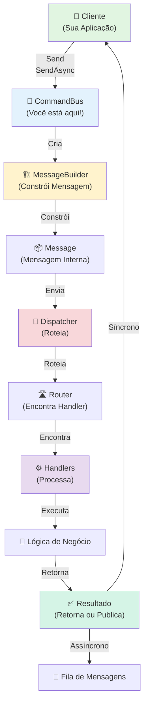
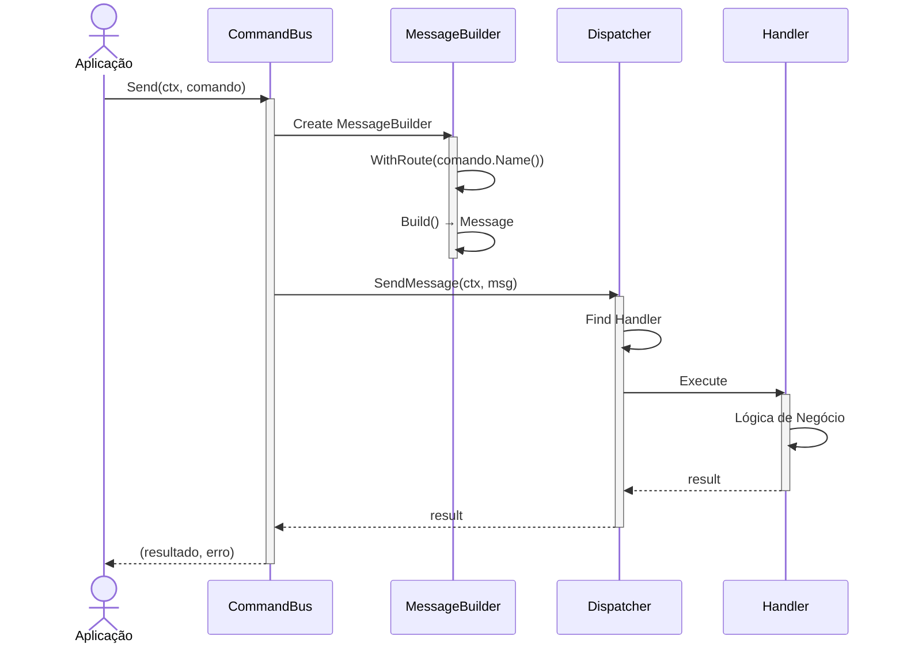
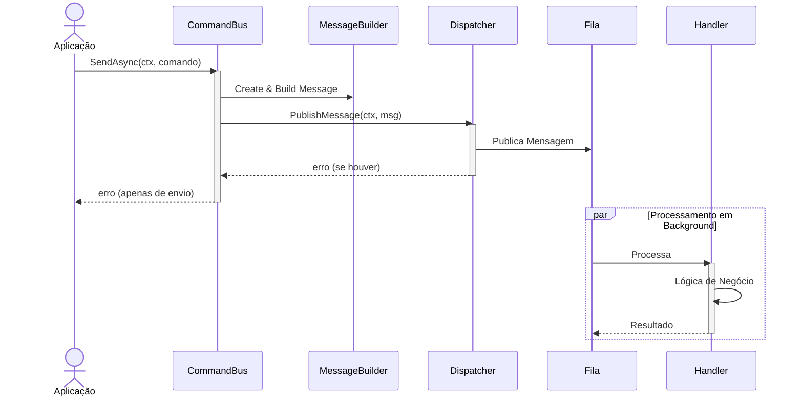

# 🎯 Command Bus

## 📖 O que é?

O **Command Bus** é o componente responsável por orquestrar a execução de **Comandos** no sistema Gomes. Um comando é uma instrução que altera o estado do sistema, como criar um usuário, atualizar um pedido ou deletar um registro.

O Command Bus atua como intermediário entre a aplicação e os handlers que processam os comandos. Ele fornece métodos simples e intuitivos para enviar comandos de forma **síncrona** (esperando a resposta) ou **assíncrona** (fire-and-forget), mantendo a consistência e rastreabilidade de todas as operações através de IDs de correlação automáticos.

Este componente é essencial no padrão **CQRS (Command Query Responsibility Segregation)**, separando as operações de escrita (Comandos) das operações de leitura (Queries).

### Quando Usar

- ✅ **Modificações de dados**: Quando você precisa alterar o estado do sistema (criar, atualizar, deletar)
- ✅ **Operações críticas**: Quando você precisa da resposta do comando antes de prosseguir
- ✅ **Processamento assíncrono**: Quando deseja enviar um comando e não esperar pela resposta
- ✅ **Segregação CQRS**: Quando quer separar claramente leitura e escrita
- ✅ **Rastreabilidade**: Quando precisa rastrear todas as modificações do sistema

### Quando NÃO Usar

- ❌ **Leitura de dados**: Use QueryBus para ler dados
- ❌ **Notificações simples**: Use EventBus para publicar eventos
- ❌ **Operações que não mudam estado**: Qualquer operação read-only deve usar Query

---

## 🎁 Características Principais

| Característica                | Descrição                                                      |
| ----------------------------- | -------------------------------------------------------------- |
| **Execução Síncrona**         | Envie um comando e aguarde o resultado imediatamente           |
| **Execução Assíncrona**       | Envie um comando e continue sem esperar (fire-and-forget)      |
| **Payloads Customizados**     | Suporte a enviando dados brutos com headers customizados       |
| **Correlação Automática**     | IDs de correlação gerados automaticamente para rastreabilidade |
| **Roteamento Inteligente**    | Rotas automáticas baseadas no nome do comando                  |
| **Type-Safe**                 | Suporte a generics do Go para máxima segurança de tipos        |
| **Integração com Dispatcher** | Funciona perfeitamente com o sistema de mensagens do Gomes     |

---

## 🔧 Implementação Detalhada

### Arquitetura

O Command Bus funciona em conjunto com os seguintes componentes:

```
Cliente
  ↓
CommandBus (Você está aqui!)
  ↓
Dispatcher (Roteia para o handler)
  ↓
MessageBuilder (Constrói a mensagem)
  ↓
Handler (Processa o comando)
  ↓
Resultado/Erro
```

**Fluxo Interno:**

1. **Cliente** envia um comando via CommandBus
2. **CommandBus** cria um `MessageBuilder` com o tipo `Command`
3. **MessageBuilder** constrói uma `Message` interna com o _payload_ (dados do comando)
4. **Dispatcher** recebe a mensagem e roteia para o handler apropriado
5. **Handler** executa a lógica de negócio
6. **Resultado** é retornado ao cliente (síncrono) ou publicado (assíncrono)

### Características Técnicas

- **Thread-Safe**: ✅ Sim - O CommandBus pode ser usado concorrentemente por múltiplas goroutines
- **Assíncrono**: ✅ Sim - Suporta tanto operações síncronas quanto assíncronas
- **Idempotente**: ⚠️ Depende - O comando em si pode ser idempotente, mas o bus não força isso
- **Configurável**: ✅ Sim - Funciona com diferentes dispatchers e handlers

---

## 📚 Métodos Públicos

### NewCommandBus(dispatcher Dispatcher) \*CommandBus

**Descrição**: Cria uma nova instância do Command Bus com o dispatcher especificado.

**Parâmetros**:

- `dispatcher Dispatcher`: O despachador de mensagens que será usado para rotear comandos

**Retorno**:

- `*CommandBus`: Nova instância do Command Bus

**Exemplo**:

```go
dispatcher := // obter dispatcher do gomes
commandBus := bus.NewCommandBus(dispatcher)
```

**Uso Prático**: Normalmente você obtém o CommandBus através do Gomes, não cria diretamente:

```go
commandBus, err := gomes.CommandBus()
```

---

### Send(ctx context.Context, action handler.Action) (any, error)

**Descrição**: Executa um **comando de forma síncrona**, aguardando o resultado antes de retornar. Ideal quando você precisa da resposta imediatamente.

**Parâmetros**:

- `ctx context.Context`: Contexto para timeout/cancelamento. Se o contexto for cancelado, a operação é interrompida
- `action handler.Action`: O comando a executar (deve implementar `Name()` que retorna o nome único do comando)

**Retorno**:

- `any`: O resultado retornado pelo handler do comando
- `error`: Erro se a execução falhar

**Exemplo**:

```go
type CreateUserCommand struct {
    Username string
    Email    string
}

func (c *CreateUserCommand) Name() string {
    return "createUser"  // Nome único do comando
}

// Usar o comando
ctx := context.Background()
result, err := commandBus.Send(ctx, &CreateUserCommand{
    Username: "alice",
    Email:    "alice@example.com",
})

if err != nil {
    log.Printf("Erro: %v", err)
} else {
    log.Printf("Resultado: %v", result)  // Resposta do handler
}
```

---

### SendRaw(ctx context.Context, route string, payload any, headers map[string]string) (any, error)

**Descrição**: Executa um comando com **payload customizado e headers personalizados**, de forma síncrona. Use quando você precisa de controle total sobre a estrutura da mensagem.

**Parâmetros**:

- `ctx context.Context`: Contexto para timeout/cancelamento
- `route string`: Rota do comando (identificador única que o dispatcher usa)
- `payload any`: Dados do comando (pode ser qualquer tipo)
- `headers map[string]string`: Headers customizados para a mensagem

**Retorno**:

- `any`: O resultado
- `error`: Erro se falhar

**Exemplo**:

```go
// Enviar comando com payload raw
result, err := commandBus.SendRaw(
    ctx,
    "user.create",  // Rota
    map[string]interface{}{
        "username": "bob",
        "email":    "bob@example.com",
        "role":     "admin",
    },
    map[string]string{
        "source":    "api",
        "ipAddress": "192.168.1.1",
    },
)
```

---

### SendAsync(ctx context.Context, action handler.Action) error

**Descrição**: Executa um comando de forma **assíncrona** (fire-and-forget), retornando imediatamente sem esperar pela resposta. Ideal para operações não-críticas.

**Parâmetros**:

- `ctx context.Context`: Contexto para timeout/cancelamento
- `action handler.Action`: O comando a executar

**Retorno**:

- `error`: Erro se o envio falhar (não há erro de execução do handler)

**Exemplo**:

```go
type SendNotificationCommand struct {
    UserID  string
    Message string
}

func (c *SendNotificationCommand) Name() string {
    return "sendNotification"
}

// Enviar de forma assíncrona
err := commandBus.SendAsync(ctx, &SendNotificationCommand{
    UserID:  "user123",
    Message: "Seu pedido foi confirmado!",
})

if err != nil {
    log.Printf("Erro ao enviar: %v", err)
} else {
    log.Println("Comando enviado! (resposta não aguardada)")
}
```

---

### SendRawAsync(ctx context.Context, route string, payload any, headers map[string]string) error

**Descrição**: Executa um comando com **payload e headers customizados de forma assíncrona**. Combina a flexibilidade do `SendRaw` com o comportamento fire-and-forget do `SendAsync`.

**Parâmetros**:

- `ctx context.Context`: Contexto para timeout/cancelamento
- `route string`: Rota do comando
- `payload any`: Dados do comando
- `headers map[string]string`: Headers customizados

**Retorno**:

- `error`: Erro se o envio falhar

**Exemplo**:

```go
err := commandBus.SendRawAsync(
    ctx,
    "email.send",
    map[string]interface{}{
        "to":      "user@example.com",
        "subject": "Welcome!",
        "body":    "Thank you for signing up",
    },
    map[string]string{
        "priority": "high",
        "template": "welcome",
    },
)
```

---

## 🏗️ Diagrama de Componentes



**Componentes Principais**:

- **Client**: Você! A aplicação que envia comandos
- **CommandBus**: O orquestrador que recebe seus comandos
- **MessageBuilder**: Constrói a mensagem interna
- **Dispatcher**: Roteia a mensagem para o handler correto
- **Handler**: Executa a lógica do comando
- **Result**: Retorna o resultado (síncrono) ou publica (assíncrono)

---

## 🔄 Diagrama de Execução

### Fluxo Síncrono (Send)



### Fluxo Assíncrono (SendAsync)



---

## 💡 Exemplo de Uso Prático

### Setup Completo

```go
package main

import (
    "context"
    "log/slog"
    "time"

    "github.com/jeffersonbrasilino/gomes"
    kafka "github.com/jeffersonbrasilino/gomes/channel/kafka"
)

// 1. DEFINIR O COMANDO
// =====================

type CreateOrderCommand struct {
    OrderID    string  `json:"orderId"`
    CustomerID string  `json:"customerId"`
    Amount     float64 `json:"amount"`
    Items      []string `json:"items"`
}

// Name retorna o identificador único do comando
func (c *CreateOrderCommand) Name() string {
    return "createOrder"
}

// 2. DEFINIR O HANDLER
// =====================

type CreateOrderHandler struct {
    // Você pode injetar dependências aqui (database, logger, etc)
}

func (h *CreateOrderHandler) Handle(
    ctx context.Context,
    cmd *CreateOrderCommand,
) (any, error) {
    slog.Info("Processando comando",
        "orderId", cmd.OrderID,
        "customerId", cmd.CustomerID,
        "amount", cmd.Amount,
    )

    // Simular processamento
    time.Sleep(100 * time.Millisecond)

    // Retornar resultado
    return map[string]interface{}{
        "id":        cmd.OrderID,
        "status":    "created",
        "timestamp": time.Now(),
    }, nil
}

// 3. SETUP DO SISTEMA
// ====================

func main() {
    // Registrar conexão Kafka
    gomes.AddChannelConnection(
        kafka.NewConnection("kafka", []string{"localhost:9092"}),
    )

    // Registrar canais de publicação
    gomes.AddPublisherChannel(
        kafka.NewPublisherChannelAdapterBuilder("kafka", "orders.topic"),
    )

    // Registrar handler
    gomes.AddActionHandler(&CreateOrderHandler{})

    // Iniciar o sistema
    if err := gomes.Start(); err != nil {
        slog.Error("Erro ao iniciar Gomes", "err", err)
        panic(err)
    }
    defer gomes.Shutdown()

    // 4. USAR COMMAND BUS
    // ====================

    // Obter o CommandBus síncrono
    commandBus, err := gomes.CommandBus()
    if err != nil {
        slog.Error("Erro ao obter CommandBus", "err", err)
        return
    }

        // Obter o CommandBus síncrono
    asyncCommandBus, err := omes.CommandBusByChannel("orders.topic")
    if err != nil {
        slog.Error("Erro ao obter CommandBus", "err", err)
        return
    }

    ctx := context.Background()

    // Exemplo 1: Envio SÍNCRONO (Espera resposta)
    // ===========================================
    slog.Info("=== Exemplo 1: Send (Síncrono) ===")

    result, err := commandBus.Send(ctx, &CreateOrderCommand{
        OrderID:    "ORD123",
        CustomerID: "CUST456",
        Amount:     199.99,
        Items:      []string{"Item A", "Item B"},
    })

    if err != nil {
        slog.Error("Erro ao processar comando", "err", err)
    } else {
        slog.Info("Comando executado com sucesso!", "resultado", result)
    }

    // Exemplo 2: Envio ASSÍNCRONO (Fire-and-forget)
    // ============================================
    slog.Info("=== Exemplo 2: SendAsync (Assíncrono) ===")

    err = asyncCommandBus.SendAsync(ctx, &CreateOrderCommand{
        OrderID:    "ORD124",
        CustomerID: "CUST457",
        Amount:     299.99,
        Items:      []string{"Item C"},
    })

    if err != nil {
        slog.Error("Erro ao enviar comando", "err", err)
    } else {
        slog.Info("Comando enviado! (Não esperamos resposta)")
    }

    // Exemplo 3: Envio RAW com Headers Customizados
    // ============================================
    slog.Info("=== Exemplo 3: SendRaw (Com Headers) ===")

    result, err = commandBus.SendRaw(
        ctx,
        "createOrder", // Rota
        map[string]interface{}{
            "orderId":    "ORD125",
            "customerId": "CUST458",
            "amount":     399.99,
            "items":      []string{"Item D", "Item E"},
        },
        map[string]string{
            "source":      "mobile-app",
            "userId":      "USER789",
            "ipAddress":   "192.168.1.100",
            "userAgent":   "iOS/14.5",
        },
    )

    if err != nil {
        slog.Error("Erro ao processar comando raw", "err", err)
    } else {
        slog.Info("Comando raw executado!", "resultado", result)
    }

    // Exemplo 4: Context com Timeout
    // =============================
    slog.Info("=== Exemplo 4: Send com Timeout ===")

    ctxWithTimeout, cancel := context.WithTimeout(ctx, 5*time.Second)
    defer cancel()

    result, err = commandBus.Send(ctxWithTimeout, &CreateOrderCommand{
        OrderID:    "ORD126",
        CustomerID: "CUST459",
        Amount:     499.99,
        Items:      []string{"Item F"},
    })

    if err != nil {
        slog.Error("Erro ao processar comando (timeout?)", "err", err)
    } else {
        slog.Info("Comando com timeout executado!", "resultado", result)
    }

    slog.Info("Demonstração completa!")
}
```

### Configuração com CommandBusByChannel

Se você quiser usar um canal específico:

```go
// Registrar canais diferentes
gomes.AddPublisherChannel(
    kafka.NewPublisherChannelAdapterBuilder("kafka", "orders.topic"),
)

gomes.AddPublisherChannel(
    kafka.NewPublisherChannelAdapterBuilder("kafka", "payments.topic"),
)

// Obter CommandBus para canal específico
orderCommandBus, _ := gomes.CommandBusByChannel("orders.topic")
paymentCommandBus, _ := gomes.CommandBusByChannel("payments.topic")

// Usar cada um independentemente
orderCommandBus.SendAsync(ctx, &CreateOrderCommand{...})
paymentCommandBus.SendAsync(ctx, &ProcessPaymentCommand{...})
```

---

## ✅ Boas Práticas

- ✅ **Use Send para operações críticas**: Quando o resultado é importante, use `Send` para ficar síncrono
- ✅ **Use SendAsync para operações não-críticas**: Notificações, logs, etc.
- ✅ **Sempre passa um contexto**: Use `context.WithTimeout()` ou `context.WithCancel()` para controlar a execução
- ✅ **Implemente o Name() corretamente**: Deve retornar um identificador único e consistente
- ✅ **Trate erros apropriadamente**: Sempre verifique o erro retornado
- ✅ **Use validação no handler**: Valide os dados do comando dentro do handler
- ✅ **Mantenha comandos simples**: Cada comando deve fazer uma coisa bem
- ✅ **Use tipos forte**: Prefira tipos específicos em vez de `map[string]interface{}`

### Erros Comuns a Evitar

- ❌ **Ignorar erros**: Não esqueça de verificar `if err != nil`
- ❌ **Usar timeouts muito curtos**: Commands podem ser lentos em sistemas sobrecarregados
- ❌ **Enviando dados sensíveis nos headers**: Headers podem ser logados, use payload para dados sensíveis
- ❌ **Não implementar Name()**: Isso causará panics ou erros no roteamento
- ❌ **Esperar resposta de SendAsync**: SendAsync não retorna dados, use Send para isso
- ❌ **Usar CommandBus para Queries**: Use QueryBus para leitura de dados
- ❌ **Comandos muito grandes**: Divida em múltiplos comandos menores se for muito grande

---

## 🔍 Troubleshooting

### Problema: "Handler not found for route X"

**Sintomas**:

- Erro: `handler not found`
- Execução falha silenciosamente

**Causa**: O nome do comando (`Name()`) não corresponde a nenhum handler registrado

**Solução**:

```go
// ❌ Errado - Handler registrado mas comando com nome diferente
type UpdateUserCommand struct{}
func (c *UpdateUserCommand) Name() string {
    return "updateU" // Nome errado!
}

// ✅ Correto - Nomes devem corresponder
type UpdateUserCommand struct{}
func (c *UpdateUserCommand) Name() string {
    return "updateUser" // Corresponde ao handler registrado
}

// Verificar que o handler está registrado:
type UpdateUserHandler struct{}
func (h *UpdateUserHandler) Handle(ctx context.Context, cmd *UpdateUserCommand) (any, error) {
    // ...
}

gomes.AddActionHandler(&UpdateUserHandler{}) // Handler registrado corretamente
```

---

### Problema: Context deadline exceeded

**Sintomas**:

- Erro: `context deadline exceeded`
- Comando nunca retorna

**Causa**: O timeout do contexto é muito curto ou o handler é muito lento

**Solução**:

```go
// ❌ Errado - Timeout muito curto
ctx, cancel := context.WithTimeout(context.Background(), 100*time.Millisecond)
defer cancel()
commandBus.Send(ctx, command) // Provavelmente vai dar timeout

// ✅ Correto - Timeout apropriado
ctx, cancel := context.WithTimeout(context.Background(), 30*time.Second)
defer cancel()
commandBus.Send(ctx, command)

// Ou sem timeout (não recomendado em produção):
commandBus.Send(context.Background(), command)
```

---

### Problema: SendAsync não retorna erro

**Sintomas**:

- `SendAsync` não retorna erro quando imagina que deveria
- Handler não está sendo executado

**Causa**: `SendAsync` é fire-and-forget. Erros de execução não são retornados

**Solução**:

```go
// ❌ Errado - Esperando erro de execução do handler
err := commandBus.SendAsync(ctx, cmd)
if err != nil {
    log.Println("Handler falhou!") // Isso nunca vai aparecer
}

// ✅ Correto - SendAsync só retorna erro de envio
err := commandBus.SendAsync(ctx, cmd)
if err != nil {
    log.Println("Erro ao ENVIAR comando (não de execução)")
}
// Erros de execução precisam ser tratados dentro do handler
```

---

### Problema: Headers não estão sendo propagados

**Sintomas**:

- Headers customizados não chegam ao handler/dispatcher

**Causa**: Usar `Send` sem headers ao invés de `SendRaw`

**Solução**:

```go
// ❌ Errado - Sem headers
commandBus.Send(ctx, cmd)

// ✅ Correto - Com headers customizados
commandBus.SendRaw(
    ctx,
    cmd.Name(),
    cmd,
    map[string]string{
        "userId": "123",
        "source": "api",
    },
)
```

---

## 📚 Referências

- [CommandBus GoDoc](../../bus/command_bus.go): Código-fonte comentado
- [Exemplo Completo](../../examples/cqrs/main.go): Arquivo de exemplo no projeto
- [Handler Interface](../../message/handler/handler.go): Interface do Action Handler
- [CQRS Pattern](https://martinfowler.com/bliki/CQRS.html): Leitura externa sobre CQRS
- [Message System](../message.md): Entender a estrutura interna de mensagens

---

**Última Atualização**: 16 de fevereiro de 2026  
**Status**: ✅ Produção  
**Versão do Gomes**: v1.0+  
**Mantido por**: Especialista em Desenvolvimento Backend (Gomes)
