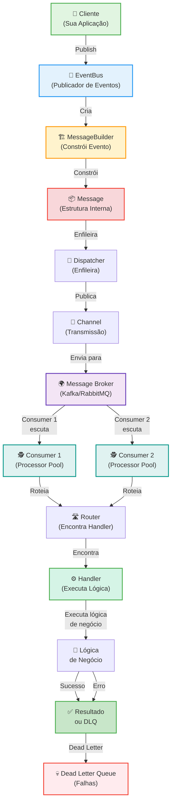
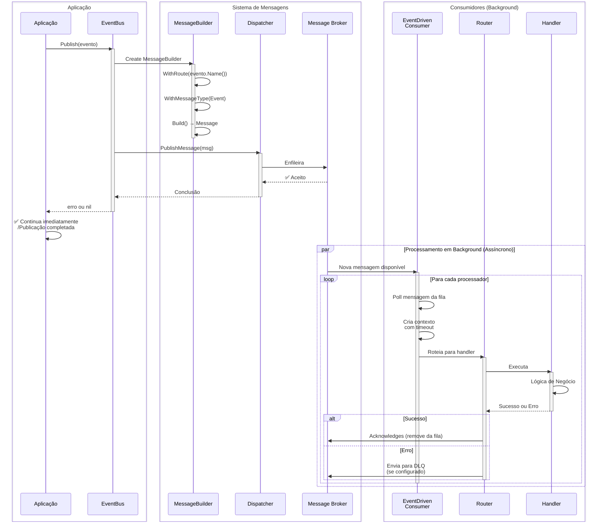

# 🎯 Fluxo de Processamento de Eventos

**Tipo**: Padrão de Integração  
**Objetivo**: Publicar e processar eventos assincronamente em broadcast para múltiplos subscribers  
**Status**: ✅ Produção

---

## 📖 O que é?

O **Fluxo de Processamento de Eventos** é a sequência de operações que ocorre quando um evento é publicado no sistema Gomes. Este fluxo representa notificações de que algo importante aconteceu no sistema (como "Pedido Criado", "Pagamento Confirmado", "Usuário Registrado"), e múltiplos componentes precisam ser informados para reagir apropriadamente.

Diferente dos **Comandos** (que modificam o estado), os **Eventos** representam fatos que já ocorreram. Um evento é publicado através do **EventBus**, enfileirado em um **Message Broker** (Kafka, RabbitMQ), e então processado de forma assíncrona por múltiplos **EventDrivenConsumers** em paralelo. Cada consumer pode ter vários processadores rodando concorrentemente para distribuir a carga.

Este fluxo é essencial no padrão **Event-Driven Architecture** e integra-se perfeitamente com **CQRS**, permitindo que diferentes partes do sistema se comuniquem de forma desacoplada e escalável.

### Quando Usar

- ✅ **Notificações assincronas**: Quando múltiplos componentes precisam ser informados de um evento
- ✅ **Desacoplamento de sistemas**: Quando quer separar o produtor do evento dos consumidores
- ✅ **Processamento assíncrono**: Quando a ação não precisa acontecer imediatamente
- ✅ **Broadcasting**: Quando um evento pode ter múltiplos subscribers interessados
- ✅ **Escalabilidade**: Quando precisa distribuir o processamento entre múltiplos workers
- ✅ **Auditoria e logging**: Quando quer registrar que algo aconteceu no sistema
- ✅ **Notificações**: Enviar emails, SMS, push notifications em background

### Quando NÃO Usar

- ❌ **Quando precisa de resposta síncrona**: Use CommandBus ou QueryBus em vez de EventBus
- ❌ **Operações críticas que precisam de garantia imediata**: Use Commands para operações essenciais
- ❌ **Consultas de dados**: Use QueryBus para leitura
- ❌ **Quando um único resultado é necessário**: Eventos são broadcast, não retornam resultado

---

## 🎁 Características Principais

| Característica              | Descrição                                                              |
| --------------------------- | ---------------------------------------------------------------------- |
| **Publicação assíncrona**   | Publica eventos sem aguardar o processamento                           |
| **Múltiplos subscribers**   | Vários consumers podem escutar o mesmo evento                          |
| **Paralelização automática** | Múltiplos processadores rodando concorrentemente                       |
| **Correlação automática**   | IDs de correlação para rastreabilidade entre eventos relacionados      |
| **Processamento em fila**   | Garante entrega through message broker (Kafka, RabbitMQ)              |
| **Payloads customizados**   | Suporte a eventos com headers personalizados                           |
| **Dead Letter Channels**    | Eventos que falham são redirecionados para DLQ                        |
| **Timeouts de processamento** | Controle do tempo máximo para processar um evento                      |

---

## 🔧 Implementação Detalhada

### Arquitetura

O fluxo de processamento de eventos é organizado em etapas bem definidas:

```
┌─────────────────────────────────────────────────────────────────┐
│ 1. CLIENTE (Sua Aplicação)                                      │
│    ↓ Chama eventBus.Publish() ou PublishRaw()                   │
└─────────────────────────────────────────────────────────────────┘
                           ↓
┌─────────────────────────────────────────────────────────────────┐
│ 2. EVENT BUS (bus/event_bus.go)                                 │
│    ↓ Prepara o evento para publicação                           │
│    • Recebe o evento (Action)                                   │
│    • Obtém o MessageBuilder via dispatcher                      │
└─────────────────────────────────────────────────────────────────┘
                           ↓
┌─────────────────────────────────────────────────────────────────┐
│ 3. MESSAGE BUILDER (message/message_builder.go)                 │
│    ↓ Constrói a mensagem interna                                │
│    • Define rotas                                               │
│    • Adiciona headers                                           │
│    • Define tipo como Event                                    │
│    • Gera IDs de correlação                                     │
└─────────────────────────────────────────────────────────────────┘
                           ↓
┌─────────────────────────────────────────────────────────────────┐
│ 4. MESSAGE (message/message.go)                                 │
│    ↓ Representa a mensagem estruturada                          │
│    • Payload: dados do evento                                   │
│    • Headers: metadados                                         │
│    • Route: identificador do evento                             │
│    • MessageType: sempre Event                                 │
└─────────────────────────────────────────────────────────────────┘
                           ↓
┌─────────────────────────────────────────────────────────────────┐
│ 5. DISPATCHER (message/endpoint/message_dispatcher.go)          │
│    ↓ Publica a mensagem                                         │
│    • Sempre usa PublishMessage() (assíncrono)                   │
│    • Enfileira na fila de mensagens                             │
└─────────────────────────────────────────────────────────────────┘
                           ↓
┌─────────────────────────────────────────────────────────────────┐
│ 6. CHANNEL (message/channel/)                                   │
│    ↓ Transmite através do broker                                │
│    • Publica em Kafka, RabbitMQ, etc                           │
│    • Múltiplos consumers podem escutar                         │
└─────────────────────────────────────────────────────────────────┘
                           ↓
┌─────────────────────────────────────────────────────────────────┐
│ 7. MESSAGE BROKER (Kafka, RabbitMQ, etc)                        │
│    ↓ Armazena e distribui mensagens                             │
│    • Garante entrega ordenada                                   │
│    • Persiste o evento                                          │
│    • Distribui para múltiplos consumers                         │
└─────────────────────────────────────────────────────────────────┘
                           ↓
         ┌─────────────────┴─────────────────┐
         ↓ Consumer 1                        ↓ Consumer 2
┌──────────────────────┐           ┌──────────────────────┐
│ EVENT DRIVEN         │           │ EVENT DRIVEN         │
│ CONSUMER 1           │           │ CONSUMER 2           │
│ (Processor Pool)     │           │ (Processor Pool)     │
└──────────────────────┘           └──────────────────────┘
         ↓                                   ↓
    P1 P2 P3 P4                        P1 P2 P3 P4
    │ │ │ │ (Processadores)           │ │ │ │
    └─┴─┴─┘                           └─┴─┴─┘
         ↓                                   ↓
┌──────────────────────┐           ┌──────────────────────┐
│ GATEWAY/ROUTER       │           │ GATEWAY/ROUTER       │
│ (Encontra Handler)   │           │ (Encontra Handler)   │
└──────────────────────┘           └──────────────────────┘
         ↓                                   ↓
┌──────────────────────┐           ┌──────────────────────┐
│ HANDLER              │           │ HANDLER              │
│ (Executa ação)       │           │ (Executa ação)       │
└──────────────────────┘           └──────────────────────┘
         ↓                                   ↓
┌──────────────────────┐           ┌──────────────────────┐
│ RESULTADO            │           │ RESULTADO            │
│ Sucesso/Erro         │           │ Sucesso/Erro         │
└──────────────────────┘           └──────────────────────┘
```

### Fluxo detalhado de processamento

**Fase 1: Publicação do Evento**
- Aplicação cria struct que implementa `handler.Action` (method `Name()`)
- Chama `eventBus.Publish()` ou `eventBus.PublishRaw()`

**Fase 2: Construção da Mensagem**
- EventBus cria um `MessageBuilder` via `dispatcher.MessageBuilder()`
- Tipo é definido como `Event`
- Rota é extraída do `action.Name()`

**Fase 3: Enfileiramento**
- EventBus chama `dispatcher.PublishMessage()` (sempre assíncrono)
- Mensagem é enfileirada no Message Broker

**Fase 4: Retorno Imediato**
- EventBus retorna imediatamente (apenas erro de enfileiramento, nunca erro de processamento)

**Fase 5: Consumo assíncrono**
- EventDrivenConsumer escuta o Message Broker
- Múltiplos Processadores extraem mensagens da fila
- Cada processador aloca um gateway para rotear para o handler

**Fase 6: Roteamento**
- Gateway encontra o handler apropriado baseado na rota
- Handler é localizado e preparado para execução

**Fase 7: Processamento**
- Handler executa a lógica de negócio
- Pode retornar resultado ou erro

**Fase 8: Reconhecimento ou DLQ**
- Se sucesso: Mensagem é reconhecida e removida da fila
- Se erro: Pode ser enviada para Dead Letter Queue (se configurado)

### Características Técnicas

- **Thread-Safe**: ✅ Sim - EventBus pode ser usado concorrentemente por múltiplas goroutines
- **Assíncrono**: ✅ Sim - Sempre assíncrono (sempre PublishMessage, nunca SendMessage)
- **Idempotente**: ⚠️ Depende do handler - Recomenda-se implementar idempotência nos handlers
- **Escalável**: ✅ Sim - Múltiplos consumers, múltiplos processadores por consumer
- **Distribuído**: ✅ Sim - Message broker distribui entre múltiplas instâncias da aplicação

---

## 📚 Métodos Principais do Fluxo

### EventBus.Publish()

**Local**: [bus/event_bus.go](bus/event_bus.go#L47-L57)

Publica um evento de forma **assíncrona**.

```go
func (c *EventBus) Publish(ctx context.Context, action handler.Action) error
```

**Fluxo**:
1. Cria MessageBuilder via dispatcher
2. Define tipo como `Event`
3. Define rota como `action.Name()`
4. Chama `dispatcher.PublishMessage()` (enfileira apenas)
5. Retorna imediatamente (apenas erro de enfileiramento)

**Características**:
- ✅ Sempre assíncrono (fire-and-forget)
- ✅ Não retorna resultado do handler
- ✅ Apenas retorna erro se enfileiramento falhar
- ✅ Ideal para notificações e broadcasts

### EventBus.PublishRaw()

**Local**: [bus/event_bus.go](bus/event_bus.go#L59-L77)

Publica um evento com **payload e headers customizados**.

```go
func (c *EventBus) PublishRaw(
    ctx context.Context,
    route string,
    payload any,
    headers map[string]string,
) error
```

**Fluxo**:
1. Cria MessageBuilder via dispatcher
2. Define tipo como `Event`
3. Define rota customizada
4. Adiciona headers customizados
5. Chama `dispatcher.PublishMessage()` (enfileira)
6. Retorna imediatamente

### EventDrivenConsumer.Run()

**Local**: [message/endpoint/event_driven_consumer.go](message/endpoint/event_driven_consumer.go)

Inicia o consumo assíncrono de eventos.

```go
func (c *EventDrivenConsumer) Run(ctx context.Context) error
```

**Responsabilidades**:
- Conecta à fila via InboundChannelAdapter
- Cria múltiplos processadores (workers)
- Distribui mensagens entre processadores
- Gerencia timeouts de processamento
- Encaminha para DLQ em caso de falha

### EventDrivenConsumer.WithAmountOfProcessors()

Configura quantos workers processarão mensagens em paralelo.

```go
func (c *EventDrivenConsumer) WithAmountOfProcessors(amount int) *EventDrivenConsumer
```

---

## 🏗️ Diagrama de Componentes



**Componentes Principais**:

- **Cliente**: Sua aplicação que publica eventos
- **EventBus**: Orquestrador que publica eventos para o broker
- **MessageBuilder**: Constrói a mensagem de evento
- **Message**: Representa o evento estruturado
- **Dispatcher**: Enfileira a mensagem
- **Channel**: Transmite via broker
- **Message Broker**: Kafka, RabbitMQ ou similar
- **EventDrivenConsumer**: Listener que consome eventos
- **Handler**: Executa a lógica de reação ao evento
- **Dead Letter Queue**: Armazena eventos que falharam

---

## 🔄 Diagrama de Execução

### Fluxo Completo de Publicação e Consumo



**Pontos Chave**:
1. **Publicação é não-bloqueante**: A aplicação não espera o processamento
2. **Múltiplos processadores**: Muitos eventos podem ser processados em paralelo
3. **Reconhecimento na fila**: Só remove da fila após sucesso
4. **DLQ para falhas**: Eventos que falham vão para Dead Letter Queue

---

## 💡 Exemplo de Uso Prático

### Setup Completo com Processamento de Eventos

```go
package main

import (
    "context"
    "fmt"
    "log/slog"
    "time"

    "github.com/jeffersonbrasilino/gomes"
    kafka "github.com/jeffersonbrasilino/gomes/channel/kafka"
    "github.com/jeffersonbrasilino/gomes/message"
)

// ============================================================
// PARTE 1: DEFINIR OS EVENTOS
// ============================================================

// Evento 1: Pedido Criado
type OrderCreatedEvent struct {
    OrderID    string  `json:"orderId"`
    CustomerID string  `json:"customerId"`
    Amount     float64 `json:"amount"`
    Timestamp  time.Time `json:"timestamp"`
}

func (e *OrderCreatedEvent) Name() string {
    return "orderCreated"
}

// Evento 2: Pagamento Confirmado
type PaymentConfirmedEvent struct {
    PaymentID string    `json:"paymentId"`
    OrderID   string    `json:"orderId"`
    Amount    float64   `json:"amount"`
    Timestamp time.Time `json:"timestamp"`
}

func (e *PaymentConfirmedEvent) Name() string {
    return "paymentConfirmed"
}

// ============================================================
// PARTE 2: DEFINIR OS HANDLERS (podem ter múltiplos!)
// ============================================================

// Handler 1 para OrderCreatedEvent: Enviar email de confirmação
type SendOrderConfirmationEmailHandler struct{}

func (h *SendOrderConfirmationEmailHandler) Handle(
    ctx context.Context,
    event *OrderCreatedEvent,
) (any, error) {
    slog.Info("Enviando email de confirmação",
        "orderId", event.OrderID,
        "customer", event.CustomerID,
    )
    
    time.Sleep(200 * time.Millisecond)
    
    slog.Info("✅ Email enviado com sucesso")
    return nil, nil
}

// Handler 2 para OrderCreatedEvent: Atualizar inventory
type UpdateInventoryHandler struct{}

func (h *UpdateInventoryHandler) Handle(
    ctx context.Context,
    event *OrderCreatedEvent,
) (any, error) {
    slog.Info("Atualizando inventário",
        "orderId", event.OrderID,
    )
    
    time.Sleep(150 * time.Millisecond)
    
    slog.Info("✅ Inventário atualizado")
    return nil, nil
}

// Handler 3 para OrderCreatedEvent: Registrar em auditoria
type AuditOrderCreationHandler struct{}

func (h *AuditOrderCreationHandler) Handle(
    ctx context.Context,
    event *OrderCreatedEvent,
) (any, error) {
    slog.Info("Registrando em auditoria",
        "orderId", event.OrderID,
        "timestamp", event.Timestamp,
    )
    
    time.Sleep(100 * time.Millisecond)
    
    slog.Info("✅ Auditoria registrada")
    return nil, nil
}

// Handler 4 para PaymentConfirmedEvent: Atualizar status do pedido
type UpdateOrderStatusHandler struct{}

func (h *UpdateOrderStatusHandler) Handle(
    ctx context.Context,
    event *PaymentConfirmedEvent,
) (any, error) {
    slog.Info("Atualizando status do pedido",
        "orderId", event.OrderID,
        "status", "paid",
    )
    
    time.Sleep(100 * time.Millisecond)
    
    slog.Info("✅ Status do pedido atualizado")
    return nil, nil
}

// ============================================================
// PARTE 3: SETUP DO SISTEMA
// ============================================================

func initializeGomes() error {
    // 1. Registrar conexão Kafka
    gomes.AddChannelConnection(
        kafka.NewConnection("kafka", []string{"localhost:9092"}),
    )

    // 2. Registrar canais de consumo (escuta de eventos)
    orderEventsConsumer := kafka.NewConsumerChannelAdapterBuilder(
        "kafka",
        "order.events",        // Tópico
        "order-consumer-group", // Grupo de consumo
    )
    gomes.AddConsumerChannel(orderEventsConsumer)

    paymentEventsConsumer := kafka.NewConsumerChannelAdapterBuilder(
        "kafka",
        "payment.events",
        "payment-consumer-group",
    )
    gomes.AddConsumerChannel(paymentEventsConsumer)

    // 3. Registrar canal de publicação (publicar eventos)
    gomes.AddPublisherChannel(
        kafka.NewPublisherChannelAdapterBuilder("kafka", "order.events"),
    )
    gomes.AddPublisherChannel(
        kafka.NewPublisherChannelAdapterBuilder("kafka", "payment.events"),
    )

    // 4. Registrar handlers para os eventos
    // IMPORTANTE: Um único evento pode ter múltiplos handlers!
    gomes.AddActionHandler(&SendOrderConfirmationEmailHandler{})
    gomes.AddActionHandler(&UpdateInventoryHandler{})
    gomes.AddActionHandler(&AuditOrderCreationHandler{})
    gomes.AddActionHandler(&UpdateOrderStatusHandler{})

    // 5. Iniciar o sistema
    if err := gomes.Start(); err != nil {
        return fmt.Errorf("erro ao iniciar Gomes: %w", err)
    }

    return nil
}

// ============================================================
// PARTE 4: EXEMPLO 1 - PUBLICAR EVENTO
// ============================================================

func examplePublishOrderCreatedEvent() error {
    slog.Info("=== Exemplo 1: Publicar Evento OrderCreated ===")

    eventBus, err := gomes.EventBusByChannel("order.events")
    if err != nil {
        return err
    }

    ctx := context.Background()

    // Publicar evento (sem esperar resultado!)
    err = eventBus.Publish(ctx, &OrderCreatedEvent{
        OrderID:    "ORD-001",
        CustomerID: "CUST-123",
        Amount:     199.99,
        Timestamp:  time.Now(),
    })

    if err != nil {
        slog.Error("Erro ao publicar evento", "err", err)
        return err
    }

    slog.Info("✅ Evento publicado!")
    slog.Info("💡 Nota: Os 3 handlers para este evento são executados em paralelo em background")
    slog.Info("   1. SendOrderConfirmationEmailHandler")
    slog.Info("   2. UpdateInventoryHandler")
    slog.Info("   3. AuditOrderCreationHandler")

    return nil
}

// ============================================================
// PARTE 5: EXEMPLO 2 - PUBLISHRAW COM HEADERS
// ============================================================

func examplePublishWithHeaders() error {
    slog.Info("=== Exemplo 2: Publicar Evento com Headers ===")

    eventBus, err := gomes.EventBusByChannel("order.events")
    if err != nil {
        return err
    }

    ctx := context.Background()

    // Publicar com headers customizados
    err = eventBus.PublishRaw(
        ctx,
        "orderCreated",
        map[string]interface{}{
            "orderId":    "ORD-002",
            "customerId": "CUST-456",
            "amount":     299.99,
            "timestamp":  time.Now(),
        },
        map[string]string{
            "source":      "mobile-app",
            "userId":      "USER-789",
            "ipAddress":   "192.168.1.100",
            "requestId":   "REQ-ABC123",
            "priority":    "high",
        },
    )

    if err != nil {
        slog.Error("Erro ao publicar", "err", err)
        return err
    }

    slog.Info("✅ Evento publicado com headers customizados!")

    return nil
}

// ============================================================
// PARTE 6: EXEMPLO 3 - CONSUMIR EVENTOS (Background)
// ============================================================

func exampleConsumeEvents(ctx context.Context) error {
    slog.Info("=== Exemplo 3: Consumindo Eventos em Background ===")

    // Obter consumers para cada canal
    orderConsumer, err := gomes.EventDrivenConsumer("order-consumer-group")
    if err != nil {
        return err
    }

    paymentConsumer, err := gomes.EventDrivenConsumer("payment-consumer-group")
    if err != nil {
        return err
    }

    // Iniciar consumers em goroutines
    go func() {
        slog.Info("Iniciando consumer de order events")
        err := orderConsumer.
            WithAmountOfProcessors(4).              // 4 workers processando em paralelo
            WithMessageProcessingTimeout(10000).   // 10 segundos de timeout
            WithStopOnError(false).                 // Não parar se um evento falhar
            Run(ctx)
        if err != nil {
            slog.Error("Erro no order consumer", "err", err)
        }
    }()

    go func() {
        slog.Info("Iniciando consumer de payment events")
        err := paymentConsumer.
            WithAmountOfProcessors(2).              // 2 workers
            WithMessageProcessingTimeout(5000).
            WithStopOnError(false).
            Run(ctx)
        if err != nil {
            slog.Error("Erro no payment consumer", "err", err)
        }
    }()

    slog.Info("✅ Consumers iniciados!")
    slog.Info("💡 Nota: Agora os eventos publicados serão processados por estes consumers")

    return nil
}

// ============================================================
// PARTE 7: EXEMPLO 4 - CADEIA DE EVENTOS
// ============================================================

func exampleEventChainReaction() error {
    slog.Info("=== Exemplo 4: Cadeia de Reação de Eventos ===")

    eventBusOrders, _ := gomes.EventBusByChannel("order.events")
    eventBusPayments, _ := gomes.EventBusByChannel("payment.events")
    ctx := context.Background()

    // Passo 1: Publicar evento de pedido criado
    slog.Info("Passo 1: Publicando OrderCreatedEvent...")
    err := eventBusOrders.Publish(ctx, &OrderCreatedEvent{
        OrderID:    "ORD-003",
        CustomerID: "CUST-789",
        Amount:     499.99,
        Timestamp:  time.Now(),
    })
    if err != nil {
        return err
    }
    slog.Info("✅ OrderCreatedEvent publicado")
    slog.Info("   Isso dispara: Email, Inventory Update, Auditoria")

    // Aguardar um pouco para o processamento anterior
    time.Sleep(500 * time.Millisecond)

    // Passo 2: Publicar evento de pagamento confirmado
    slog.Info("Passo 2: Publicando PaymentConfirmedEvent...")
    err = eventBusPayments.Publish(ctx, &PaymentConfirmedEvent{
        PaymentID: "PAY-XYZ789",
        OrderID:   "ORD-003",
        Amount:    499.99,
        Timestamp: time.Now(),
    })
    if err != nil {
        return err
    }
    slog.Info("✅ PaymentConfirmedEvent publicado")
    slog.Info("   Isso dispara: Update Order Status")

    slog.Info("💡 Nota: Ambos os eventos foram publicados e processados em paralelo!")

    return nil
}

// ============================================================
// PARTE 8: EXEMPLO 5 - MÚLTIPLOS PUBLISHERS
// ============================================================

func exampleBatchPublishEvents() error {
    slog.Info("=== Exemplo 5: Publicar Múltiplos Eventos ===")

    eventBus, _ := gomes.EventBusByChannel("order.events")
    ctx := context.Background()

    // Simular múltiplos pedidos sendo criados rapidamente
    for i := 1; i <= 5; i++ {
        err := eventBus.Publish(ctx, &OrderCreatedEvent{
            OrderID:    fmt.Sprintf("ORD-%03d", i+100),
            CustomerID: fmt.Sprintf("CUST-%03d", i),
            Amount:     float64(i) * 100,
            Timestamp:  time.Now(),
        })

        if err != nil {
            slog.Error("Erro ao publicar", "orderId", fmt.Sprintf("ORD-%03d", i+100))
        } else {
            slog.Info("Evento publicado", "orderId", fmt.Sprintf("ORD-%03d", i+100))
        }

        time.Sleep(100 * time.Millisecond)
    }

    slog.Info("✅ 5 eventos publicados!")
    slog.Info("💡 Todos serão processados em paralelo pelos 4 workers de cada consumer")

    return nil
}

// ============================================================
// PARTE 9: MAIN - DEMONSTRAÇÃO COMPLETA
// ============================================================

func main() {
    // Configurar logging
    slog.SetDefault(slog.New(slog.NewTextHandler(os.Stderr, nil)))

    // Inicializar Gomes
    if err := initializeGomes(); err != nil {
        slog.Error("Erro ao inicializar Gomes", "err", err)
        panic(err)
    }

    ctx, cancel := context.WithCancel(context.Background())
    defer cancel()

    // Iniciar consumers
    if err := exampleConsumeEvents(ctx); err != nil {
        slog.Error("Erro ao iniciar consumers", "err", err)
        panic(err)
    }

    // Aguardar um pouco para consumers ficarem prontos
    time.Sleep(1 * time.Second)

    // Executar exemplos
    examples := []struct {
        name string
        fn   func() error
    }{
        {"Publicar Evento", examplePublishOrderCreatedEvent},
        {"PublishRaw com Headers", examplePublishWithHeaders},
        {"Cadeia de Reação", exampleEventChainReaction},
        {"Batch de Eventos", exampleBatchPublishEvents},
    }

    for _, ex := range examples {
        slog.Info("Iniciando exemplo", "nome", ex.name)
        if err := ex.fn(); err != nil {
            slog.Error("Erro no exemplo", "nome", ex.name, "err", err)
        }
        time.Sleep(2 * time.Second) // Aguardar processamento
        fmt.Println() // Linha em branco
    }

    slog.Info("✅ Demonstração completa!")
    slog.Info("Pressione Ctrl+C para sair...")

    // Aguardar antes de desligar
    time.Sleep(10 * time.Second)

    // Shutdown gracioso
    cancel()
    gomes.Shutdown()
    slog.Info("Sistema desligado")
}
```

### Comparação: Comandos vs Eventos

```go
package main

import "context"

// =================================================
// COMANDOS: Modificam estado, bloqueantes
// =================================================

type CreateUserCommand struct {
    Username string
}

func (c *CreateUserCommand) Name() string {
    return "createUser"
}

// Usar comando (operação crítica, espera resposta)
func usarComando(ctx context.Context) {
    commandBus, _ := gomes.CommandBus()

    // ✅ Síncrono: Eu aguardo a resposta
    result, err := commandBus.Send(ctx, &CreateUserCommand{
        Username: "alice",
    })

    if err != nil {
        println("❌ Erro crítico:", err)
    } else {
        println("✅ Usuário criado:", result)
    }
}

// =================================================
// EVENTOS: Notificações, não-bloqueantes
// =================================================

type UserCreatedEvent struct {
    UserID   string
    Username string
}

func (e *UserCreatedEvent) Name() string {
    return "userCreated"
}

// Usar evento (notificação, não espera)
func usarEvento(ctx context.Context) {
    eventBus, _ := gomes.EventBusByChannel("user-events")

    // ✅ Assíncrono: Publico e continuo imediatamente
    err := eventBus.Publish(ctx, &UserCreatedEvent{
        UserID:   "US-123",
        Username: "alice",
    })

    if err != nil {
        println("❌ Erro ao publicar:", err)
    } else {
        println("✅ Evento publicado! (processamento em background)")
    }

    // Aplicação continua, sem aguardar
    println("💡 Enquanto isso, múltiplos handlers reagem ao evento")
}
```

---

## ✅ Boas Práticas

- ✅ **Use Publish() para notificações**: Quando múltiplos componentes precisam reagir
- ✅ **Mantenha eventos simples**: Só inclua dados relevantes do que mudou
- ✅ **Implemente Name() única e consistente**: Deve corresponder ao nome do handler
- ✅ **Configure múltiplos processadores**: Use `WithAmountOfProcessors()` para escalar
- ✅ **Use headers para rastreabilidade**: Inclua userId, requestId, timestamp, etc
- ✅ **Trate erros no handler**: Sempre verifique e registre erros
- ✅ **Use Dead Letter Channels**: Para eventos que falham e precisam serem investigados
- ✅ **Implemente idempotência**: O mesmo evento pode ser processado múltiplas vezes

### Diferenças da Documentação de Comandos

| Aspecto | Comando | Evento |
| --- | --- | --- |
| **Bloqueante** | ✅ Pode ser síncrono | ❌ Sempre assíncrono |
| **Retorno** | ✅ Retorna resultado | ❌ Não retorna nada |
| **Subscribers** | 1 handler por comando | Múltiplos handlers |
| **Objetivo** | Modificar estado | Notificar que algo aconteceu |
| **Método** | `Send()` ou `SendAsync()` | `Publish()` sempre |
| **Quando usar** | Operações críticas | Notificações desacopladas |

### Erros Comuns a Evitar

- ❌ **Esperar resultado de Publish()**: Eventos não retornam resultado, use CommandBus para isso
- ❌ **Criar eventos muito grandes**: Inclua apenas dados essenciais, não todo o contexto
- ❌ **Usar eventos para operações críticas**: Se o resultado é essencial, use CommandBus
- ❌ **Não tratar erros no handler**: Sempre registre erros, senão falhas silenciosas acontecem
- ❌ **Usar um único processador**: Configure múltiplos processadores para escalar
- ❌ **Timeouts muito curtos**: Use pelo menos 5-10 segundos de timeout
- ❌ **Não implementar Dead Letter Channels**: Eventos que falham desaparecem
- ❌ **Ignorar correlationId**: Use headers para rastreabilidade end-to-end

---

## 🔍 Troubleshooting

### Problema: Handler nunca é executado

**Sintomas**:
- Evento publicado com sucesso
- Handler nunca é chamado
- Sem mensagens de erro

**Causa**: Consumer não está rodando, ou nome do evento não corresponde ao handler

**Solução**:

```go
// ✅ Corrigir 1: Garantir que consumer está rodando
consumer, _ := gomes.EventDrivenConsumer("order-consumer-group")
go func() {
    consumer.WithAmountOfProcessors(4).Run(ctx)
}()

// ✅ Corrigir 2: Nome do evento deve corresponder
type UserCreatedEvent struct{}
func (e *UserCreatedEvent) Name() string {
    return "userCreated" // Deve corresponder ao nome no handler
}

type UserCreatedHandler struct{}
func (h *UserCreatedHandler) Handle(ctx context.Context, event *UserCreatedEvent) (any, error) {
    // Handler será chamado agora
    return nil, nil
}

gomes.AddActionHandler(&UserCreatedHandler{})
```

---

### Problema: Mensagens duplicadas sendo processadas

**Sintomas**:
- Handler executado múltiplas vezes
- Mesmo evento processado várias vezes

**Causa**: Consumer group duplicado ou falta de reconhecimento de mensagem

**Solução**:

```go
// Implementar idempotência no handler
type UserCreatedHandler struct{}
func (h *UserCreatedHandler) Handle(ctx context.Context, event *UserCreatedEvent) (any, error) {
    // Verificar se já foi processado usando correlationId
    if alreadyProcessed(event.UserID) {
        slog.Info("Evento já foi processado", "userId", event.UserID)
        return nil, nil // Retornar sucesso sem processar novamente
    }
    
    // Processar normalmente
    process(event)
    
    // Marcar como processado
    markAsProcessed(event.UserID)
    
    return nil, nil
}
```

---

### Problema: Eventos acumulando na fila (backlog)

**Sintomas**:
- Fila cresce constantemente
- Lag do consumer aumenta
- Eventos não estão sendo processados rápido

**Causa**: Insuficiente número de processadores ou handlers lentos

**Solução**:

```go
// ✅ Aumentar número de processadores
consumer, _ := gomes.EventDrivenConsumer("events")

// Aumentar de 1 para 10 processadores
consumer.WithAmountOfProcessors(10).Run(ctx)

// Ou usar um pool de consumers (em múltiplas instâncias)
// - Instância 1: 5 processadores
// - Instância 2: 5 processadores
// - Instância 3: 5 processadores
// Total: 15 processadores processando em paralelo
```

---

### Problema: Timeout ao processar evento

**Sintomas**:
- Erro: `message processing timeout`
- Handler não completa antes do timeout

**Causa**: Timeout configurado é muito curto para o processamento

**Solução**:

```go
// ❌ Errado - Timeout muito curto
consumer.WithMessageProcessingTimeout(500).Run(ctx) // 0.5 segundos!

// ✅ Correto - Dar tempo suficiente
consumer.WithMessageProcessingTimeout(30000).Run(ctx) // 30 segundos

// ✅ Aumentar timeout se o handler for lento
consumer.WithMessageProcessingTimeout(60000).Run(ctx) // 60 segundos
```

---

### Problema: Mensagens não chegam ao Dead Letter Queue

**Sintomas**:
- Handler falha
- Evento desaparece sem trace

**Causa**: Dead Letter Channel não configurado

**Solução**:

```go
// Configurar Dead Letter Channel
consumerChannel := kafka.NewConsumerChannelAdapterBuilder(
    "kafka",
    "order.events",
    "order-consumer",
)

// Adicionar DLQ
consumerChannel.WithDeadLetterChannelName("order.events.dlq")

gomes.AddConsumerChannel(consumerChannel)

// Registrar canal de publicação para DLQ
gomes.AddPublisherChannel(
    kafka.NewPublisherChannelAdapterBuilder("kafka", "order.events.dlq"),
)

// Agora eventos que falham vão para DLQ
```

---

## 📚 Referências Internas

- [EventBus Completo](../../bus/event_bus.go): Implementação do EventBus
- [EventDrivenConsumer](../../message/endpoint/event_driven_consumer.go): Consumer assíncrono
- [MessageBusbuilder](../../message/endpoint/gateway.go): Gateway para processamento
- [Exemplo EventDrivenConsumer](../../examples/event_driven_consumer/main.go): Exemplo funcional
- [Documentação CommandBus](./command-bus.md): Entender diferenças com Comandos

---

## 📚 Referências Externas

- [Event-Driven Architecture - Sam Newman](https://samnewman.io/what-is-new/#event-driven): Conceitos fundamentais
- [Enterprise Integration Patterns](https://www.enterpriseintegrationpatterns.com/): Padrões de integração
- [CQRS Pattern](https://martinfowler.com/bliki/CQRS.html): Segregação de responsabilidades
- [Kafka Documentation](https://kafka.apache.org/documentation/): Message broker Kafka
- [RabbitMQ Tutorials](https://www.rabbitmq.com/getstarted.html): Message broker RabbitMQ

---

**Última Atualização**: 16 de fevereiro de 2026  
**Status**: ✅ Produção  
**Versão do Gomes**: v1.0+  
**Mantido por**: Especialista em Desenvolvimento Backend
