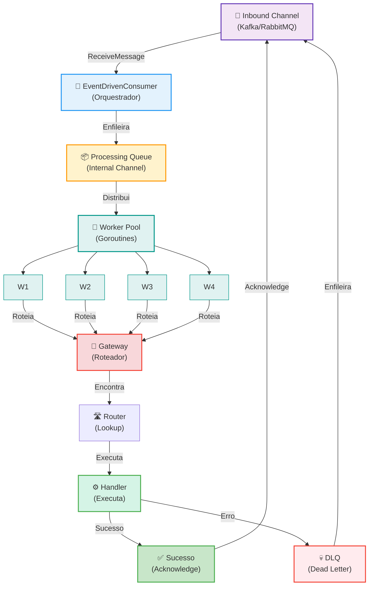
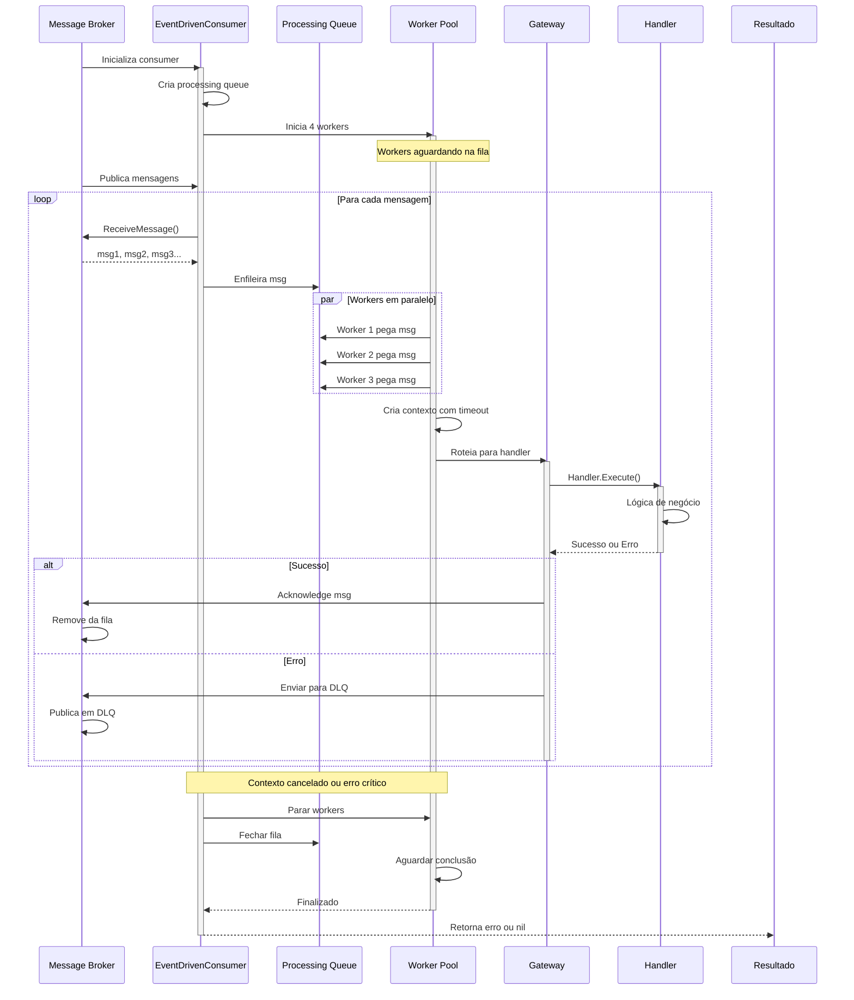

# 🎯 Event-Driven Consumer

**Tipo**: Componente de Consumo  
**Objetivo**: Processar mensagens assincronamente com múltiplos workers paralelos  
**Status**: ✅ Produção

---

## 📖 O que é?

O **EventDrivenConsumer** é o componente responsável por consumir e processar mensagens de forma assíncrona e escalável. Ele escuta um canal de entrada (InboundChannelAdapter), extrai mensagens de uma fila, e as distribui para múltiplos processadores (workers) que trabalham concorrentemente para tratá-las.

O EventDrivenConsumer implementa o padrão **Event-Driven Consumer** dos Enterprise Integration Patterns, permitindo que sua aplicação reaja a eventos/mensagens de forma não-bloqueante. Ele gerencia automaticamente threads/goroutines, timeouts, tratamento de erros, e integração com Dead Letter Channels para mensagens que falham.

Este componente é essencial para sistemas que precisam processar alto volume de mensagens de forma confiável e escalável, permitindo balanceamento de carga entre múltiplos workers.

### Quando Usar

- ✅ **Processamento assíncrono de eventos**: Quando você publica eventos e precisa processá-los sem bloquear
- ✅ **Alta concorrência e escalabilidade**: Quando múltiplos workers precisam processar mensagens em paralelo
- ✅ **Sistemas orientados a eventos**: Quando a arquitetura é event-driven (Kafka, RabbitMQ)
- ✅ **Distribuição de carga**: Quando quer balancear o processamento entre múltiplos workers
- ✅ **Processamento resiliente**: Quando precisa de retry, dead letter channels, e tratamento de erros
- ✅ **Observabilidade com traces**: Quando quer rastrear cada mensagem processada com OpenTelemetry

### Quando NÃO Usar

- ❌ **Processamento síncrono**: Se precisa de resposta imediata, use CommandBus ou QueryBus
- ❌ **Garantia de ordem**: Se a ordem de processamento é crítica (melhor usar 1 processador)
- ❌ **Processamento simples em memória**: Se não usa message broker, EventDrivenConsumer pode ser overkill
- ❌ **Polling simples**: Se precisa apenas consultar dados periodicamente, use PollingConsumer

---

## 🎁 Características Principais

| Característica                | Descrição                                                              |
| ----------------------------- | ---------------------------------------------------------------------- |
| **Processadores paralelos**   | Múltiplos workers independentes processando mensagens concorrentemente |
| **Pool de processamento**     | Fila interna para distribuir mensagens entre processadores             |
| **Timeouts configuráveis**    | Controla tempo máximo para processar cada mensagem                     |
| **Dead Letter Channels**      | Mensagens que falham são automaticamente redirecionadas                |
| **Tratamento de erros**       | Suporte para parar ou continuar em caso de erro                        |
| **OpenTelemetry integrado**   | Traces automáticos de cada mensagem processada                         |
| **Graceful shutdown**         | Desligamento limpo aguardando conclusão dos processadores              |
| **Interceptadores**           | Hooks before/after para preprocessamento e pós-processamento           |
| **Reconhecimento automático** | Mensagens reconhecidas apenas após sucesso                             |
| **ReplyTo dinâmico**          | Suporte para enviar respostas usando header replyTo                    |

---

## 🔧 Implementação Detalhada

### Arquitetura do Consumer

```
┌─────────────────────────────────────────────────────────────┐
│ INBOUND CHANNEL ADAPTER (Kafka, RabbitMQ, etc)             │
│ ↓ ReceiveMessage() contínuamente extrai mensagens          │
└──────────────────┬──────────────────────────────────────────┘
                   ↓
    ┌──────────────────────────────────────┐
    │ PROCESSING QUEUE (Internal Channel) │
    │ • FIFO queue de mensagens            │
    │ • Tamanho configurável               │
    │ • Distribui entre processadores     │
    └──────┬───────────────────────────────┘
           ↓
    ┌──────────────────────────────────────────┐
    │ PROCESSOR POOL (Goroutines)            │
    │                                        │
    │ Worker 1 ──┐                          │
    │ Worker 2 ──┼─→ processa & reconhece  │
    │ Worker 3 ──┤                          │
    │ Worker 4 ──┘                          │
    └──────┬────────────┬────────────────────┘
           ↓            ↓
        ┌────────────────────────┐
        │ GATEWAY (Roteador)     │
        │ • Encontra handler     │
        │ • Interceptadores      │
        │ • Retry & DLQ          │
        └────────┬───────────────┘
                 ↓
         ┌─────────────────────────┐
         │ HANDLER                 │
         │ • Lógica de negócio     │
         │ • Com timeout           │
         │ • Com tracing           │
         └─────────────────────────┘
```

### Fluxo de Processamento de Uma Mensagem

1. **Recebimento** → InboundChannelAdapter.ReceiveMessage()
2. **Enfileiramento** → Inserida na processingQueue
3. **Atribuição** → Worker idle retira da fila
4. **Processamento** → Executa com timeout
5. **Roteamento** → Gateway encontra handler apropriado
6. **Execução** → Handler.Handle(ctx, msg)
7. **Resultado** → Sucesso ou erro
8. **Reconhecimento** → Remove da fila/publica para DLQ

### Características Técnicas

- **Thread-Safe**: ✅ Sim - Usa channels e sync.WaitGroup para segurança
- **Assíncrono**: ✅ Sim - Sempre assíncrono com múltiplas goroutines
- **Concorrente**: ✅ Sim - Suporta múltiplos processadores (workers)
- **Escalável**: ✅ Sim - Cresce com ou scale-out (múltiplas instâncias)
- **Resiliente**: ✅ Sim - Suporta retries, timeout, DLQ, graceful shutdown

---

## 📚 Métodos Públicos

### NewEventDrivenConsumerBuilder(referenceName string)

**Local**: [message/endpoint/event_driven_consumer.go](message/endpoint/event_driven_consumer.go#L54-L59)

**Descrição**: Cria um builder para construir um EventDrivenConsumer. A `referenceName` deve corresponder ao nome registrado do consumer channel.

**Parâmetros**:

- `referenceName`: Nome identificador do consumer channel (deve estar registrado em Gomes)

**Retorno**:

- `*EventDrivenConsumerBuilder`: Builder para configuração fluente

**Exemplo**:

```go
builder := endpoint.NewEventDrivenConsumerBuilder("order-consumer")
```

---

### WithAmountOfProcessors(amount int)

**Local**: [message/endpoint/event_driven_consumer.go](message/endpoint/event_driven_consumer.go#L183-L195)

**Descrição**: Configura quantos processadores (workers) irão processar mensagens em paralelo.

**Parâmetros**:

- `amount`: Número de processadores paralelos (default: 1)

**Retorno**:

- `*EventDrivenConsumer`: Retorna self para method chaining

**Valores recomendados**:

- `1`: Processamento sequencial (garante ordem)
- `4-8`: Pequena/média concorrência
- `10-20`: Alta concorrência
- `100+`: Muito alta concorrência (use com cuidado)

**Exemplo**:

```go
consumer.WithAmountOfProcessors(4)
```

**⚠️ Aviso**: Se a **ordem de processamento é crítica**, não use este setting ou use apenas 1 processador. Processadores paralelos não garantem ordem.

---

### WithMessageProcessingTimeout(milliseconds int)

**Local**: [message/endpoint/event_driven_consumer.go](message/endpoint/event_driven_consumer.go#L166-L176)

**Descrição**: Configura timeout máximo (em milissegundos) para processar cada mensagem.

**Parâmetros**:

- `milliseconds`: Timeout em ms (default: 100000 = 100 segundos)

**Retorno**:

- `*EventDrivenConsumer`: Retorna self para method chaining

**Comportamento**:

- Se handler não completar em tempo, contexto é cancelado
- Handler recebe context.Deadline
- Handler deve respeitar o contexto cancelado

**Valores recomendados**:

- `5000`: 5 segundos (operações muito rápidas)
- `30000`: 30 segundos (padrão recomendado)
- `60000`: 60 segundos (operações lentas)
- `300000`: 5 minutos (operações muito pesadas)

**Exemplo**:

```go
consumer.WithMessageProcessingTimeout(30000)
```

---

### WithStopOnError(value bool)

**Local**: [message/endpoint/event_driven_consumer.go](message/endpoint/event_driven_consumer.go#L198-L208)

**Descrição**: Configura se o consumer deve parar ao encontrar erro no processamento.

**Parâmetros**:

- `value`: true para parar, false para continuar (default: true)

**Retorno**:

- `*EventDrivenConsumer`: Retorna self para method chaining

**Comportamento**:

- `true`: Uma única mensagem que falha causa parada de todo consumer
- `false`: Erros são logados mas consumer continua processando

**Use**:

- `true`: Operações críticas onde um erro invalida tudo
- `false`: Processamento tolerante a falhas (recomendado em produção)

**Exemplo**:

```go
consumer.WithStopOnError(false)
```

---

### Run(ctx context.Context)

**Local**: [message/endpoint/event_driven_consumer.go](message/endpoint/event_driven_consumer.go#L211-L248)

**Descrição**: Inicia o consumer para processar mensagens. Este método é bloqueante e entra em loop infinito até que o contexto seja cancelado ou ocorra erro crítico.

**Parâmetros**:

- `ctx`: Context para cancelamento e timeout

**Retorno**:

- `error`: Erro se ocorrer, nil se parado graciosamente

**Fluxo interno**:

1. Valida configuração
2. Cria fila de processamento
3. Inicia workers
4. Loop infinito:
   - Extrai mensagem do InboundChannelAdapter
   - Enfileira na processingQueue
   - Workers retiram da fila e processam
5. Retorna erro se contexto cancelado ou stopOnError

**Exemplo**:

```go
go func() {
    err := consumer.Run(ctx)
    if err != nil {
        slog.Error("Consumer error", "err", err)
    }
}()
```

---

### Stop()

**Local**: [message/endpoint/event_driven_consumer.go](message/endpoint/event_driven_consumer.go#L347-L349)

**Descrição**: Solicita o consumer para parar de forma graciosa.

**Comportamento**:

- Cancelamento do contexto interno
- Aguarda conclusão dos processadores
- Fecha a fila
- Limpa recursos

**Exemplo**:

```go
consumer.Stop()
```

---

## 🏗️ Diagrama de Componentes



**Componentes Principais**:

- **Inbound Channel**: Kafka, RabbitMQ, ou outro message broker
- **EventDrivenConsumer**: Orquestrador principal
- **Processing Queue**: Fila interna que distribui entre workers
- **Worker Pool**: Múltiplas goroutines processando em paralelo
- **Gateway**: Roteador que encontra o handler apropriado
- **Handler**: Executa a lógica de negócio
- **Success**: Reconhece mensagem (remove da fila)
- **DLQ**: Dead Letter Queue para falhas

---

## 🔄 Diagrama de Execução



**Fluxo**:

1. Consumer inicia e cria workers
2. Loop infinito extrai mensagens do broker
3. Enfileira na fila interna
4. Workers processam em paralelo
5. Gateway roteia para handler
6. Handler processa com timeout
7. Sucesso = acknowledge, Erro = DLQ
8. Contexto cancelado = shutdown gracioso

---

## 💡 Exemplo de Uso Prático

### Setup Completo com EventDrivenConsumer

```go
package main

import (
    "context"
    "fmt"
    "log/slog"
    "time"

    "github.com/jeffersonbrasilino/gomes"
    kafka "github.com/jeffersonbrasilino/gomes/channel/kafka"
)

// ============================================================
// PARTE 1: DEFINIR OS EVENTOS
// ============================================================

type OrderCreatedEvent struct {
    OrderID    string  `json:"orderId"`
    CustomerID string  `json:"customerId"`
    Amount     float64 `json:"amount"`
}

func (e *OrderCreatedEvent) Name() string {
    return "orderCreated"
}

type PaymentConfirmedEvent struct {
    PaymentID string  `json:"paymentId"`
    OrderID   string  `json:"orderId"`
    Amount    float64 `json:"amount"`
}

func (e *PaymentConfirmedEvent) Name() string {
    return "paymentConfirmed"
}

// ============================================================
// PARTE 2: DEFINIR OS HANDLERS
// ============================================================

// Handler 1: Processar notificação de pedido
type ProcessOrderNotificationHandler struct{}

func (h *ProcessOrderNotificationHandler) Handle(
    ctx context.Context,
    event *OrderCreatedEvent,
) (any, error) {
    slog.Info("Processando notificação de pedido",
        "orderId", event.OrderID,
        "customer", event.CustomerID,
    )

    // Simular processamento
    time.Sleep(500 * time.Millisecond)

    slog.Info("✅ Notificação processada")
    return nil, nil
}

// Handler 2: Atualizar status de pagamento
type UpdatePaymentStatusHandler struct{}

func (h *UpdatePaymentStatusHandler) Handle(
    ctx context.Context,
    event *PaymentConfirmedEvent,
) (any, error) {
    slog.Info("Atualizando status de pagamento",
        "paymentId", event.PaymentID,
        "orderId", event.OrderID,
    )

    time.Sleep(300 * time.Millisecond)

    slog.Info("✅ Status atualizado")
    return nil, nil
}

// ============================================================
// PARTE 3: SETUP DO SISTEMA
// ============================================================

func initializeGomes() error {
    // 1. Registrar conexão Kafka
    gomes.AddChannelConnection(
        kafka.NewConnection("kafka", []string{"localhost:9092"}),
    )

    // 2. Registrar canais de consumo
    orderConsumer := kafka.NewConsumerChannelAdapterBuilder(
        "kafka",
        "order.events",
        "order-consumer-group",
    )
    // Configurar Dead Letter Queue
    orderConsumer.WithDeadLetterChannelName("order.events.dlq")
    gomes.AddConsumerChannel(orderConsumer)

    paymentConsumer := kafka.NewConsumerChannelAdapterBuilder(
        "kafka",
        "payment.events",
        "payment-consumer-group",
    )
    paymentConsumer.WithDeadLetterChannelName("payment.events.dlq")
    gomes.AddConsumerChannel(paymentConsumer)

    // 3. Registrar canais de publicação (para resposta/DLQ)
    gomes.AddPublisherChannel(
        kafka.NewPublisherChannelAdapterBuilder("kafka", "order.events"),
    )
    gomes.AddPublisherChannel(
        kafka.NewPublisherChannelAdapterBuilder("kafka", "order.events.dlq"),
    )
    gomes.AddPublisherChannel(
        kafka.NewPublisherChannelAdapterBuilder("kafka", "payment.events"),
    )
    gomes.AddPublisherChannel(
        kafka.NewPublisherChannelAdapterBuilder("kafka", "payment.events.dlq"),
    )

    // 4. Registrar handlers
    gomes.AddActionHandler(&ProcessOrderNotificationHandler{})
    gomes.AddActionHandler(&UpdatePaymentStatusHandler{})

    // 5. Iniciar sistema
    if err := gomes.Start(); err != nil {
        return fmt.Errorf("erro ao iniciar Gomes: %w", err)
    }

    return nil
}

// ============================================================
// PARTE 4: EXEMPLO 1 - CONSUMER BÁSICO
// ============================================================

func exampleBasicConsumer(ctx context.Context) error {
    slog.Info("=== Exemplo 1: Consumer Básico ===")

    // Obter consumer construído automaticamente por Gomes
    consumer, err := gomes.EventDrivenConsumer("order-consumer-group")
    if err != nil {
        return err
    }

    // Configurar com padrões
    consumer.
        WithAmountOfProcessors(1).
        WithMessageProcessingTimeout(10000).
        WithStopOnError(true)

    slog.Info("Consumer básico configurado")
    slog.Info("✅ 1 processador, 10s timeout, para em erro")

    return nil
}

// ============================================================
// PARTE 5: EXEMPLO 2 - CONSUMER ESCALADO
// ============================================================

func exampleScaledConsumer(ctx context.Context) error {
    slog.Info("=== Exemplo 2: Consumer Escalado ===")

    consumer, _ := gomes.EventDrivenConsumer("order-consumer-group")

    // Configurar para alta concorrência
    consumer.
        WithAmountOfProcessors(8).              // 8 workers paralelos
        WithMessageProcessingTimeout(30000).   // 30 segundos
        WithStopOnError(false).                 // Continuar em erro
        Run(ctx)

    slog.Info("✅ Consumer escalado iniciado")
    slog.Info("   8 processors, 30s timeout, continua em erro")

    return nil
}

// ============================================================
// PARTE 6: EXEMPLO 3 - MULTIPLE CONSUMERS
// ============================================================

func exampleMultipleConsumers(ctx context.Context) error {
    slog.Info("=== Exemplo 3: Múltiplos Consumers ===")

    // Consumer 1 para Order Events
    orderConsumer, _ := gomes.EventDrivenConsumer("order-consumer-group")
    go func() {
        err := orderConsumer.
            WithAmountOfProcessors(4).
            WithMessageProcessingTimeout(20000).
            WithStopOnError(false).
            Run(ctx)
        if err != nil {
            slog.Error("Order consumer error", "err", err)
        }
    }()

    slog.Info("✅ Order consumer iniciado")

    // Consumer 2 para Payment Events
    paymentConsumer, _ := gomes.EventDrivenConsumer("payment-consumer-group")
    go func() {
        err := paymentConsumer.
            WithAmountOfProcessors(2).
            WithMessageProcessingTimeout(15000).
            WithStopOnError(false).
            Run(ctx)
        if err != nil {
            slog.Error("Payment consumer error", "err", err)
        }
    }()

    slog.Info("✅ Payment consumer iniciado")
    slog.Info("💡 Ambos os consumers rodando em paralelo!")

    return nil
}

// ============================================================
// PARTE 7: EXEMPLO 4 - CONSUMER COM CONTROLE MANUAL
// ============================================================

func exampleControlledConsumer(ctx context.Context) error {
    slog.Info("=== Exemplo 4: Consumer com Controle Manual ===")

    consumer, _ := gomes.EventDrivenConsumer("order-consumer-group")

    // Iniciar consumer em goroutine
    stopChan := make(chan error, 1)
    go func() {
        err := consumer.
            WithAmountOfProcessors(4).
            WithMessageProcessingTimeout(30000).
            WithStopOnError(false).
            Run(ctx)
        stopChan <- err
    }()

    slog.Info("✅ Consumer iniciado com controle manual")

    // Aguardar um tempo
    time.Sleep(10 * time.Second)

    // Parar consumer manualmente
    slog.Info("Parando consumer...")
    consumer.Stop()

    // Aguardar conclusão
    err := <-stopChan
    if err != nil {
        slog.Error("Consumer parou com erro", "err", err)
    } else {
        slog.Info("✅ Consumer parou graciosamente")
    }

    return nil
}

// ============================================================
// PARTE 8: EXEMPLO 5 - TUNING PARA DIFERENTES CARGAS
// ============================================================

func exampleTuningForLoads(ctx context.Context) {
    slog.Info("=== Exemplo 5: Tuning para Diferentes Cargas ===")

    // Cenário 1: Operações muito rápidas (< 100ms)
    slog.Info("Cenário 1: Operações muito rápidas")
    fastConsumer, _ := gomes.EventDrivenConsumer("fast-consumer")
    fastConsumer.
        WithAmountOfProcessors(16).         // Muitos workers
        WithMessageProcessingTimeout(5000). // Timeout curto (5s)
        WithStopOnError(false)
    slog.Info("  16 processors, 5s timeout")

    // Cenário 2: Operações normais (1-2 segundos)
    slog.Info("Cenário 2: Operações normais")
    normalConsumer, _ := gomes.EventDrivenConsumer("normal-consumer")
    normalConsumer.
        WithAmountOfProcessors(8).          // Workers moderados
        WithMessageProcessingTimeout(30000).// Timeout padrão (30s)
        WithStopOnError(false)
    slog.Info("  8 processors, 30s timeout (recomendado)")

    // Cenário 3: Operações lentas (10-30 segundos)
    slog.Info("Cenário 3: Operações lentas")
    slowConsumer, _ := gomes.EventDrivenConsumer("slow-consumer")
    slowConsumer.
        WithAmountOfProcessors(2).          // Poucos workers
        WithMessageProcessingTimeout(60000).// Timeout longo (60s)
        WithStopOnError(false)
    slog.Info("  2 processors, 60s timeout")

    // Cenário 4: Processamento crítico (ordem important)
    slog.Info("Cenário 4: Processamento com ordem garantida")
    criticalConsumer, _ := gomes.EventDrivenConsumer("critical-consumer")
    criticalConsumer.
        WithAmountOfProcessors(1).          // Sequencial!
        WithMessageProcessingTimeout(30000).
        WithStopOnError(true)               // Para em erro
    slog.Info("  1 processor, 30s timeout, para em erro")
}

// ============================================================
// PARTE 9: EXEMPLO 6 - PUBLISHER & CONSUMER JUNTOS
// ============================================================

func examplePublisherAndConsumer(ctx context.Context) {
    slog.Info("=== Exemplo 6: Publisher e Consumer Juntos ===")

    // Iniciar consumer
    consumer, _ := gomes.EventDrivenConsumer("order-consumer-group")
    go func() {
        consumer.
            WithAmountOfProcessors(4).
            WithMessageProcessingTimeout(30000).
            WithStopOnError(false).
            Run(ctx)
    }()

    slog.Info("Consumer iniciado, aguardando mensagens...")
    time.Sleep(1 * time.Second)

    // Publicar eventos
    eventBus, _ := gomes.EventBusByChannel("order.events")

    for i := 1; i <= 10; i++ {
        err := eventBus.Publish(ctx, &OrderCreatedEvent{
            OrderID:    fmt.Sprintf("ORD-%03d", i),
            CustomerID: fmt.Sprintf("CUST-%02d", i%5),
            Amount:     float64(i) * 100,
        })

        if err != nil {
            slog.Error("Erro ao publicar", "err", err)
        } else {
            slog.Info("Evento publicado", "orderId", fmt.Sprintf("ORD-%03d", i))
        }

        time.Sleep(100 * time.Millisecond)
    }

    slog.Info("✅ 10 eventos publicados")
    slog.Info("💡 Consumer com 4 workers processando em paralelo")

    // Aguardar processamento
    time.Sleep(5 * time.Second)
}

// ============================================================
// PARTE 10: MAIN
// ============================================================

func main() {
    slog.SetDefault(slog.New(slog.NewTextHandler(os.Stderr, nil)))

    if err := initializeGomes(); err != nil {
        slog.Error("Erro ao inicializar", "err", err)
        panic(err)
    }

    ctx, cancel := context.WithCancel(context.Background())
    defer cancel()

    // Executar exemplos
    exampleMultipleConsumers(ctx)
    examplePublisherAndConsumer(ctx)

    slog.Info("✅ Demonstração completa!")
    slog.Info("Pressione Ctrl+C para sair...")

    time.Sleep(30 * time.Second)
    cancel()

    gomes.Shutdown()
}
```

### Configuração por Tipo de Workload

```go
// 📊 Pequena carga - poucos eventos
consumer.WithAmountOfProcessors(1).Run(ctx)

// 📈 Média carga - centenas de eventos/segundo
consumer.WithAmountOfProcessors(4).Run(ctx)

// 📊 Alta carga - milhares de eventos/segundo
consumer.WithAmountOfProcessors(8).WithStopOnError(false).Run(ctx)

// 🚀 Muito alta carga - distribuído em múltiplas instâncias
consumer.WithAmountOfProcessors(16).WithStopOnError(false).Run(ctx)
// + escalar horizontalmente com múltiplas instâncias
```

---

## ✅ Boas Práticas

- ✅ **Configure múltiplos processadores para escala**: Use pelo menos 4-8 para distribuir carga
- ✅ **Use timeout apropriado**: 30 segundos é bom padrão, ajuste conforme need
- ✅ **Configure WithStopOnError(false)**: Erro em uma mensagem não deve derrubar consumer
- ✅ **Implemente idempotência**: Message pode ser processada múltiplas vezes (retries)
- ✅ **Use Dead Letter Channels**: Configure DLQ para investigar falhas
- ✅ **Monitore com logs**: Use structured logging para rastrear processamento
- ✅ **Teste com carga**: Determine número ideal de processadores
- ✅ **Escale horizontalmente**: Execute múltiplas instâncias para distribuir
- ✅ **Use graceful shutdown**: Aguarde conclusão de mensagens ao parar
- ✅ **Rastreie com OpenTelemetry**: Consumer já integra traces automáticos

### Padrões Recomendados

#### Processamento Sequencial (Ordem Importante)

```go
consumer.
    WithAmountOfProcessors(1).              // 1 worker = sequencial
    WithMessageProcessingTimeout(30000).
    WithStopOnError(true).                  // Para em erro
    Run(ctx)
```

#### Processamento Tolerante (Pena é Crítica)

```go
consumer.
    WithAmountOfProcessors(8).              // Múltiplos workers
    WithMessageProcessingTimeout(30000).
    WithStopOnError(false).                 // Continua em erro
    Run(ctx)
```

#### Processamento em Background (Baixa Prioridade)

```go
consumer.
    WithAmountOfProcessors(4).
    WithMessageProcessingTimeout(60000).    // Timeout longo
    WithStopOnError(false).
    Run(ctx)
```

### Erros Comuns a Evitar

- ❌ **Usar 1 processador esperando paralelismo**: Mude para 4+ para real concorrência
- ❌ **Timeout muito curto**: Handler rápido talvez falhe. Use pelo menos 5-10 segundos
- ❌ **Timeout muito longo**: Sistema demora para reagir a falhas. 60 segundos máximo
- ❌ **StopOnError(true) em produção**: Uma mensagem com erro derruba todo consumer
- ❌ **Sem Dead Letter Channel**: Failed messages desaparecem sem trace
- ❌ **Sem tratamento de erro no handler**: Erros silenciosos são piores
- ❌ **Handler bloqueia em sleep/wait**: Consumer fica lento, use context
- ❌ **Não implementar idempotência**: Message pode ser processada 2x, estado fica inconsistente
- ❌ **Usar número muito alto de processors**: Cria contenção, não melhora concorrência

---

## 🔍 Troubleshooting

### Problema: Consumer nunca processa mensagens

**Sintomas**:

- Consumer iniciado
- Eventos publicados
- Handler nunca é chamado
- Sem mensagens de erro

**Causa**: Consumer channel não está registrado ou nome não corresponde

**Solução**:

```go
// ✅ Registrar consumer channel ANTES de iniciar
consumerChannel := kafka.NewConsumerChannelAdapterBuilder(
    "kafka",
    "order.events",
    "order-consumer-group",
)
gomes.AddConsumerChannel(consumerChannel)

// ✅ Usar MESMO nome ao obter consumer
consumer, _ := gomes.EventDrivenConsumer("order-consumer-group")

// ✅ Iniciar depois de configurar
err := consumer.Run(ctx)
```

---

### Problema: Timeout ao processar mensagem

**Sintomas**:

- Erro: `message processing timeout`
- Handler não completa a tempo

**Causa**: Timeout configurado é menor que o tempo de execução

**Solução**:

```go
// ❌ Errado - timeout muito curto
consumer.WithMessageProcessingTimeout(1000).Run(ctx) // 1 segundo!

// ✅ Correto - dar tempo suficiente
consumer.WithMessageProcessingTimeout(30000).Run(ctx) // 30 segundos

// ✅ Se handler é muito lento
consumer.WithMessageProcessingTimeout(120000).Run(ctx) // 2 minutos
```

---

### Problema: Uma mensagem com erro para todo consumer

**Sintomas**:

- Handler lança erro
- Consumer inteiro para de processar
- Sem mais mensagens sendo consumidas

**Causa**: `WithStopOnError(true)` (padrão)

**Solução**:

```go
// ❌ Errado - para em erro
consumer.WithStopOnError(true).Run(ctx) // Default!

// ✅ Correto - continua em erro
consumer.WithStopOnError(false).Run(ctx)
```

---

### Problema: Performance baixa, muitas mensagens acumulando

**Sintomas**:

- Lag do consumer aumenta
- Fila cresce constantemente
- Mensagens não são processadas rápido

**Causa**: Número de processadores insuficiente para carga

**Solução**:

```go
// ❌ Insuficiente
consumer.WithAmountOfProcessors(1).Run(ctx) // Default!

// ✅ Aumentar para distribuir carga
consumer.WithAmountOfProcessors(8).Run(ctx)

// ✅ Ou escalar horizontalmente
// - Instância 1: 4 processors
// - Instância 2: 4 processors
// - Instância 3: 4 processors
// Total: 12 processors distribuídos
```

---

### Problema: Mensagens duplicadas sendo processadas

**Sintomas**:

- Handler executado 2+ vezes
- Mesmo evento duplicado no sistema

**Causa**: Falta de reconhecimento (de ack) ou timeout longo

**Solução**:

```go
// Implementar idempotência no handler
type MyHandler struct{}
func (h *MyHandler) Handle(ctx context.Context, event *MyEvent) (any, error) {
    // Verificar se já foi processado
    if processed := checkIfProcessed(event.ID); processed {
        slog.Info("Já foi processado", "id", event.ID)
        return nil, nil // Retornar sucesso sem duplicar
    }

    // Processar
    result := process(event)

    // Marcar como processado
    markAsProcessed(event.ID)

    return result, nil
}
```

---

### Problema: Memory leak, uso de memória crescente

**Sintomas**:

- Memória cresce indefinidamente
- Sem erro nos logs
- Consumer fica lento com o tempo

**Causa**: Goroutines não finalizadas ou contexto não cancelado

**Solução**:

```go
// ✅ Garantir que consumer para corretamente
consumer.Stop()

// ✅ Ou cancelar contexto
cancel() // context.WithCancel

// ✅ Usar defer para garantir limpeza
defer func() {
    consumer.Stop()
    gomes.Shutdown()
}()

// ✅ Em goroutine, sempre aguardar conclusão
go func() {
    err := consumer.Run(ctx)
    // ... ctx foi cancelado, consumer parou
}()
```

---

## 📚 Referências Internas

- [EventDrivenConsumer Code](message/endpoint/event_driven_consumer.go): Implementação completa
- [Gateway](message/endpoint/gateway.go): Roteador de mensagens
- [Exemplo EventDrivenConsumer](examples/event_driven_consumer/main.go): Código de exemplo
- [Event Processing Flow](event-processing-flow.md): Fluxo geral de eventos
- [Command Bus Documentation](command-bus.md): Entender diferenças com Consumer

---

## 📚 Referências Externas

- [Event-Driven Consumer Pattern](https://www.enterpriseintegrationpatterns.com/patterns/messaging/EventDrivenConsumer.html): Enterprise Integration Patterns
- [Go Concurrency Patterns](https://go.dev/blog/pipelines): Padrões de concorrência
- [Context Usage](https://go.dev/blog/context): Best practices com context
- [Kafka Consumer Groups](https://kafka.apache.org/documentation/#consumerconfigs): Kafka docs
- [RabbitMQ Consumers](https://www.rabbitmq.com/consumers.html): RabbitMQ docs

---

**Última Atualização**: 16 de fevereiro de 2026  
**Status**: ✅ Produção  
**Versão do Gomes**: v1.0+  
**Mantido por**: Especialista em Desenvolvimento Backend
