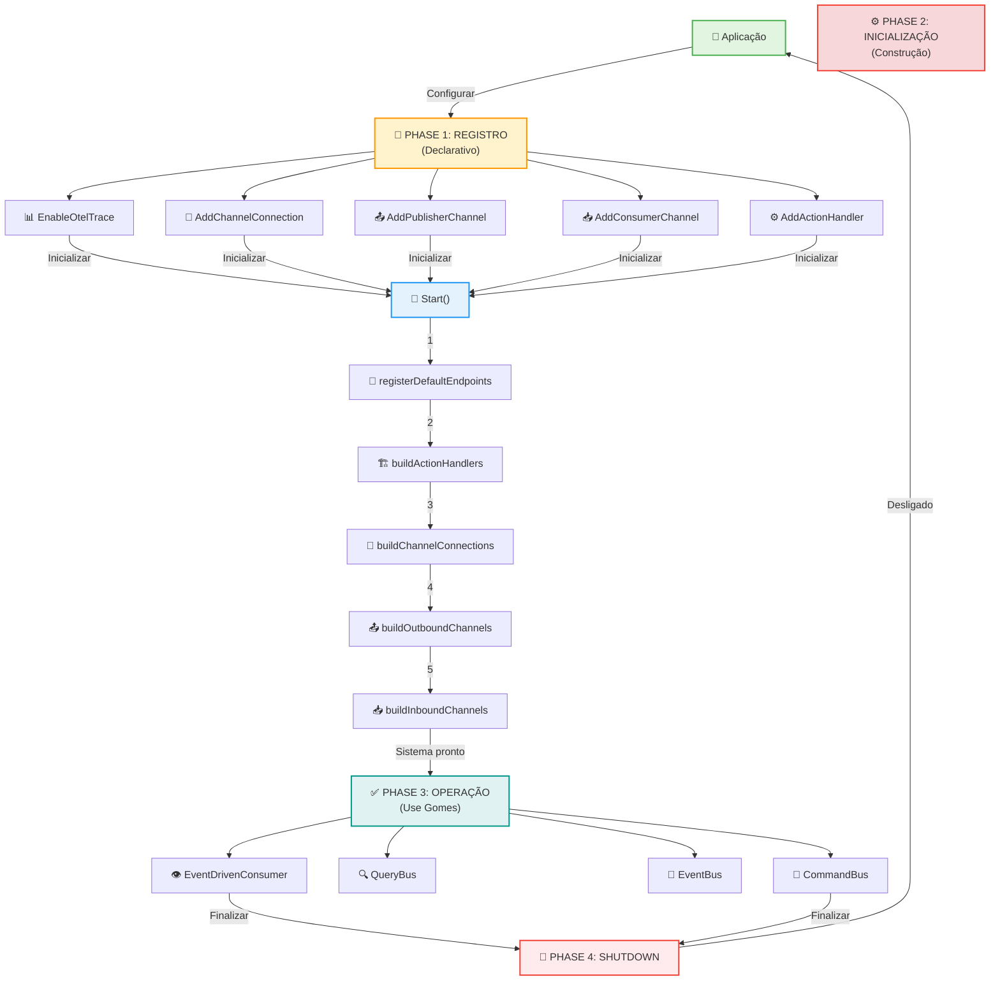
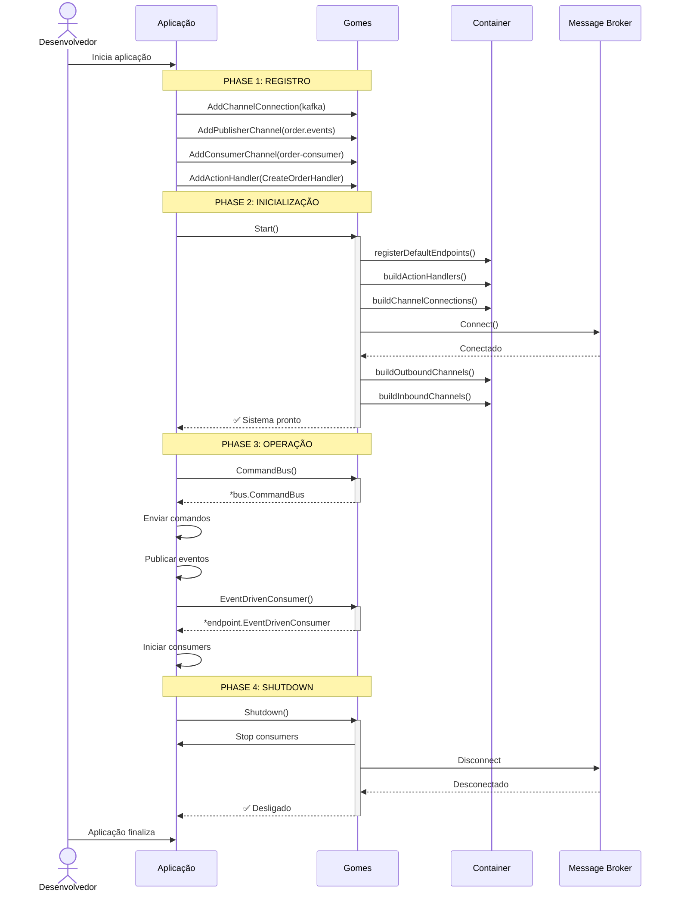

# 🎯 Gomes Bootstrap & Initialization

**Tipo**: Sistema/Framework  
**Objetivo**: Configurar e inicializar o plugin Gomes com todos os componentes necessários  
**Status**: ✅ Produção

---

## 📖 O que é?

O **Gomes Bootstrap** é o processo de inicialização do sistema de mensagens Gomes. Ele gerencia o ciclo de vida completo da plataforma, desde o registro de componentes (conexões, canais, handlers) até a inicialização das estruturas internas e a obtenção dos buses para operações.

O bootstrap implementa o padrão de **inicialização declarativa**, permitindo que você registre todos os componentes desejados antes de iniciar o sistema. Após `gomes.Start()`, todo o sistema está pronto para ser utilizado. O bootstrap também gerencia o encerramento gracioso (graceful shutdown) quando a aplicação termina.

Este é o ponto de entrada essencial para qualquer aplicação que use Gomes. Compreender o bootstrap é fundamental para integrar corretamente o framework em sua arquitetura.

### Quando Usar

- ✅ **Inicialize qualquer aplicação com Gomes**: Sempre necessário como primeiro passo
- ✅ **Setup de ambiente multi-ambiente**: Configure diferentes canais por ambiente
- ✅ **Integração com message brokers**: Registre conexões Kafka, RabbitMQ, etc
- ✅ **Gerenciamento de ciclo de vida**: Inicialize e desligue a aplicação corretamente
- ✅ **Injeção de dependência**: Registre handlers e canais antes de usar
- ✅ **Observabilidade**: Habilite traces antes de iniciar

### Quando NÃO Usar

- ❌ **Operações após Shutdown**: Sistema está desligado, não funciona mais
- ❌ **Sem registrar handlers**: Handlers devem ser registrados ANTES de Start()
- ❌ **Sem registrar conexões**: Conexões devem estar configuradas ANTES de Start()
- ❌ **Start múltiplas vezes**: Start() deve ser chamado uma única vez

---

## 🎁 Características Principais

| Característica                 | Descrição                                                     |
| ------------------------------ | ------------------------------------------------------------- |
| **Registro declarativo**       | Registre componentes antes de inicializar                     |
| **Inicialização ordenada**     | Componentes inicializam em ordem correta (dependências first) |
| **Múltiplos buses**            | CommandBus, QueryBus, EventBus com suporte a múltiplos canais |
| **Gerenciamento de endpoints** | Rastreamento automático de endpoints ativos                   |
| **Graceful shutdown**          | Desligamento limpo com aguardo de conclusão                   |
| **Observabilidade integrada**  | Suporte nativo para OpenTelemetry traces                      |
| **Depuração**                  | Função para visualizar endpoints ativos                       |
| **Injeção de dependências**    | Sistema de containers para resolução de dependências          |
| **Multi-tenancy ready**        | Suporte a múltiplos consumer/publisher channels               |
| **Type-safe**                  | Generics do Go para máxima segurança de tipos                 |

---

## 🔧 Implementação Detalhada

### Arquitetura do Bootstrap

```
┌─────────────────────────────────────────────────────────────┐
│ APLICAÇÃO                                                   │
│ (Seu código)                                                │
└────────────────┬────────────────────────────────────────────┘
                 ↓
    ┌────────────────────────────────────────┐
    │ 1. REGISTRO DE COMPONENTES             │
    │ • AddChannelConnection()               │
    │ • AddPublisherChannel()                │
    │ • AddConsumerChannel()                 │
    │ • AddActionHandler()                   │
    │ • EnableOtelTrace()                    │
    └────────────────┬───────────────────────┘
                     ↓
    ┌────────────────────────────────────────┐
    │ 2. START() - INICIALIZAÇÃO             │
    │ • registerDefaultEndpoints()           │
    │ • buildActionHandlers()                │
    │ • buildChannelConnections()            │
    │ • buildOutboundChannels()              │
    │ • buildInboundChannels()               │
    └────────────────┬───────────────────────┘
                     ↓
    ┌────────────────────────────────────────┐
    │ 3. SISTEMA PRONTO                      │
    │ • CommandBus()                         │
    │ • QueryBus()                           │
    │ • EventBus()                           │
    │ • EventDrivenConsumer()                │
    └────────────────┬───────────────────────┘
                     ↓
    ┌────────────────────────────────────────┐
    │ 4. OPERAÇÕES (Send, Publish, Consume) │
    │ • Enviar comandos/queries              │
    │ • Publicar eventos                     │
    │ • Consumir mensagens                   │
    └────────────────┬───────────────────────┘
                     ↓
    ┌────────────────────────────────────────┐
    │ 5. SHUTDOWN() - ENCERRAMENTO           │
    │ • Stop consumers                       │
    │ • Close channels                       │
    │ • Disconnect connections               │
    │ • Cleanup recursos                     │
    └─────────────────────────────────────────┘
```

### Ordem de Inicialização

O método `Start()` executa as seguintes etapas em ordem:

1. **registerDefaultEndpoints()** - Cria CommandBus e QueryBus padrão
2. **buildActionHandlers()** - Constrói todos os handlers registrados
3. **buildChannelConnections()** - Conecta a todos os message brokers
4. **buildOutboundChannels()** - Cria adaptadores de publicação
5. **buildInboundChannels()** - Cria adaptadores de consumo

**Cada etapa depende da anterior**, garantindo que componentes estejam disponíveis quando necessários.

### Ciclo de Vida da Aplicação

```
Aplicação Inicia
        ↓
    PHASE 1: REGISTRO
    (pode haver múltiplas chamadas em qualquer ordem)
    • gomes.AddChannelConnection()
    • gomes.AddPublisherChannel()
    • gomes.AddConsumerChannel()
    • gomes.AddActionHandler()
    • gomes.EnableOtelTrace() (opcional)
        ↓
    PHASE 2: INICIALIZAÇÃO
    • gomes.Start() ← Ponto crítico!
    (chamada APENAS UMA VEZ)
        ↓
    PHASE 3: OPERAÇÃO
    • bus := gomes.CommandBus()
    • consumer := gomes.EventDrivenConsumer()
    • Enviar/consumir mensagens
        ↓
    PHASE 4: ENCERRAMENTO
    • gomes.Shutdown()
    (chamada ao final da aplicação)
        ↓
    Aplicação Termina
```

### Características Técnicas

- **Thread-Safe**: ✅ Sim - Usa containers sincronizados
- **Assíncrono**: ⚠️ Parcial - Startup é síncrono, consumers são assincronos
- **Idempotente**: ❌ Não - Start() deve ser chamado apenas uma vez
- **Configurável**: ✅ Sim - Cada componente é registrável antes de Start()

---

## 📚 Métodos Públicos

### AddChannelConnection(con adapter.ChannelConnection)

**Local**: [gomes.go](gomes.go#L115-L125)

**Descrição**: Registra uma conexão com um message broker (Kafka, RabbitMQ, etc). Deve ser chamado ANTES de `Start()`.

**Parâmetros**:

- `con`: Implementação de ChannelConnection (ex: kafka.NewConnection)

**Retorno**:

- `error`: Erro se uma conexão com mesmo nome já existe

**Quando usar**:

- Assim que a aplicação inicia, antes de qualquer outra operação

**Exemplo**:

```go
gomes.AddChannelConnection(
    kafka.NewConnection("kafka", []string{"localhost:9092"}),
)
```

---

### AddPublisherChannel(publisher BuildableComponent[endpoint.OutboundChannelAdapter])

**Local**: [gomes.go](gomes.go#L76-L87)

**Descrição**: Registra um canal de publicação (tópico/fila onde enviar mensagens). Deve ser chamado ANTES de `Start()`.

**Parâmetros**:

- `publisher`: Builder de canal de publicação (ex: kafka.NewPublisherChannelAdapterBuilder)

**Retorno**:

- `error`: Erro se um canal com mesmo nome já existe

**Exemplo**:

```go
gomes.AddPublisherChannel(
    kafka.NewPublisherChannelAdapterBuilder("kafka", "order.events"),
)
```

---

### AddConsumerChannel(inboundChannel BuildableComponent[*adapter.InboundChannelAdapter])

**Local**: [gomes.go](gomes.go#L157-L167)

**Descrição**: Registra um canal de consumo (tópico/fila para ler mensagens). Deve ser chamado ANTES de `Start()`.

**Parâmetros**:

- `inboundChannel`: Builder de canal de consumo (ex: kafka.NewConsumerChannelAdapterBuilder)

**Retorno**:

- `error`: Erro se um consumer com mesmo nome já existe

**Exemplo**:

```go
gomes.AddConsumerChannel(
    kafka.NewConsumerChannelAdapterBuilder(
        "kafka",
        "order.events",        // tópico
        "order-consumer-group", // grupo
    ),
)
```

---

### AddActionHandler[T, U](handlerAction handler.ActionHandler[T, U])

**Local**: [gomes.go](gomes.go#L224-L245)

**Descrição**: Registra um handler que processará comandos, queries ou eventos. Deve ser chamado ANTES de `Start()`.

**Parâmetros**:

- `handlerAction`: Implementação de ActionHandler para um tipo específico

**Retorno**:

- `error`: Erro se handler é nil ou já existe para essa ação

**Exemplo**:

```go
gomes.AddActionHandler(&CreateOrderHandler{})
gomes.AddActionHandler(&UpdatePaymentStatusHandler{})
```

---

### Start()

**Local**: [gomes.go](gomes.go#L277-L297)

**Descrição**: Inicializa o sistema Gomes. Deve ser chamado DEPOIS de registrar todos os componentes e ANTES de usar qualquer bus ou consumer.

**Retorno**:

- `error`: Erro se qualquer componente falhar ao inicializar

**Ordem de execução**:

1. Registra endpoints padrão (CommandBus, QueryBus)
2. Constrói todos os action handlers
3. Conecta a todos os message brokers
4. Cria adaptadores de publicação (outbound)
5. Cria adaptadores de consumo (inbound)

**Exemplo**:

```go
if err := gomes.Start(); err != nil {
    slog.Error("Erro ao iniciar Gomes", "err", err)
    panic(err)
}
```

---

### CommandBus()

**Local**: [gomes.go](gomes.go#L299-L310)

**Descrição**: Retorna o CommandBus padrão para enviar comandos síncronos ou assincronos. Deve ser chamado DEPOIS de `Start()`.

**Retorno**:

- `*bus.CommandBus`: Bus para enviar comandos
- `error`: Erro se sistema não inicializado

**Exemplo**:

```go
commandBus, err := gomes.CommandBus()
if err != nil {
    return err
}
result, err := commandBus.Send(ctx, &CreateOrderCommand{...})
```

---

### QueryBus()

**Local**: [gomes.go](gomes.go#L312-L323)

**Descrição**: Retorna o QueryBus padrão para executar queries síncronas. Deve ser chamado DEPOIS de `Start()`.

**Retorno**:

- `*bus.QueryBus`: Bus para executar queries
- `error`: Erro se sistema não inicializado

**Exemplo**:

```go
queryBus, err := gomes.QueryBus()
if err != nil {
    return err
}
result, err := queryBus.Execute(ctx, &GetOrderQuery{OrderID: "123"})
```

---

### EventBusByChannel(channelName string)

**Local**: [gomes.go](gomes.go#L371-L390)

**Descrição**: Retorna um EventBus para publicar eventos em um canal específico. Deve ser chamado DEPOIS de `Start()`.

**Parâmetros**:

- `channelName`: Nome do canal registrado via AddPublisherChannel

**Retorno**:

- `*bus.EventBus`: Bus para publicar eventos
- `error`: Erro se canal não existe

**Exemplo**:

```go
eventBus, err := gomes.EventBusByChannel("order.events")
if err != nil {
    return err
}
err = eventBus.Publish(ctx, &OrderCreatedEvent{...})
```

---

### EventDrivenConsumer(consumerName string)

**Local**: [gomes.go](gomes.go#L392-L410)

**Descrição**: Cria um consumer para processar mensagens assincronamente de um canal registrado. Deve ser chamado DEPOIS de `Start()`.

**Parâmetros**:

- `consumerName`: Nome do consumer registrado via AddConsumerChannel

**Retorno**:

- `*endpoint.EventDrivenConsumer`: Consumer para processar mensagens
- `error`: Erro se consumer já existe ou não registrado

**Exemplo**:

```go
consumer, err := gomes.EventDrivenConsumer("order-consumer-group")
if err != nil {
    return err
}
err = consumer.
    WithAmountOfProcessors(4).
    WithMessageProcessingTimeout(30000).
    WithStopOnError(false).
    Run(ctx)
```

---

### Shutdown()

**Local**: [gomes.go](gomes.go#L412-L442)

**Descrição**: Encerra o sistema Gomes de forma graciosa. Deve ser chamado quando a aplicação está encerrando.

**Comportamento**:

1. Para todos os EventDrivenConsumers
2. Fecha todos os canais de consumo
3. Desconecta de todos os brokers
4. Fecha todos os adaptadores de publicação

**Exemplo**:

```go
defer gomes.Shutdown()

if err := gomes.Start(); err != nil {
    panic(err)
}

// ... usar gomes ...

// Ao final
gomes.Shutdown()
```

---

### ShowActiveEndpoints()

**Local**: [gomes.go](gomes.go#L444-L470)

**Descrição**: Exibe todos os endpoints ativos no sistema. Útil para debug e monitoramento.

**Saída**: Tabela formatada mostrando nome e tipo de cada endpoint

**Exemplo**:

```go
gomes.Start()
gomes.ShowActiveEndpoints()
// Output:
// ---[Message System] Active Endpoints ---
// Endpoint Name                | Type
// -------------------------------------------
// default.channel.command      | [outbound] Command-Bus
// default.channel.query        | [outbound] Query-Bus
// order.events                 | [outbound] Event-Bus
// order-consumer-group         | [inbound] Event-Driven
```

---

### EnableOtelTrace()

**Local**: [gomes.go](gomes.go#L472-L477)

**Descrição**: Habilita distributed tracing com OpenTelemetry. Deve ser chamado ANTES de `Start()`.

**Exemplo**:

```go
gomes.EnableOtelTrace()
gomes.Start()
```

---

## 🏗️ Diagrama de Componentes



**Fases Principais**:

1. **REGISTRO**: Declarar componentes (pode ser em qualquer ordem)
2. **INICIALIZAÇÃO**: Start() constrói tudo (ordem específica)
3. **OPERAÇÃO**: Use CommandBus, QueryBus, EventBus, Consumers
4. **SHUTDOWN**: Encerre de forma graciosa

---

## 🔄 Diagrama de Execução



**Fluxo**:

1. Desenvolvedor inicia a aplicação
2. Registra todos os componentes (fase 1)
3. Chama Start() uma única vez (fase 2 - automática)
4. Usa CommandBus, QueryBus, EventBus (fase 3)
5. Chama Shutdown() ao encerrar (fase 4)

---

## 💡 Exemplo de Uso Prático

### Setup Completo do Gomes Bootstrap

```go
package main

import (
    "context"
    "fmt"
    "log/slog"
    "os"
    "os/signal"
    "syscall"
    "time"

    "github.com/jeffersonbrasilino/gomes"
    kafka "github.com/jeffersonbrasilino/gomes/channel/kafka"
)

// ============================================================
// PARTE 1: DEFINIR EVENTOS E HANDLERS
// ============================================================

type OrderCreatedEvent struct {
    OrderID string `json:"orderId"`
    Amount  float64 `json:"amount"`
}

func (e *OrderCreatedEvent) Name() string {
    return "orderCreated"
}

type OrderCreatedHandler struct{}

func (h *OrderCreatedHandler) Handle(
    ctx context.Context,
    event *OrderCreatedEvent,
) (any, error) {
    slog.Info("Processando evento", "orderId", event.OrderID)
    return nil, nil
}

// ============================================================
// PARTE 2: FASE 1 - REGISTRO DE COMPONENTES
// ============================================================

func registerComponents() error {
    slog.Info("=== FASE 1: REGISTRO DE COMPONENTES ===")

    // 2.1: Registrar conexão com Kafka
    slog.Info("1. Registrando conexão Kafka...")
    err := gomes.AddChannelConnection(
        kafka.NewConnection("kafka", []string{"localhost:9092"}),
    )
    if err != nil {
        return fmt.Errorf("erro registrar conexão: %w", err)
    }
    slog.Info("   ✅ Conexão Kafka registrada")

    // 2.2: Registrar canais de publicação
    slog.Info("2. Registrando canais de publicação...")
    err = gomes.AddPublisherChannel(
        kafka.NewPublisherChannelAdapterBuilder("kafka", "order.events"),
    )
    if err != nil {
        return fmt.Errorf("erro registrar publisher: %w", err)
    }
    slog.Info("   ✅ Canal order.events registrado")

    // 2.3: Registrar canais de consumo
    slog.Info("3. Registrando canais de consumo...")
    err = gomes.AddConsumerChannel(
        kafka.NewConsumerChannelAdapterBuilder(
            "kafka",
            "order.events",
            "order-consumer-group",
        ),
    )
    if err != nil {
        return fmt.Errorf("erro registrar consumer: %w", err)
    }
    slog.Info("   ✅ Consumer order-consumer-group registrado")

    // 2.4: Registrar handlers
    slog.Info("4. Registrando handlers...")
    err = gomes.AddActionHandler(&OrderCreatedHandler{})
    if err != nil {
        return fmt.Errorf("erro registrar handler: %w", err)
    }
    slog.Info("   ✅ OrderCreatedHandler registrado")

    // 2.5: Habilitar observabilidade (opcional)
    slog.Info("5. Habilitando OpenTelemetry traces...")
    gomes.EnableOtelTrace()
    slog.Info("   ✅ Traces habilitados")

    return nil
}

// ============================================================
// PARTE 3: FASE 2 - INICIALIZAÇÃO (automática no Start)
// ============================================================

func initializeGomes() error {
    slog.Info("=== FASE 2: INICIALIZAÇÃO (Start) ===")
    slog.Info("Iniciando o sistema Gomes...")

    err := gomes.Start()
    if err != nil {
        return fmt.Errorf("erro ao iniciar Gomes: %w", err)
    }

    slog.Info("✅ Sistema Gomes inicializado com sucesso!")
    slog.Info("   Endpoints ativos:")
    gomes.ShowActiveEndpoints()

    return nil
}

// ============================================================
// PARTE 4: FASE 3 - OPERAÇÃO
// ============================================================

func demonstrateUsage(ctx context.Context) error {
    slog.Info("=== FASE 3: OPERAÇÃO ===")

    // 4.1: Obter CommandBus
    slog.Info("1. Obtendo CommandBus...")
    commandBus, err := gomes.CommandBus()
    if err != nil {
        return fmt.Errorf("erro obter CommandBus: %w", err)
    }
    slog.Info("   ✅ CommandBus obtido")

    // 4.2: Obter QueryBus
    slog.Info("2. Obtendo QueryBus...")
    queryBus, err := gomes.QueryBus()
    if err != nil {
        return fmt.Errorf("erro obter QueryBus: %w", err)
    }
    slog.Info("   ✅ QueryBus obtido")

    // 4.3: Obter EventBus por canal
    slog.Info("3. Obtendo EventBus para canal order.events...")
    eventBus, err := gomes.EventBusByChannel("order.events")
    if err != nil {
        return fmt.Errorf("erro obter EventBus: %w", err)
    }
    slog.Info("   ✅ EventBus obtido")

    // 4.4: Criar consumer
    slog.Info("4. Criando EventDrivenConsumer...")
    consumer, err := gomes.EventDrivenConsumer("order-consumer-group")
    if err != nil {
        return fmt.Errorf("erro criar consumer: %w", err)
    }
    slog.Info("   ✅ Consumer criado")

    // 4.5: Iniciar consumer em goroutine
    slog.Info("5. Iniciando consumer em background...")
    go func() {
        err := consumer.
            WithAmountOfProcessors(4).
            WithMessageProcessingTimeout(30000).
            WithStopOnError(false).
            Run(ctx)
        if err != nil {
            slog.Error("Consumer parou", "err", err)
        }
    }()
    slog.Info("   ✅ Consumer iniciado")

    // 4.6: Publicar evento
    slog.Info("6. Publicando evento...")
    err = eventBus.Publish(ctx, &OrderCreatedEvent{
        OrderID: "ORD-001",
        Amount:  199.99,
    })
    if err != nil {
        return fmt.Errorf("erro publicar evento: %w", err)
    }
    slog.Info("   ✅ Evento publicado")

    // Aguardar processamento
    time.Sleep(2 * time.Second)

    return nil
}

// ============================================================
// PARTE 5: FASE 4 - SHUTDOWN
// ============================================================

func gracefulShutdown() {
    slog.Info("=== FASE 4: SHUTDOWN ===")
    slog.Info("Encerrando o sistema Gomes...")

    gomes.Shutdown()

    slog.Info("✅ Sistema Gomes encerrado com sucesso!")
}

// ============================================================
// MAIN
// ============================================================

func main() {
    // Configurar logging
    slog.SetDefault(slog.New(slog.NewTextHandler(os.Stderr, nil)))

    slog.Info("╔════════════════════════════════════════╗")
    slog.Info("║   DEMONSTRAÇÃO DO GOMES BOOTSTRAP    ║")
    slog.Info("╚════════════════════════════════════════╝")
    fmt.Println()

    // FASE 1: Registrar componentes
    if err := registerComponents(); err != nil {
        slog.Error("Erro na fase 1", "err", err)
        return
    }
    fmt.Println()

    // FASE 2: Inicializar
    if err := initializeGomes(); err != nil {
        slog.Error("Erro na fase 2", "err", err)
        return
    }
    fmt.Println()

    // Context com cancelamento por Ctrl+C
    ctx, cancel := context.WithCancel(context.Background())
    defer cancel()

    // Capturar sinais de interrupção
    sigChan := make(chan os.Signal, 1)
    signal.Notify(sigChan, syscall.SIGINT, syscall.SIGTERM)

    // FASE 3: Usar o sistema
    if err := demonstrateUsage(ctx); err != nil {
        slog.Error("Erro na fase 3", "err", err)
    }
    fmt.Println()

    slog.Info("Sistema rodando. Pressione Ctrl+C para sair...")

    // Aguardar sinal de interrupção
    <-sigChan

    fmt.Println()

    // FASE 4: Encerrar
    gracefulShutdown()
}
```

### Pattern Recomendado para Produção

```go
package main

import (
    "context"
    "fmt"
    "log/slog"
    "os"
    "os/signal"
    "syscall"

    "github.com/jeffersonbrasilino/gomes"
    kafka "github.com/jeffersonbrasilino/gomes/channel/kafka"
)

func setupGomes() error {
    // Registrar conexões
    gomes.AddChannelConnection(
        kafka.NewConnection("kafka", []string{"kafka:9092"}),
    )

    // Registrar canais
    gomes.AddPublisherChannel(
        kafka.NewPublisherChannelAdapterBuilder("kafka", "events"),
    )
    gomes.AddConsumerChannel(
        kafka.NewConsumerChannelAdapterBuilder("kafka", "events", "consumer-1"),
    )

    // Registrar handlers
    gomes.AddActionHandler(&EventHandler1{})
    gomes.AddActionHandler(&EventHandler2{})

    // Inicializar
    return gomes.Start()
}

func main() {
    // Setup
    if err := setupGomes(); err != nil {
        slog.Error("Setup failed", "err", err)
        os.Exit(1)
    }
    defer gomes.Shutdown()

    // Context com graceful shutdown
    ctx, cancel := context.WithCancel(context.Background())
    defer cancel()

    sigChan := make(chan os.Signal, 1)
    signal.Notify(sigChan, syscall.SIGINT, syscall.SIGTERM)

    // Iniciar consumers
    consumer, _ := gomes.EventDrivenConsumer("consumer-1")
    go func() {
        consumer.WithAmountOfProcessors(4).Run(ctx)
    }()

    // Aguardar sinal
    <-sigChan
    cancel()
}
```

---

## ✅ Boas Práticas

- ✅ **Registre tudo antes de Start()**: Adicione todas as conexões, canais e handlers ANTES de chamar Start()
- ✅ **Chame Start() apenas uma vez**: Sistema já está pronto após Start(), não chame novamente
- ✅ **Sempre use defer para Shutdown()**: Use `defer gomes.Shutdown()` logo após Start() para garantir limpeza
- ✅ **Use context.WithCancel()**: Para encerrar consumers graciosamente
- ✅ **Habilite traces em produção**: Chame EnableOtelTrace() ANTES de Start() para observabilidade
- ✅ **Valide erros em cada etapa**: Cada função pode falhar, sempre verifique retorno
- ✅ **Use ShowActiveEndpoints() para debug**: Quando tiver problemas, verifique quais endpoints estão ativos
- ✅ **Separar setup de uso**: Crie funções de setup isoladas para melhor testabilidade
- ✅ **Aguarde conclusão de consumers**: Use `<-ctx.Done()` para aguardar antes de sair
- ✅ **Configurar logging**: Use structured logging para visibilidade do que está acontecendo

### Padrão de Erro Comum

❌ **Errado**:

```go
func main() {
    gomes.Start()                          // Sem verificar erro!
    commandBus, _ := gomes.CommandBus()   // Ignorar erro!
    commandBus.Send(ctx, cmd)
}
```

✅ **Correto**:

```go
func main() {
    if err := gomes.Start(); err != nil {
        slog.Error("Erro ao iniciar", "err", err)
        os.Exit(1)
    }
    defer gomes.Shutdown()  // SEMPRE cleanup!

    commandBus, err := gomes.CommandBus()
    if err != nil {
        slog.Error("Erro ao obter CommandBus", "err", err)
        return
    }

    result, err := commandBus.Send(ctx, cmd)
    if err != nil {
        slog.Error("Erro ao enviar", "err", err)
        return
    }
}
```

### Erros Comuns a Evitar

- ❌ **Chamar Start() múltiplas vezes**: Sistema já foi inicializado, chamadas extras falham
- ❌ **Usar buses ANTES de Start()**: Endpoints não existem até Start() ser chamado
- ❌ **Não chamar Shutdown()**: Recursos ficam abertos, conexões vivas, goroutines rodando
- ❌ **Registrar depois de Start()**: Componentes registrados depois de Start() são ignorados
- ❌ **Sem verificar erros**: Cada função pode falhar, sempre verifique
- ❌ **Context sem deadline**: Use context.WithCancel() ou WithTimeout() para controle
- ❌ **Múltiplas instâncias de handlers**: Um handler por ação, adicionar múltiplos causa erro
- ❌ **Nome de canal errado**: Typo no nome do canal causa falha ao obter bus
- ❌ **Conexão recusada sem reconectar**: Se broker cai, Start() falha, deve reconectar
- ❌ **Sem logs**: Sem saber o que está acontecendo torna muito difícil debugar

---

## 🔍 Troubleshooting

### Problema: "failed to get default command bus"

**Sintomas**:

- Erro ao chamar `gomes.CommandBus()`
- Sistema não inicializado

**Causa**: Não chamou `gomes.Start()` ou Start() falhou silenciosamente

**Solução**:

```go
// ✅ Garantir que Start() foi chamado e verificado
if err := gomes.Start(); err != nil {
    slog.Error("Start falhou", "err", err)  // Verificar qual foi o erro
    panic(err)
}

// Apenas depois usar os buses
commandBus, _ := gomes.CommandBus()
```

---

### Problema: "handler for X already exists"

**Sintomas**:

- Erro ao chamar `gomes.AddActionHandler()`
- Mensagem diz que handler já existe

**Causa**: Registrando qual handler para a mesma ação

**Solução**:

```go
// ❌ Errado - dois handlers para mesma ação
gomes.AddActionHandler(&CreateOrderHandler{})
gomes.AddActionHandler(&CreateOrderHandler{}) // Erro aqui!

// ✅ Correto - um handler por ação
gomes.AddActionHandler(&CreateOrderHandler{})
gomes.AddActionHandler(&UpdateOrderHandler{})
```

---

### Problema: Consumer nunca inicia ou processa

**Sintomas**:

- Consumer criado com sucesso
- Mensagens publicadas
- Nada é processado

**Causa**: Consumer channel não foi registrado corretamente

**Solução**:

```go
// ✅ Registrar consumer ANTES de Start()
gomes.AddConsumerChannel(
    kafka.NewConsumerChannelAdapterBuilder("kafka", "order.events", "order-group"),
)

// ✅ Start()
gomes.Start()

// ✅ Usar MESMO nome para obter consumer
consumer, _ := gomes.EventDrivenConsumer("order-group")  // ← MESMO NOME!
```

---

### Problema: "connection refused" ao initializar

**Sintomas**:

- Erro durante `gomes.Start()`
- Message broker não está respondendo

**Causa**: Broker (Kafka, RabbitMQ) não está rodando ou endereço incorreto

**Solução**:

```bash
# Verificar se Kafka está rodando
docker ps | grep kafka

# Verificar endereço e porta
telnet localhost 9092  # Se conecta, está OK

# Se não funciona, corrigir o endereço
gomes.AddChannelConnection(
    kafka.NewConnection("kafka", []string{"localhost:9092"}),  // Verificar URL
)
```

---

### Problema: Goroutine leak ou memory crescente

**Sintomas**:

- Memória cresce indefinidamente
- Logs mostram goroutines acumulando

**Causa**: Não chamou `gomes.Shutdown()`

**Solução**:

```go
// ✅ SEMPRE usar defer para garantir Shutdown
if err := gomes.Start(); err != nil {
    panic(err)
}
defer gomes.Shutdown()  // ← IMPORTANTÍSSIMO!

// Usar o sistema...
// Quando a função retorna, Shutdown() é chamado automaticamente
```

---

### Problema: Mensagens não são processadas

**Sintomas**:

- Eventos publicados com sucesso
- Consumer rodando
- Handler nunca é chamado

**Causa**: Handler não registrado ou nome da ação incorreto

**Solução**:

```go
// ✅ Registrar handler ANTES de Start()
type OrderCreatedEvent struct{}
func (e *OrderCreatedEvent) Name() string {
    return "orderCreated"
}

type OrderCreatedHandler struct{}
func (h *OrderCreatedHandler) Handle(ctx context.Context, event *OrderCreatedEvent) (any, error) {
    return nil, nil
}

// Registrar ANTES de Start()
gomes.AddActionHandler(&OrderCreatedHandler{})
gomes.Start()

// Publicar evento com MESMO nome
eventBus, _ := gomes.EventBusByChannel("order.events")
eventBus.Publish(ctx, &OrderCreatedEvent{})  // ← MESMO NAME()!
```

---

## 📚 Referências Internas

- [Gomes Core](gomes.go): Implementação completa do bootstrap
- [CommandBus Documentation](command-bus.md): Como usar CommandBus
- [EventBus Documentation](event-processing-flow.md): Como usar EventBus
- [EventDrivenConsumer Documentation](event-driven-consumer.md): Como configurar consumers
- [Command Processing Flow](command-processing-flow.md): Fluxo completo de comandos
- [Event Processing Flow](event-processing-flow.md): Fluxo completo de eventos

---

## 📚 Referências Externas

- [Dependency Injection Pattern](https://www.digitalocean.com/community/tutorials/dependency-injection-pattern-in-go): DI em Go
- [Go Context Best Practices](https://go.dev/blog/context): Como usar context
- [Graceful Shutdown in Go](https://github.com/go-gracefully/examples): Exemplos de shutdown gracioso
- [Message Broker Comparison](https://www.cloudamqp.com/blog/apache-kafka-vs-rabbitmq.html): Kafka vs RabbitMQ
- [OpenTelemetry Documentation](https://opentelemetry.io/docs/): Distributed tracing

---

**Última Atualização**: 16 de fevereiro de 2026  
**Status**: ✅ Produção  
**Versão do Gomes**: v1.0+  
**Mantido por**: Especialista em Desenvolvimento Backend
