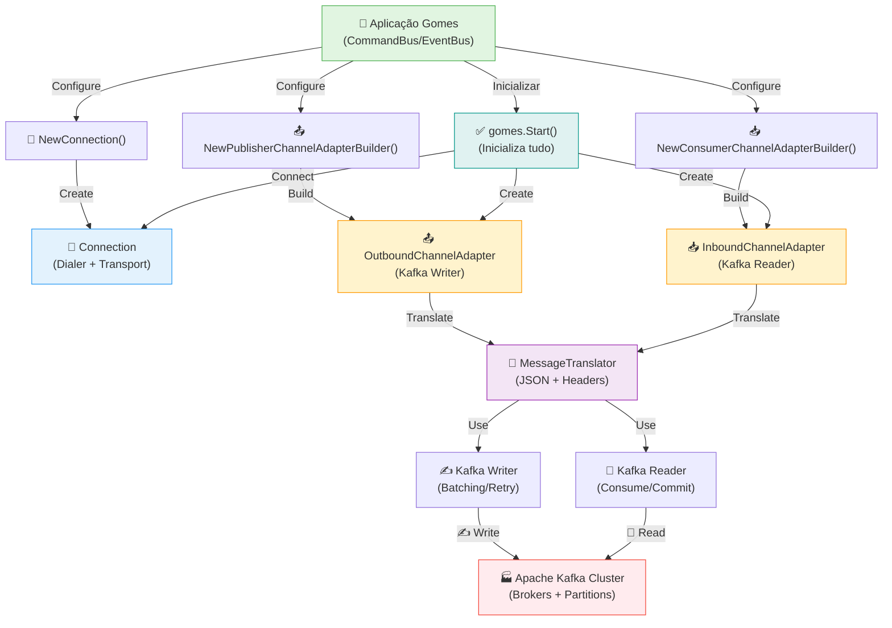
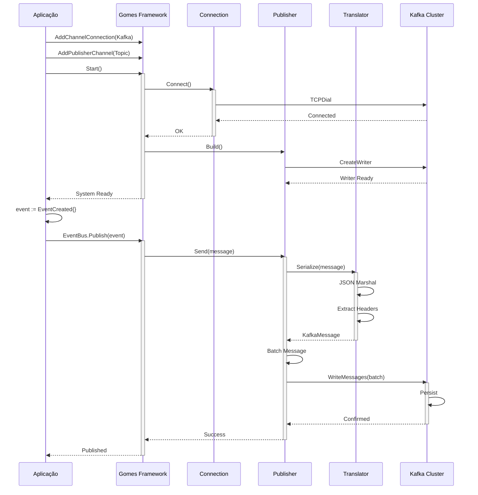

# 🎯 Kafka Channel Adapters

**Tipo**: Message Broker Integration  
**Objetivo**: Integrar Apache Kafka como message broker para publicar e consumir mensagens no Gomes  
**Status**: ✅ Produção

---

## 📖 O que é?

Os **Kafka Channel Adapters** do Gomes implementam a integração completa com Apache Kafka, permitindo usar Kafka como message broker para publicar e consumir eventos em aplicações distribuídas. O pacote está dividido em 4 componentes principais:

1. **Connection** - Gerencia conexões com brokers Kafka (producer e consumer)
2. **Outbound Channel Adapter** - Publisher para enviar mensagens para tópicos Kafka
3. **Inbound Channel Adapter** - Consumer para ler mensagens de tópicos Kafka
4. **Message Translator** - Traduz entre o formato interno do Gomes e o formato Kafka

Os adaptadores abstraem a complexidade do cliente Kafka (`segmentio/kafka-go`), permitindo usar o Gomes de forma simples enquanto aproveita a robustez e escalabilidade do Kafka. Você configura conexão, tópico e processador - o resto é automático.

### Quando Usar

- ✅ **Alto volume de mensagens**: Kafka é otimizado para throughput massivo
- ✅ **Event Sourcing**: Kafka armazena histórico completo de eventos
- ✅ **Reprocessamento**: Retroceder no offset para reprocessar eventos
- ✅ **Multi-datacenter**: Replicação e disaster recovery nativa
- ✅ **Microsserviços distribuídos**: Comunicação assíncrona entre serviços
- ✅ **Logs centralizados**: Usar Kafka como hub de eventos de toda arquitetura

### Quando NÃO Usar

- ❌ **Latência ultra-baixa**: RabbitMQ é mais rápido para operações simples
- ❌ **Routing complexo**: RabbitMQ tem padrões de roteamento mais avançados
- ❌ **Simplicidade**: Setup Kafka é mais complexo que alternativas
- ❌ **Poucos dados**: Overhead operacional pode não compensar
- ❌ **Sem necessidade de reprocessamento**: Mensagens descartadas após consumo

---

## 🎁 Características Principais

| Característica            | Descrição                                          |
| ------------------------- | -------------------------------------------------- |
| **Producer Configurável** | Batching, retries, timeouts, sync/async            |
| **Consumer Robusto**      | Heartbeat, rebalancing, commit automático          |
| **Message Translation**   | Serialização JSON e header mapping automático      |
| **TLS Support**           | Conexão segura com brokers Kafka                   |
| **Distributed Tracing**   | OpenTelemetry integrado para observabilidade       |
| **Context Support**       | Cancelamento e timeouts via context Go             |
| **Topic Configuration**   | Suporte a groupos, partições, múltiplos tópicos    |
| **Performance Tuning**    | BatchSize, BatchBytes, QueueCapacity configuráveis |
| **Consumer Group**        | Rebalancing automático entre consumers             |
| **Offset Management**     | Commit automático com intervalo configurável       |

---

## 🔧 Implementação Detalhada

### Arquitetura

```
┌─────────────────────────────────────────────────────────────┐
│                     APLICAÇÃO GOMES                         │
│  ┌────────────────────────────────────────────────────────┐ │
│  │         CommandBus / EventBus / Consumer              │ │
│  └───────────────────┬────────────────────────────────────┘ │
└────────────────────┼──────────────────────────────────────────┘
                     │
        ┌────────────┼────────────┐
        │            │            │
        ▼            ▼            ▼
    ┌────────┐  ┌──────────────┐  ┌─────────────┐
    │Connect │  │OutboundAdapter│  │InboundAdapter│
    │ ion    │  │  (Publisher) │  │  (Consumer) │
    └────┬───┘  └──────┬───────┘  └──────┬──────┘
         │             │                 │
         └─────────────┼─────────────────┘
                       │
            ┌──────────▼───────────┐
            │  MessageTranslator   │
            │  (Serialization)     │
            └──────────┬───────────┘
                       │
            ┌──────────▼───────────────────┐
            │   Kafka Client (segmentio)   │
            │  - Producer/Writer          │
            │  - Consumer/Reader          │
            │  - Dialer/Transport         │
            └──────────┬───────────────────┘
                       │
            ┌──────────▼─────────────────────┐
            │  Apache Kafka Cluster         │
            │  ┌────────────────────────┐   │
            │  │ Broker1  │ Broker2     │   │
            │  │ ┌──────────────────┐   │   │
            │  │ │ Topic1 (Parte 1) │   │   │
            │  │ │ Topic1 (Parte 2) │   │   │
            │  │ │ Topic1 (Parte 3) │   │   │
            │  │ └──────────────────┘   │   │
            │  └────────────────────────┘   │
            └──────────────────────────────┘
```

### Fluxo de Dados - Publicação

```
Aplicação Command/Event
    ↓
MessageBuilder construi mensagem
    ↓
EventBus/CommandBus envia
    ↓
OutboundChannelAdapter recebe
    ↓
MessageTranslator serializa (JSON)
    ↓
Extrai headers e adiciona trace context
    ↓
Kafka Producer agrega (batch)
    ↓
Kafka Producer envia para broker
    ↓
Broker confirma (ack)
    ↓
Producer retorna sucesso
    ↓
Aplicação continua
```

### Fluxo de Dados - Consumo

```
Kafka Broker tem mensagens no tópico
    ↓
Kafka Consumer lê em batches
    ↓
InboundChannelAdapter recebe
    ↓
MessageTranslator desserializa (JSON)
    ↓
Reconstrói headers e trace context
    ↓
EventDrivenConsumer processa via handlers
    ↓
Handler executa lógica de negócio
    ↓
Se OK: Consumer faz commit do offset
    ↓
Se ERRO: Vai para Dead Letter Queue (opcional)
    ↓
Consumer aguarda próxima mensagem
```

### Componentes Internos

**Connection**:

- Gerencia Dialer (conexão TCP para cluster)
- Gerencia Transport (multiplexing de requisições)
- Suporte a TLS para segurança
- Reusável entre producer e consumer

**OutboundChannelAdapter (Publisher)**:

- Usa Kafka Writer (producer)
- Agrupa mensagens em batches
- Suporta retries com backoff
- Pode ser sync ou async
- Rastreia via OpenTelemetry

**InboundChannelAdapter (Consumer)**:

- Usa Kafka Reader (consumer)
- Mantém consumer group para rebalancing
- Commit automático de offsets
- Heartbeat para manter membership
- Suporta múltiplos tópicos

**MessageTranslator**:

- Serializa/desserializa JSON
- Mapeia headers interno ↔ Kafka
- Propaga trace context automático
- Extrai CorrelationId como key

### Características Técnicas

- **Thread-Safe**: ✅ Sim - Kafka Writer e Reader são thread-safe
- **Assíncrono**: ✅ Sim - Producer/Consumer rodam em background
- **Idempotente**: ⚠️ Parcial - Depends na configuração de acks e retry
- **Configurável**: ✅ Sim - Builders pattern para todas as opções

---

## 📚 Métodos Públicos

### Connection Management

#### NewConnection(name string, host []string, opts ...ConnectionOptions) \*connection

**Local**: [connection.go](kafka/connection.go#L55-L70)

**Descrição**: Cria nova conexão com cluster Kafka. A conexão é singleton e reutilizada por producer/consumer.

**Parâmetros**:

- `name`: Identificador da conexão (ex: "kafka")
- `host`: Lista de endereços de brokers (ex: []string{"localhost:9092"})
- `opts`: Opções de configuração (ex: WithTlsConfig)

**Retorno**:

- `*connection`: Conexão configurada

**Exemplo**:

```go
// Conexão básica
conn := kafka.NewConnection("kafka", []string{"localhost:9092"})

// Com TLS
tlsConfig := &tls.Config{...}
conn := kafka.NewConnection(
    "kafka",
    []string{"kafka.prod:9093"},
    kafka.WithTlsConfig(tlsConfig),
)
```

#### Connect() error

**Local**: [connection.go](kafka/connection.go#L76-L92)

**Descrição**: Estabelece conexão com brokers Kafka. Cria Dialer e Transport para uso posterior.

**Retorno**:

- `error`: Erro se conexão falhar (broker offline, rede indisponível, etc)

**Exemplo**:

```go
gomes.AddChannelConnection(kafka.NewConnection(...))
// Dentro do gomes.Start(), Connect() é chamado automaticamente
```

---

### Publisher (Outbound Channel Adapter)

#### NewPublisherChannelAdapterBuilder(connectionReferenceName, topicName string)

**Local**: [outbound_channel_adapter.go](kafka/outbound_channel_adapter.go#L58-L73)

**Descrição**: Cria builder para configurar publisher Kafka. Padrão builder para setup fluenta.

**Parâmetros**:

- `connectionReferenceName`: Nome da conexão (deve estar registrada)
- `topicName`: Tópico Kafka para publicar

**Retorno**:

- `*publisherChannelAdapterBuilder`: Builder configurado

**Exemplo**:

```go
gomes.AddPublisherChannel(
    kafka.NewPublisherChannelAdapterBuilder("kafka", "order.events"),
)
```

#### WithMaxAttempts(attempts int) \*publisherChannelAdapterBuilder

**Descrição**: Define número máximo de tentativas para enviar mensagem. Falhas causam retry.

**Padrão**: 10 tentativas

**Exemplo**:

```go
kafka.NewPublisherChannelAdapterBuilder("kafka", "events").
    WithMaxAttempts(5)  // Se falhar 5x, desiste
```

#### WithBatchSize(size int) \*publisherChannelAdapterBuilder

**Descrição**: Agrupa mensagens antes de enviar. Maior batch = melhor throughput, maior latência.

**Padrão**: 100 mensagens por batch

**Exemplo**:

```go
// Para alto volume
builder.WithBatchSize(1000)  // Agrupa 1000 mensagens

// Para baixa latência
builder.WithBatchSize(10)    // Envia batches pequenos rápido
```

#### WithBatchBytes(bytes int64) \*publisherChannelAdapterBuilder

**Descrição**: Limita tamanho máximo do batch em bytes. Producer envia quando atinge batch size OU batch bytes.

**Padrão**: 1048576 bytes (1 MB)

**Exemplo**:

```go
builder.WithBatchBytes(5242880)  // 5 MB por batch
```

#### WithAsync(async bool) \*publisherChannelAdapterBuilder

**Descrição**: Modo de envio. Async retorna imediatamente, sync aguarda confirmação.

**Padrão**: true (assincronous)

**Exemplo**:

```go
// Fire and forget (rápido, sem confirmação)
builder.WithAsync(true)

// Aguardar confirmação (seguro, mais lento)
builder.WithAsync(false)
```

#### WithRequiredAcks(acks int) \*publisherChannelAdapterBuilder

**Descrição**: Nível de confirmação Kafka. 0=nenhum, 1=leader, -1=all replicas.

**Padrão**: 0 (nenhuma confirmação)

**Exemplo**:

```go
// Crítico - confirmação de todas as replicas
builder.WithRequiredAcks(-1)

// Rápido - sem confirmação
builder.WithRequiredAcks(0)
```

---

### Consumer (Inbound Channel Adapter)

#### NewConsumerChannelAdapterBuilder(connectionReferenceName, topicName, consumerName string)

**Local**: [inbound_channel_adapter.go](kafka/inbound_channel_adapter.go#L59-L76)

**Descrição**: Cria builder para configurar consumer Kafka. Consumer group para rebalancing automático.

**Parâmetros**:

- `connectionReferenceName`: Nome da conexão registrada
- `topicName`: Tópico Kafka para consumir
- `consumerName`: Nome do grupo (deve ser único entre serviços)

**Retorno**:

- `*consumerChannelAdapterBuilder`: Builder configurado

**Exemplo**:

```go
gomes.AddConsumerChannel(
    kafka.NewConsumerChannelAdapterBuilder(
        "kafka",
        "order.events",
        "order-service-consumer-group",
    ),
)
```

#### WithPartition(partition int) \*consumerChannelAdapterBuilder

**Descrição**: Consome apenas de uma partição específica. Útil para processamento ordenado.

**Exemplo**:

```go
// Apenas partição 0 (garante ordem)
builder.WithPartition(0)

// Sem especificar: consome de todas as partições
```

#### WithQueueCapacity(capacity int) \*consumerChannelAdapterBuilder

**Descrição**: Tamanho do buffer para fetch requests. Maior = menos roundtrips ao broker.

**Padrão**: 1000

**Exemplo**:

```go
builder.WithQueueCapacity(5000)  // Buffer maior para throughput
```

#### WithMinBytes(minBytes int) \*consumerChannelAdapterBuilder

**Descrição**: Mínimo de bytes que broker aguarda antes de enviar. Maior = menos requisições.

**Padrão**: 1 byte

**Exemplo**:

```go
builder.WithMinBytes(1024)  // Espera pelo menos 1KB de dados
```

#### WithMaxBytes(maxBytes int) \*consumerChannelAdapterBuilder

**Descrição**: Máximo de bytes para fetch. Prevent muito dados em uma requisição.

**Padrão**: 1048576 (1 MB)

**Exemplo**:

```go
builder.WithMaxBytes(5242880)  // Máximo 5MB por fetch
```

#### WithMaxWait(duration time.Duration) \*consumerChannelAdapterBuilder

**Descrição**: Tempo máximo que broker aguarda dados antes de enviar resposta vazia.

**Padrão**: 100ms

**Exemplo**:

```go
builder.WithMaxWait(500 * time.Millisecond)
```

#### WithReadBatchTimeout(timeout time.Duration) \*consumerChannelAdapterBuilder

**Descrição**: Timeout para ler um batch de mensagens.

**Padrão**: 10s

**Exemplo**:

```go
builder.WithReadBatchTimeout(30 * time.Second)
```

#### WithHeartbeatInterval(interval time.Duration) \*consumerChannelAdapterBuilder

**Descrição**: Frequência de heartbeat para manter membership no group. Heartbeat muito raro pode causar timeout.

**Padrão**: 3s

**Exemplo**:

```go
builder.WithHeartbeatInterval(5 * time.Second)
```

#### WithCommitInterval(interval time.Duration) \*consumerChannelAdapterBuilder

**Descrição**: Intervalo para commit automático de offsets. Commit frequente = segurança, commit raro = performance.

**Padrão**: 5s

**Exemplo**:

```go
// Commits rápido (mais seguro contra falhas)
builder.WithCommitInterval(1 * time.Second)

// Commits lento (melhor performance)
builder.WithCommitInterval(30 * time.Second)
```

#### WithPartitionWatchInterval(interval time.Duration) \*consumerChannelAdapterBuilder

**Descrição**: Frequência para detectar mudanças de partição (add/remove).

**Padrão**: 5m (5 minutos)

**Exemplo**:

```go
builder.WithPartitionWatchInterval(10 * time.Second)
```

#### WithWatchPartitionChanges(watch bool) \*consumerChannelAdapterBuilder

**Descrição**: Habilitar/desabilitar vigilância de mudanças de partição.

**Padrão**: false

**Exemplo**:

```go
// Rebalancear se tópico escalar
builder.WithWatchPartitionChanges(true)
```

---

## 🏗️ Diagrama de Componentes



---

## 🔄 Diagrama de Execução



---

## 💡 Exemplo de Uso Prático

### Setup Completo com Kafka

```go
package main

import (
    "context"
    "log/slog"
    "os"

    "github.com/jeffersonbrasilino/gomes"
    kafka "github.com/jeffersonbrasilino/gomes/channel/kafka"
)

// Definir evento
type OrderCreatedEvent struct {
    OrderID string `json:"orderId"`
    Amount  float64 `json:"amount"`
}

func (e *OrderCreatedEvent) Name() string {
    return "orderCreated"
}

// Definir handler
type OrderCreatedHandler struct{}

func (h *OrderCreatedHandler) Handle(
    ctx context.Context,
    event *OrderCreatedEvent,
) (any, error) {
    slog.Info("Processando evento",
        "orderId", event.OrderID,
        "amount", event.Amount,
    )
    return nil, nil
}

func main() {
    // 1. Configurar Kafka Connection
    slog.Info("Registrando Kafka...")
    gomes.AddChannelConnection(
        kafka.NewConnection("kafka", []string{"localhost:9092"}),
    )

    // 2. Configurar Publisher
    slog.Info("Registrando Publisher...")
    gomes.AddPublisherChannel(
        kafka.NewPublisherChannelAdapterBuilder("kafka", "order.events").
            WithBatchSize(100).
            WithMaxAttempts(5).
            WithAsync(true),
    )

    // 3. Configurar Consumer
    slog.Info("Registrando Consumer...")
    gomes.AddConsumerChannel(
        kafka.NewConsumerChannelAdapterBuilder(
            "kafka",
            "order.events",
            "order-service-group",
        ).
            WithHeartbeatInterval(5 * time.Second).
            WithCommitInterval(10 * time.Second),
    )

    // 4. Registrar Handler
    slog.Info("Registrando Handler...")
    gomes.AddActionHandler(&OrderCreatedHandler{})

    // 5. Inicializar
    slog.Info("Iniciando Gomes...")
    if err := gomes.Start(); err != nil {
        slog.Error("Erro ao iniciar", "err", err)
        os.Exit(1)
    }
    defer gomes.Shutdown()

    // 6. Publicar Evento
    slog.Info("Publicando evento...")
    eventBus, _ := gomes.EventBusByChannel("order.events")
    err := eventBus.Publish(context.Background(), &OrderCreatedEvent{
        OrderID: "ORD-12345",
        Amount:  299.99,
    })
    if err != nil {
        slog.Error("Erro publicar", "err", err)
    }

    // 7. Consumir Eventos
    slog.Info("Iniciando consumer...")
    consumer, _ := gomes.EventDrivenConsumer("order-service-group")
    err = consumer.
        WithAmountOfProcessors(4).
        WithMessageProcessingTimeout(30000).
        Run(context.Background())

    if err != nil {
        slog.Error("Consumer error", "err", err)
    }
}
```

### Configuração Otimizada para Alto Volume

```go
// Publisher otimizado para throughput
gomes.AddPublisherChannel(
    kafka.NewPublisherChannelAdapterBuilder("kafka", "events").
        WithBatchSize(1000).         // Agrupa 1000 mensagens
        WithBatchBytes(5242880).     // 5MB máximo
        WithMaxAttempts(3).          // Menos retries
        WithAsync(true).             // Fire and forget
        WithRequiredAcks(1),         // Apenas leader confirma
)

// Consumer otimizado para throughput
gomes.AddConsumerChannel(
    kafka.NewConsumerChannelAdapterBuilder(
        "kafka", "events", "high-volume-consumer",
    ).
        WithQueueCapacity(5000).
        WithMinBytes(10240).
        WithMaxBytes(10485760).
        WithCommitInterval(1 * time.Second),
)
```

### Configuração para Ordem Garantida

```go
// Uma partição = ordem garantida
consumer, _ := gomes.EventDrivenConsumer("order-service")
consumer.
    WithPartition(0).                    // Apenas partição 0
    WithAmountOfProcessors(1).           // 1 processor (sequencial)
    WithMessageProcessingTimeout(60000).
    Run(ctx)
```

---

## ✅ Boas Práticas

- ✅ **Use batch size apropriado**: 100-1000 para produção, teste para seu caso
- ✅ **Habilite commits frequentes**: 1-5s para evitar reprocessamento em falhas
- ✅ **Configure heartbeat < max.poll.interval**: Heartbeat 3s, max poll 5-10s
- ✅ **Use consumer groups**: Permite rebalancing e escalabilidade
- ✅ **Monitore lag de consumer**: Quantas mensagens ficaram para trás
- ✅ **Implemente idempotência**: Suporte a reprocessamento sem side effects
- ✅ **Use acks=-1 para crítico**: Trade performance por segurança em dados críticos
- ✅ **Escale consumer horizontalmente**: Mais consumers = mais partições processadas
- ✅ **Observe via OpenTelemetry**: Habilite traces para visibilidade end-to-end
- ✅ **Teste rebalancing**: Simule falha de brokers e recuperação

### Erros Comuns a Evitar

- ❌ **Sem connection registrada**: Registre também com `gomes.AddChannelConnection()`
- ❌ **Consumer group name similar**: Names diferentes = diferentes grupos, sem rebalancing
- ❌ **Heartbeat > max poll**: Consumer sai do grupo se não ler mensagens rápido
- ❌ **Commit muito rápido**: Muita carga no cluster, nem sempre necessário
- ❌ **Commit muito lento**: Se cair, reprocessa muitas mensagens
- ❌ **Partition sem processadores suficientes**: Bottleneck, lag cresce
- ❌ **Sem tratamento de erro**: Mensagens falham silenciosamente
- ❌ **TLS com ca inválido**: Conexão falha com erro criptografado confuso

---

## 🔍 Troubleshooting

### Problema: "Connection refused" ao iniciar

**Sintomas**:

- `dial tcp: connection refused` no startup
- Consumer/Publisher não inicia

**Causa**: Kafka broker não está rodando ou endereço incorreto

**Solução**:

```bash
# Verificar se Kafka está rodando
docker ps | grep kafka

# Testar conectividade
telnet localhost 9092

# Corrigir endereço se necessário
gomes.AddChannelConnection(
    kafka.NewConnection("kafka", []string{"kafka:9092"}),  // host correto
)
```

---

### Problema: Consumer não processa mensagens

**Sintomas**:

- Consumer iniciado
- Mensagens publicadas com sucesso
- Nada é processado
- Sem erros nos logs

**Causa**:

1. Handler não registrado
2. Tópico inválido
3. Consumer group mal configurado

**Solução**:

```go
// 1. Verificar handler registrado
gomes.AddActionHandler(&OrderCreatedHandler{})  // ANTES de Start()

// 2. Verificar nome do eventos
type OrderCreatedEvent struct {}
func (e *OrderCreatedEvent) Name() string {
    return "orderCreated"  // Deve bater com handler
}

// 3. Mostrar endpoints ativos
gomes.ShowActiveEndpoints()
// Deve aparecer consumer "order-service-group"
```

---

### Problema: Consumer lag cresce indefinidamente

**Sintomas**:

- Mensagens ficam no tópico sem ser processadas
- Offset não avança
- Fila crescendo

**Causa**:

1. Processadores insuficientes
2. Handler muito lento
3. Erro no handler (retry loop)

**Solução**:

```go
// Aumentar processadores para paralelismo
consumer.WithAmountOfProcessors(8)  // Mais workers

// Aumentar timeout se operação é lenta
consumer.WithMessageProcessingTimeout(60000)  // 60s

// Verificar logs do handler
// Se houver erro, mensagem pode ficar em retry
```

---

### Problema: Mensagens duplicadas são processadas

**Sintomas**:

- Mesmo evento processado múltiplas vezes
- Duplicação aleatória

**Causa**: Consumer caiu depois de processar mas antes de commit

**Solução**: Implementar idempotência

```go
func (h *OrderCreatedHandler) Handle(
    ctx context.Context,
    event *OrderCreatedEvent,
) (any, error) {
    // 1. Usar deduplication ID
    dedupeID := fmt.Sprintf("order:%s:created", event.OrderID)

    // 2. Verificar se já processou
    exists := db.Exists(ctx, dedupeID)
    if exists {
        return nil, nil  // Já processado, skip
    }

    // 3. Processar
    order := CreateOrder(event)

    // 4. Marcar como processado ATOMICAMENTE
    db.SetAtomic(ctx, dedupeID, true)

    return nil, nil
}
```

---

### Problema: "not a member for group" error

**Sintomas**:

- Consumer falha com erro de group membership
- Frequente rebalancing

**Causa**: Heartbeat ou max poll interval incorreto

**Solução**:

```go
// Ajustar tempos
builder.
    WithHeartbeatInterval(3 * time.Second).    // Heartbeat rápido
    WithReadBatchTimeout(30 * time.Second).    // Max poll 30s

// Heartbeat deve ser < max poll
// Regra: heartbeat = max poll / 3
```

---

### Problema: Kafka producers estão lentos

**Sintomas**:

- Publish toma muito tempo
- Throughput pequeno

**Causa**: Batch size pequeno, required acks alto

**Solução**:

```go
// Aumentar batch para agrupar mais
builder.WithBatchSize(500)

// Usar acks=1 em vez de -1
builder.WithRequiredAcks(1)

// Usar async (padrão)
builder.WithAsync(true)
```

---

## 📚 Referências

### Documentação Interna

- [Gomes Bootstrap](gomes-bootstrap.md): Como inicializar Gomes
- [Event Processing Flow](event-processing-flow.md): Como publicar eventos
- [Event-Driven Consumer](event-driven-consumer.md): Como consumir eventos

### Documentação Externa

- [Apache Kafka Documentation](https://kafka.apache.org/documentation/): Documentação oficial
- [Kafka Go Client (segmentio)](https://github.com/segmentio/kafka-go): Cliente usado pelo Gomes
- [Kafka Producer Tuning](https://kafka.apache.org/documentation/#producerconfigs): Producer config
- [Kafka Consumer Tuning](https://kafka.apache.org/documentation/#consumerconfigs): Consumer config
- [Kafka Rebalancing](https://kafka.apache.org/documentation/#intro_consumers): Consumer group protocol
- [Event Sourcing with Kafka](https://martinfowler.com/articles/event-sourcing.html): Padrão Event Sourcing

---

## 🎓 Próximos Passos

1. **Iniciante**: Use setup básico com defaults
2. **Intermediário**: Ajuste batch sizes e timeouts para seu workload
3. **Avançado**: Implemente reprocessamento, Event Sourcing, rebalancing customizado

---

**Última Atualização**: 16 de fevereiro de 2026  
**Status**: ✅ Produção  
**Versão do Gomes**: v1.0+  
**Versão Kafka**: Suporta 0.11+
