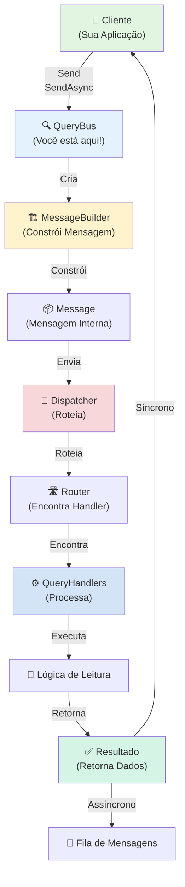
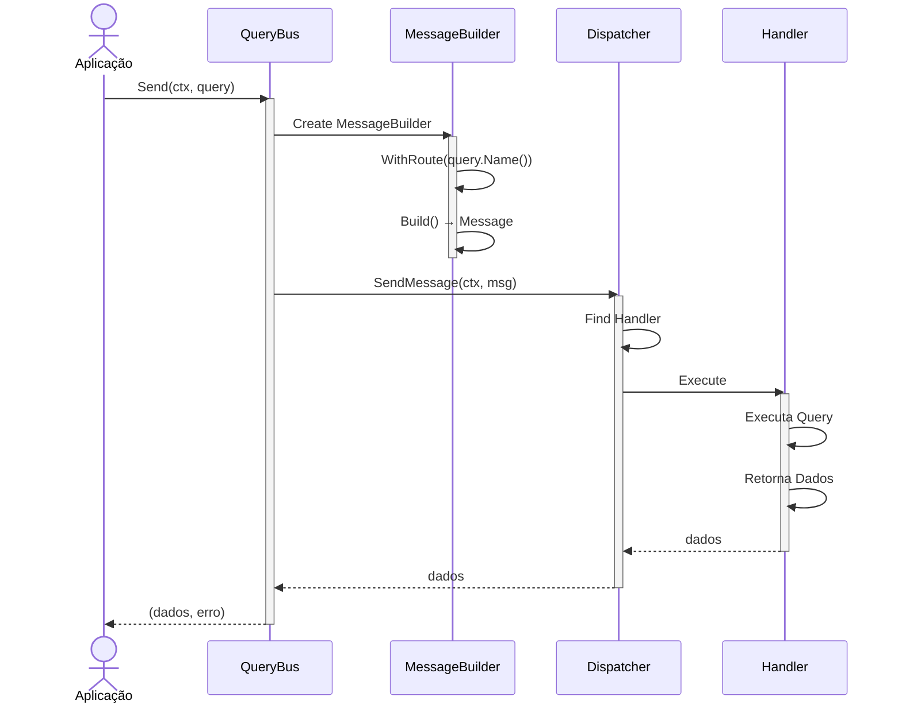
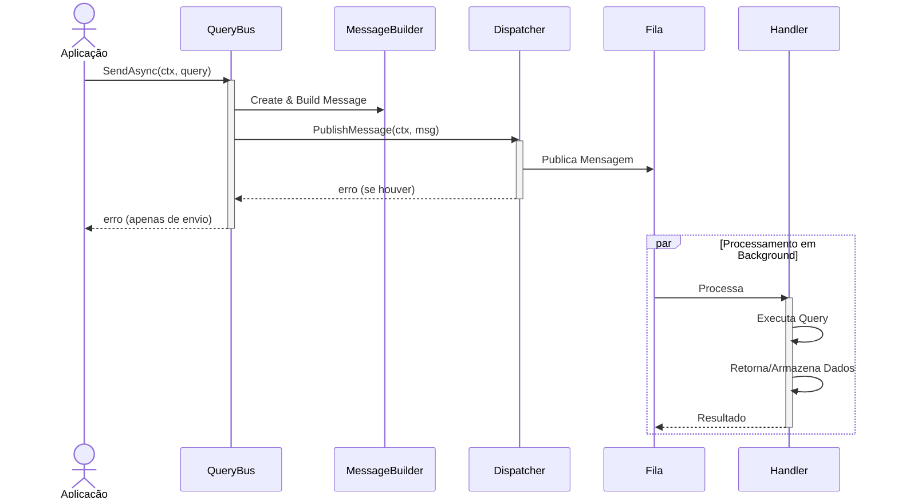

# 🎯 Query Bus

## 📖 O que é?

O **Query Bus** é o componente responsável por orquestrar a execução de **Queries** no sistema Gomes. Uma query é uma instrução que **lê dados** do sistema sem alterar seu estado, como buscar um usuário, listar pedidos ou recuperar estatísticas.

O Query Bus atua como intermediário entre a aplicação e os handlers que processam as queries. Ele fornece métodos simples e intuitivos para enviar queries de forma **síncrona** (esperando o resultado) ou **assíncrona** (fire-and-forget), mantendo a consistência e rastreabilidade de todas as operações através de IDs de correlação automáticos.

Este componente é essencial no padrão **CQRS (Command Query Responsibility Segregation)**, separando as operações de leitura (Queries) das operações de escrita (Comandos). Assim, você pode otimizar cada uma independentemente, usando diferentes estratégias de caching, indexação e arquitetura.

### Quando Usar

- ✅ **Leitura de dados**: Quando você precisa recuperar dados do sistema
- ✅ **Operações de consulta críticas**: Quando você precisa da resposta imediatamente
- ✅ **Processamento assíncrono de queries**: Quando deseja fazer uma consulta sem bloquear (rare, mas possível)
- ✅ **Segregação CQRS**: Quando quer separar claramente leitura e escrita
- ✅ **Rastreabilidade de consultas**: Quando precisa rastrear todas as leituras do sistema

### Quando NÃO Usar

- ❌ **Modificação de dados**: Use CommandBus para operações que alteram estado
- ❌ **Notificações simples**: Use EventBus para publicar eventos
- ❌ **Operações de escrita**: Qualquer operação que altera dados deve usar CommandBus

---

## 🎁 Características Principais

| Característica                | Descrição                                                      |
| ----------------------------- | -------------------------------------------------------------- |
| **Execução Síncrona**         | Envie uma query e aguarde o resultado imediatamente            |
| **Execução Assíncrona**       | Envie uma query e continue sem esperar (fire-and-forget)       |
| **Payloads Customizados**     | Suporte a envio de dados brutos com headers customizados       |
| **Correlação Automática**     | IDs de correlação gerados automaticamente para rastreabilidade |
| **Roteamento Inteligente**    | Rotas automáticas baseadas no nome da query                    |
| **Type-Safe**                 | Suporte a generics do Go para máxima segurança de tipos        |
| **Integração com Dispatcher** | Funciona perfeitamente com o sistema de mensagens do Gomes     |

---

## 🔧 Implementação Detalhada

### Arquitetura

O Query Bus funciona em conjunto com os seguintes componentes:

```
Cliente (Aplicação)
  ↓
QueryBus (Você está aqui!)
  ↓
MessageBuilder (Constrói a mensagem)
  ↓
Message (Mensagem Interna)
  ↓
Dispatcher (Roteia para o handler)
  ↓
QueryHandler (Processa a query)
  ↓
Resultado (Dados recuperados)
```

**Fluxo Interno:**

1. **Cliente** envia uma query via QueryBus
2. **QueryBus** cria um `MessageBuilder` com o tipo `Query`
3. **MessageBuilder** constrói uma `Message` interna com o _payload_ (dados da query)
4. **Dispatcher** recebe a mensagem e roteia para o handler apropriado
5. **QueryHandler** executa a lógica de recuperação de dados
6. **Resultado** é retornado ao cliente (síncrono) ou publicado (assíncrono)

### Características Técnicas

- **Thread-Safe**: ✅ Sim - O QueryBus pode ser usado concorrentemente por múltiplas goroutines
- **Assíncrono**: ✅ Sim - Suporta tanto operações síncronas quanto assíncronas
- **Idempotente**: ✅ Sim - Queries são inerentemente idempotentes (não alteram estado)
- **Configurável**: ✅ Sim - Funciona com diferentes dispatchers e handlers

---

## 📚 Métodos Públicos

### NewQueryBus(dispatcher Dispatcher) \*QueryBus

**Descrição**: Cria uma nova instância do Query Bus com o dispatcher especificado.

**Parâmetros**:

- `dispatcher Dispatcher`: O despachador de mensagens que será usado para rotear queries

**Retorno**:

- `*QueryBus`: Nova instância do Query Bus

**Exemplo**:

```go
dispatcher := // obter dispatcher do gomes
queryBus := bus.NewQueryBus(dispatcher)
```

**Uso Prático**: Normalmente você obtém o QueryBus através do Gomes, não cria diretamente:

```go
queryBus, err := gomes.QueryBus()
```

---

### Send(ctx context.Context, action handler.Action) (any, error)

**Descrição**: Executa uma **query de forma síncrona**, aguardando o resultado antes de retornar. Ideal quando você precisa dos dados imediatamente.

**Parâmetros**:

- `ctx context.Context`: Contexto para timeout/cancelamento. Se o contexto for cancelado, a operação é interrompida
- `action handler.Action`: A query a executar (deve implementar `Name()` que retorna o nome único da query)

**Retorno**:

- `any`: O resultado retornado pelo handler da query (tipicamente dados)
- `error`: Erro se a execução falhar

**Exemplo**:

```go
type GetUserByIDQuery struct {
    UserID string
}

func (q *GetUserByIDQuery) Name() string {
    return "getUserByID"  // Nome único da query
}

// Usar a query
ctx := context.Background()
result, err := queryBus.Send(ctx, &GetUserByIDQuery{
    UserID: "user123",
})

if err != nil {
    log.Printf("Erro: %v", err)
} else {
    user := result.(map[string]interface{})
    log.Printf("Usuário encontrado: %v", user)
}
```

---

### SendRaw(ctx context.Context, route string, payload any, headers map[string]string) (any, error)

**Descrição**: Executa uma query com **payload customizado e headers personalizados**, de forma síncrona. Use quando você precisa de controle total sobre a estrutura da mensagem.

**Parâmetros**:

- `ctx context.Context`: Contexto para timeout/cancelamento
- `route string`: Rota da query (identificador única que o dispatcher usa)
- `payload any`: Dados da query (pode ser qualquer tipo)
- `headers map[string]string`: Headers customizados para a mensagem

**Retorno**:

- `any`: O resultado
- `error`: Erro se falhar

**Exemplo**:

```go
// Enviar query com payload raw
result, err := queryBus.SendRaw(
    ctx,
    "user.list",  // Rota
    map[string]interface{}{
        "page":     1,
        "pageSize": 10,
        "role":     "admin",
    },
    map[string]string{
        "source":     "api",
        "ipAddress":  "192.168.1.1",
        "cacheLevel": "high",
    },
)

if err != nil {
    log.Printf("Erro: %v", err)
} else {
    users := result.([]interface{})
    log.Printf("Usuários recuperados: %d", len(users))
}
```

---

### SendAsync(ctx context.Context, action handler.Action) error

**Descrição**: Executa uma query de forma **assíncrona** (fire-and-forget), retornando imediatamente sem esperar pela resposta. Útil para pré-carregar dados ou gerar relatórios em background.

**Parâmetros**:

- `ctx context.Context`: Contexto para timeout/cancelamento
- `action handler.Action`: A query a executar

**Retorno**:

- `error`: Erro se o envio falhar (não há erro de execução do handler)

**Exemplo**:

```go
type GenerateReportQuery struct {
    ReportType string
    DateRange  string
}

func (q *GenerateReportQuery) Name() string {
    return "generateReport"
}

// Enviar de forma assíncrona
err := queryBus.SendAsync(ctx, &GenerateReportQuery{
    ReportType: "sales",
    DateRange:  "2026-02-01:2026-02-28",
})

if err != nil {
    log.Printf("Erro ao enviar: %v", err)
} else {
    log.Println("Query enviada! (resultado não aguardado)")
    // O relatório será gerado em background
}
```

---

### SendRawAsync(ctx context.Context, route string, payload any, headers map[string]string) error

**Descrição**: Executa uma query com **payload e headers customizados de forma assíncrona**. Combina a flexibilidade do `SendRaw` com o comportamento fire-and-forget do `SendAsync`.

**Parâmetros**:

- `ctx context.Context`: Contexto para timeout/cancelamento
- `route string`: Rota da query
- `payload any`: Dados da query
- `headers map[string]string`: Headers customizados

**Retorno**:

- `error`: Erro se o envio falhar

**Exemplo**:

```go
err := queryBus.SendRawAsync(
    ctx,
    "cache.preload",
    map[string]interface{}{
        "entityType": "products",
        "limit":      5000,
    },
    map[string]string{
        "priority": "high",
        "ttl":      "3600",
    },
)
```

---

## 🏗️ Diagrama de Componentes



**Componentes Principais**:

- **Client**: Você! A aplicação que envia queries
- **QueryBus**: O orquestrador que recebe suas queries
- **MessageBuilder**: Constrói a mensagem interna
- **Dispatcher**: Roteia a mensagem para o handler correto
- **QueryHandler**: Executa a lógica de recuperação de dados
- **Result**: Retorna os dados (síncrono) ou publica (assíncrono)

---

## 🔄 Diagrama de Execução

### Fluxo Síncrono (Send)



### Fluxo Assíncrono (SendAsync)



---

## 💡 Exemplo de Uso Prático

### Setup Completo

```go
package main

import (
    "context"
    "log/slog"
    "time"

    "github.com/jeffersonbrasilino/gomes"
    kafka "github.com/jeffersonbrasilino/gomes/channel/kafka"
)

// 1. DEFINIR A QUERY
// ===================

type GetOrderByIDQuery struct {
    OrderID string `json:"orderId"`
}

// Name retorna o identificador único da query
func (q *GetOrderByIDQuery) Name() string {
    return "getOrderByID"
}

// 2. DEFINIR O HANDLER
// ====================

type GetOrderByIDHandler struct {
    // Você pode injetar dependências aqui (database, cache, etc)
}

func (h *GetOrderByIDHandler) Handle(
    ctx context.Context,
    query *GetOrderByIDQuery,
) (any, error) {
    slog.Info("Processando query",
        "orderId", query.OrderID,
    )

    // Simular busca em banco de dados
    time.Sleep(50 * time.Millisecond)

    // Retornar resultado
    return map[string]interface{}{
        "id":        query.OrderID,
        "status":    "processing",
        "amount":    199.99,
        "timestamp": time.Now(),
    }, nil
}

// 3. SETUP DO SISTEMA
// ====================

func main() {
    // Registrar conexão Kafka
    gomes.AddChannelConnection(
        kafka.NewConnection("kafka", []string{"localhost:9092"}),
    )

    // Registrar canais de publicação
    gomes.AddPublisherChannel(
        kafka.NewPublisherChannelAdapterBuilder("kafka", "queries.topic"),
    )

    // Registrar handler
    gomes.AddActionHandler(&GetOrderByIDHandler{})

    // Iniciar o sistema
    if err := gomes.Start(); err != nil {
        slog.Error("Erro ao iniciar Gomes", "err", err)
        panic(err)
    }
    defer gomes.Shutdown()

    // 4. USAR QUERY BUS
    // =================

    // Obter o QueryBus síncrono
    queryBus, err := gomes.QueryBus()
    if err != nil {
        slog.Error("Erro ao obter QueryBus", "err", err)
        return
    }

    // Obter o QueryBus assíncrono por canal específico
    asyncQueryBus, err := gomes.QueryBusByChannel("queries.topic")
    if err != nil {
        slog.Error("Erro ao obter QueryBus assíncrono", "err", err)
        return
    }

    ctx := context.Background()

    // Exemplo 1: Envio SÍNCRONO (Espera resposta)
    // ===========================================
    slog.Info("=== Exemplo 1: Send (Síncrono) ===")

    result, err := queryBus.Send(ctx, &GetOrderByIDQuery{
        OrderID: "ORD12345",
    })

    if err != nil {
        slog.Error("Erro ao processar query", "err", err)
    } else {
        order := result.(map[string]interface{})
        slog.Info("Query executada com sucesso!",
            "status", order["status"],
            "amount", order["amount"],
        )
    }

    // Exemplo 2: Envio ASSÍNCRONO (Fire-and-forget)
    // ============================================
    slog.Info("=== Exemplo 2: SendAsync (Assíncrono) ===")

    err = asyncQueryBus.SendAsync(ctx, &GetOrderByIDQuery{
        OrderID: "ORD12346",
    })

    if err != nil {
        slog.Error("Erro ao enviar query", "err", err)
    } else {
        slog.Info("Query enviada! (Não esperamos resposta)")
    }

    // Exemplo 3: Envio RAW com Headers Customizados
    // ============================================
    slog.Info("=== Exemplo 3: SendRaw (Com Headers) ===")

    result, err = queryBus.SendRaw(
        ctx,
        "order.search",
        map[string]interface{}{
            "status": "completed",
            "limit":  50,
        },
        map[string]string{
            "source":     "api",
            "cacheLevel": "high",
            "timeout":    "5000",
        },
    )

    if err != nil {
        slog.Error("Erro ao processar query raw", "err", err)
    } else {
        slog.Info("Query raw executada!", "resultado", result)
    }

    // Exemplo 4: Query com Timeout
    // =============================
    slog.Info("=== Exemplo 4: Send com Timeout ===")

    ctxWithTimeout, cancel := context.WithTimeout(ctx, 3*time.Second)
    defer cancel()

    result, err = queryBus.Send(ctxWithTimeout, &GetOrderByIDQuery{
        OrderID: "ORD12347",
    })

    if err != nil {
        slog.Error("Erro ao processar query (timeout?)", "err", err)
    } else {
        slog.Info("Query com timeout executada!", "resultado", result)
    }

    slog.Info("Demonstração completa!")
}
```

### Configuração com QueryBusByChannel

Se você quiser usar um canal específico:

```go
// Registrar canais diferentes
gomes.AddPublisherChannel(
    kafka.NewPublisherChannelAdapterBuilder("kafka", "queries.topic"),
)

gomes.AddPublisherChannel(
    kafka.NewPublisherChannelAdapterBuilder("kafka", "cache.topic"),
)

// Obter QueryBus para canal específico
queryBus, _ := gomes.QueryBusByChannel("queries.topic")
cacheBus, _ := gomes.QueryBusByChannel("cache.topic")

// Usar cada um independentemente
result, _ := queryBus.Send(ctx, &GetOrderByIDQuery{...})
cacheBus.SendAsync(ctx, &PreloadCacheQuery{...})
```

---

## ✅ Boas Práticas

- ✅ **Use Send para operações críticas**: Quando você precisa dos dados imediatamente, use `Send`
- ✅ **Use SendAsync para operações em background**: Pré-carregamento de cache, geração de relatórios
- ✅ **Sempre passa um contexto**: Use `context.WithTimeout()` ou `context.WithCancel()` para controlar a execução
- ✅ **Implemente o Name() corretamente**: Deve retornar um identificador único e consistente
- ✅ **Trate erros apropriadamente**: Sempre verifique o erro retornado
- ✅ **Use validação no handler**: Valide os parâmetros da query dentro do handler
- ✅ **Mantenha queries simples**: Cada query deve fazer uma coisa bem e rapidamente
- ✅ **Use tipos fortes**: Prefira tipos específicos em vez de `map[string]interface{}`

### Erros Comuns a Evitar

- ❌ **Ignorar erros**: Não esqueça de verificar `if err != nil`
- ❌ **Usar timeouts muito curtos**: Queries podem ser lentas em sistemas sobrecarregados
- ❌ **Enviar dados sensíveis nos headers**: Headers podem ser logados, use estruturas internas
- ❌ **Não implementar Name()**: Isso causará panics ou erros no roteamento
- ❌ **Esperar resposta de SendAsync**: SendAsync não retorna dados, use Send para isso
- ❌ **Usar QueryBus para modificar dados**: Use CommandBus para operações de escrita
- ❌ **Queries muito complexas**: Divida em múltiplas queries menores se for muito complexa

---

## 🔍 Troubleshooting

### Problema: "Handler not found for route X"

**Sintomas**:

- Erro: `handler not found`
- Execução falha silenciosamente

**Causa**: O nome da query (`Name()`) não corresponde a nenhum handler registrado

**Solução**:

```go
// ❌ Errado - Handler registrado mas query com nome diferente
type GetProductListQuery struct{}
func (q *GetProductListQuery) Name() string {
    return "getProduct" // Nome errado!
}

// ✅ Correto - Nomes devem corresponder
type GetProductListQuery struct{}
func (q *GetProductListQuery) Name() string {
    return "getProductList" // Corresponde ao handler registrado
}

// Verificar que o handler está registrado:
type GetProductListHandler struct{}
func (h *GetProductListHandler) Handle(ctx context.Context, q *GetProductListQuery) (any, error) {
    // ...
}

gomes.AddActionHandler(&GetProductListHandler{}) // Handler registrado corretamente
```

---

### Problema: Context deadline exceeded

**Sintomas**:

- Erro: `context deadline exceeded`
- Query nunca retorna

**Causa**: O timeout do contexto é muito curto ou a query é muito lenta

**Solução**:

```go
// ❌ Errado - Timeout muito curto
ctx, cancel := context.WithTimeout(context.Background(), 100*time.Millisecond)
defer cancel()
queryBus.Send(ctx, query) // Provavelmente vai dar timeout

// ✅ Correto - Timeout apropriado para queries
ctx, cancel := context.WithTimeout(context.Background(), 10*time.Second)
defer cancel()
queryBus.Send(ctx, query)

// Ou sem timeout (não recomendado em produção):
queryBus.Send(context.Background(), query)
```

---

### Problema: SendAsync não retorna erro da execução

**Sintomas**:

- `SendAsync` não retorna erro quando imagina que deveria
- Handler não está sendo executado

**Causa**: `SendAsync` é fire-and-forget. Erros de execução não são retornados

**Solução**:

```go
// ❌ Errado - Esperando erro de execução do handler
err := queryBus.SendAsync(ctx, query)
if err != nil {
    log.Println("Query falhou!") // Isso nunca vai aparecer
}

// ✅ Correto - SendAsync só retorna erro de envio
err := queryBus.SendAsync(ctx, query)
if err != nil {
    log.Println("Erro ao ENVIAR query (não de execução)")
}
// Erros de execução precisam ser tratados dentro do handler
```

---

### Problema: Headers não estão sendo propagados

**Sintomas**:

- Headers customizados não chegam ao handler/dispatcher

**Causa**: Usar `Send` sem headers ao invés de `SendRaw`

**Solução**:

```go
// ❌ Errado - Sem headers
queryBus.Send(ctx, query)

// ✅ Correto - Com headers customizados
queryBus.SendRaw(
    ctx,
    query.Name(),
    query,
    map[string]string{
        "userId":     "123",
        "cacheLevel": "high",
    },
)
```

---

## 📚 Referências

- [QueryBus GoDoc](../../bus/query_bus.go): Código-fonte comentado
- [CommandBus Documentation](./command-bus.md): Documentação do Command Bus (similar em estrutura)
- [Exemplo Completo](../../examples/cqrs/main.go): Arquivo de exemplo no projeto
- [Handler Interface](../../message/handler/handler.go): Interface do Action Handler
- [CQRS Pattern](https://martinfowler.com/bliki/CQRS.html): Leitura externa sobre CQRS
- [Message System](../message.md): Entender a estrutura interna de mensagens

---

**Última Atualização**: 16 de fevereiro de 2026  
**Status**: ✅ Produção  
**Versão do Gomes**: v1.0+  
**Mantido por**: Especialista em Desenvolvimento Backend (Gomes)
