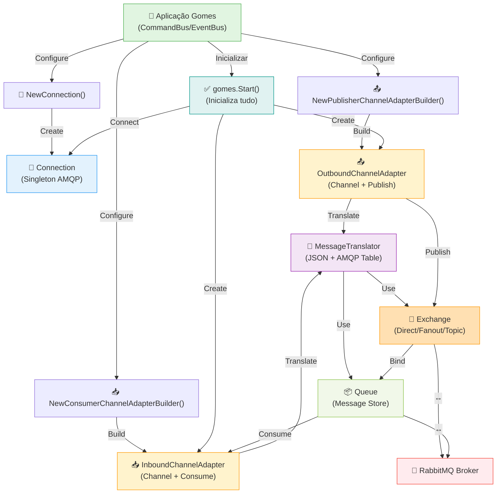
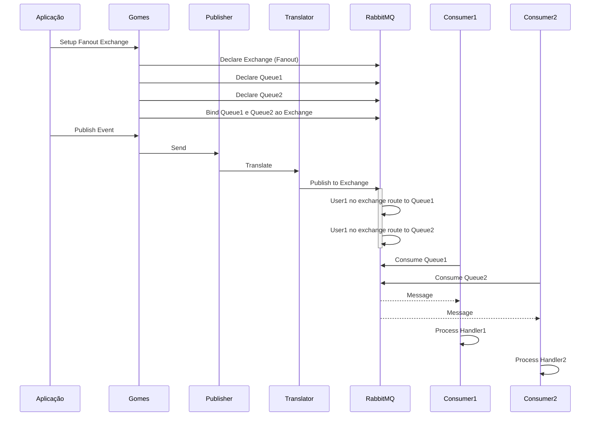

# 🎯 RabbitMQ Channel Adapters

**Tipo**: Message Broker Integration  
**Objetivo**: Integrar RabbitMQ como message broker para publicar e consumir mensagens no Gomes com roteamento avançado  
**Status**: ✅ Produção

---

## 📖 O que é?

Os **RabbitMQ Channel Adapters** do Gomes implementam integração completa com RabbitMQ, permitindo usar RabbitMQ como message broker para comunicação assíncrona em arquiteturas de microserviços. O pacote divide-se em 4 componentes principais:

1. **Connection** - Gerencia conexão singleton com broker RabbitMQ (AMQP)
2. **Outbound Channel Adapter** - Publisher para enviar mensagens via queues ou exchanges
3. **Inbound Channel Adapter** - Consumer para ler mensagens de queues RabbitMQ
4. **Message Translator** - Traduz entre o formato interno do Gomes e o formato AMQP

Os adaptadores abstraem a complexidade do cliente RabbitMQ, oferecendo suporte a **padrões avançados de roteamento** como Fanout (broadcast), Direct (específico), Topic (padrão), e Headers. RabbitMQ é ideal quando você precisa de routing complexo, garantia de entrega e operações mais lentas comparado ao Kafka, mas mais simples de operar.

### Quando Usar

- ✅ **Roteamento complexo**: Fanout, Direct, Topic, Headers exchanges
- ✅ **Garantia de entrega**: Mensagens perseveradas até consumo
- ✅ **Simplicidade operacional**: Mais fácil que Kafka para começar
- ✅ **Baixa para média carga**: Adequado para sistemas comuns
- ✅ **Processamento de tarefas**: Task queues, job scheduling
- ✅ **Fanout para broadcast**: Múltiplos consumidores de mesmo evento

### Quando NÃO Usar

- ❌ **Alto volume extremo**: Kafka é melhor para terabytes/dia
- ❌ **Reprocessamento**: RabbitMQ descarta mensagens após consumo
- ❌ **Event Sourcing puro**: Kafka é indexado para replaying
- ❌ **Sem persistência**: Mensagens perdem-se se broker cair
- ❌ **Múltiplos datacenters**: Replicação é mais complexa

---

## 🎁 Características Principais

| Característica              | Descrição                                               |
| --------------------------- | ------------------------------------------------------- |
| **4 Tipos de Exchange**     | Fanout, Direct, Topic, Headers para roteamento flexível |
| **Connection Singleton**    | Uma conexão reutilizada por toda aplicação              |
| **Work Queue Pattern**      | Distribuir tarefas entre múltiplos workers              |
| **Pub/Sub Pattern**         | Um publisher, múltiplos subscribers                     |
| **Routing Keys**            | Roteamento dinâmico baseado em padrões                  |
| **Message Translation**     | JSON + AMQP Table para headers                          |
| **OpenTelemetry Integrado** | Tracing automático de ponta a ponta                     |
| **Queue Configuration**     | Durable, Exclusive, Auto-delete, Arguments              |
| **Consumer Flags**          | Exclusive, NoLocal, NoWait para controle fino           |
| **Error Handling**          | Auto-ack/Manual-ack, Dead Letter Queues                 |

---

## 🔧 Implementação Detalhada

### Arquitetura

```
┌─────────────────────────────────────────────────────────────┐
│                     APLICAÇÃO GOMES                         │
│  ┌────────────────────────────────────────────────────────┐ │
│  │         CommandBus / EventBus / Consumer              │ │
│  └───────────────────┬────────────────────────────────────┘ │
└────────────────────┼──────────────────────────────────────────┘
                     │
        ┌────────────┼────────────┐
        │            │            │
        ▼            ▼            ▼
    ┌────────┐  ┌──────────────┐  ┌─────────────┐
    │Connect │  │OutboundAdapter│  │InboundAdapter│
    │ ion    │  │  (Publisher) │  │  (Consumer) │
    └────┬───┘  └──────┬───────┘  └──────┬──────┘
         │             │                 │
         └─────────────┼─────────────────┘
                       │
            ┌──────────▼───────────┐
            │  MessageTranslator   │
            │  (JSON + Headers)    │
            └──────────┬───────────┘
                       │
            ┌──────────▼───────────────────┐
            │   RabbitMQ Client (amqp091)  │
            │  - Publisher/Channel         │
            │  - Consumer/Channel          │
            │  - Connection (Singleton)    │
            └──────────┬───────────────────┘
                       │
            ┌──────────▼─────────────────────┐
            │  RabbitMQ Broker              │
            │  ┌───────────────────────┐    │
            │  │ Exchanges            │    │
            │  │ ├─ Fanout            │    │
            │  │ ├─ Direct            │    │
            │  │ ├─ Topic             │    │
            │  │ └─ Headers           │    │
            │  └───────────────────────┘    │
            │  ┌───────────────────────┐    │
            │  │ Queues               │    │
            │  │ ├─ Queue1            │    │
            │  │ ├─ Queue2            │    │
            │  │ └─ Queue3            │    │
            │  └───────────────────────┘    │
            └──────────────────────────────┘
```

### Tipos de Exchange

```
┌─────────────────────────────────────────────────────────────┐
│ DIRECT (Roteamento Específico)                              │
│  Sender → Exchange → [Queue] ← Consumer                     │
│  Routing Key DEVE bater exatamente                          │
│  Use: Tarefas específicas, RPC                             │
└─────────────────────────────────────────────────────────────┘

┌─────────────────────────────────────────────────────────────┐
│ FANOUT (Broadcast)                                          │
│  Sender → Exchange → [Queue1] ← Consumer1                   │
│                  → [Queue2] ← Consumer2                     │
│                  → [Queue3] ← Consumer3                     │
│  Ignora Routing Key, broadcasts para TODAS as queues        │
│  Use: Notificações, eventos gerais                         │
└─────────────────────────────────────────────────────────────┘

┌─────────────────────────────────────────────────────────────┐
│ TOPIC (Padrão Flexível)                                     │
│  Sender →(order.created) → Exchange                         │
│         (order.paid)      ├→ Queue(order.*) ← OrderService │
│         (user.created)    ├→ Queue(*.created) ← Audit       │
│  Routing Key suporta wildcards (* = 1 palavra, # = N)      │
│  Use: Eventos complexos, Log agregado                      │
└─────────────────────────────────────────────────────────────┘

┌─────────────────────────────────────────────────────────────┐
│ HEADERS (Header-based)                                      │
│  Sender → {x-type: "payment", x-priority: "high"}           │
│       → Exchange verifica headers                           │
│       → [Payments Queue] se x-type=payment                  │
│  Use: Roteamento baseado em múltiplos critérios            │
└─────────────────────────────────────────────────────────────┘
```

### Fluxo de Dados - Publicação

```
Aplicação (Command/Event)
    ↓
MessageBuilder constrói mensagem
    ↓
EventBus/CommandBus envia
    ↓
OutboundChannelAdapter recebe
    ↓
MessageTranslator serializa (JSON + Headers AMQP)
    ↓
Define ContentType, Headers table, Body
    ↓
PublishChannel publica no Exchange/Queue
    ↓
RabbitMQ roteia baseado em:
  - Tipo de exchange
  - Routing key
  - Bindings das queues
    ↓
Mensagem armazenada na Queue
    ↓
Aplicação retorna
```

### Fluxo de Dados - Consumo

```
RabbitMQ tem mensagens na Queue
    ↓
Inbound Adapter faz Consume() em background
    ↓
RabbitMQ entrega batches de mensagens
    ↓
MessageTranslator desserializa (JSON + Headers)
    ↓
Reconstrói headers e trace context
    ↓
EventDrivenConsumer processa via handlers
    ↓
Handler executa lógica de negócio
    ↓
Se OK: Ack (hand to consumer)
    ↓
Se ERRO: Nack (pode re-queue ou Dead Letter)
    ↓
Consumer aguarda próxima mensagem
```

### Componentes Internos

**Connection**:

- Singleton pattern (reutiliza conexão)
- AMQP Dial com format: `amqp://[user:password@]host[:port]/vhost`
- Uma conexão para toda aplicação

**OutboundChannelAdapter (Publisher)**:

- Publica via Queue (default) ou Exchange
- Queue pattern: default exchange, routing key = queue name
- Exchange pattern: custom exchange com routing keys
- JSON serialization para payload
- AMQP Table para headers

**InboundChannelAdapter (Consumer)**:

- Consome de queue específica
- Básico vs exclusivo consumer
- Flags: noLocal, exclusive, noWait
- Arguments para configurações avançadas

**MessageTranslator**:

- Serializa para JSON
- Headers como AMQP Table
- Propaga trace context automático
- Error handling na tradução

### Características Técnicas

- **Thread-Safe**: ✅ Sim - AMQP channels são thread-safe
- **Assíncrono**: ✅ Sim - Consumer roda em background goroutine
- **Idempotente**: ✅ Sim - Pode usar Queue com Dead Letter + retry
- **Configurável**: ✅ Sim - Builders para todas as opções

---

## 📚 Métodos Públicos

### Connection Management

#### NewConnection(name string, host string) \*connection

**Local**: [connection.go](rabbitmq/connection.go#L32-L48)

**Descrição**: Cria conexão singleton com RabbitMQ. Reutiliza a mesma conexão para toda aplicação.

**Parâmetros**:

- `name`: Identificador da conexão (ex: "rabbitmq")
- `host`: Endereço do broker (ex: "localhost:5672" ou "user:pass@host/vhost")

**Retorno**:

- `*connection`: Conexão singleton

**Exemplo**:

```go
// Conexão local padrão
conn := rabbitmq.NewConnection("rabbitmq", "localhost:5672")

// Com credenciais e vhost
conn := rabbitmq.NewConnection(
    "rabbitmq",
    "user:password@rabbitmq.prod:5672/production",
)
```

#### Connect() error

**Local**: [connection.go](rabbitmq/connection.go#L54-L62)

**Descrição**: Estabelece conexão AMQP com broker. Válida credenciais e conecta.

**Retorno**:

- `error`: Erro se conexão falhar

**Exemplo**:

```go
gomes.AddChannelConnection(rabbitmq.NewConnection(...))
// Connect() é chamado automaticamente dentro de gomes.Start()
```

---

### Publisher (Outbound Channel Adapter)

#### NewPublisherChannelAdapterBuilder(connectionReferenceName, channelName string)

**Local**: [outbound_channel_adapter.go](rabbitmq/outbound_channel_adapter.go#L68-L92)

**Descrição**: Cria builder para configurar publisher RabbitMQ. Padrão builder para setup fluente.

**Padrão**: Publica para **default exchange com queue name como routing key** (Work Queue Pattern)

**Parâmetros**:

- `connectionReferenceName`: Nome da conexão registrada
- `channelName`: Nome da queue (ou exchange se configurar ProducerExchange)

**Retorno**:

- `*publisherChannelAdapterBuilder`: Builder configurado

**Exemplo**:

```go
// Queue simples (padrão)
gomes.AddPublisherChannel(
    rabbitmq.NewPublisherChannelAdapterBuilder("rabbitmq", "tasks.queue"),
)

// Exchange com roteamento
gomes.AddPublisherChannel(
    rabbitmq.NewPublisherChannelAdapterBuilder("rabbitmq", "events").
        WithChannelType(rabbitmq.ProducerExchange).
        WithExchangeType(rabbitmq.ExchangeFanout),
)
```

#### WithChannelType(value producerChannelType) \*publisherChannelAdapterBuilder

**Descrição**: Define se publica para Queue ou Exchange.

**Valores**:

- `ProducerQueue` (padrão): Publica para queue, default exchange
- `ProducerExchange`: Publica para exchange com routing keys

**Exemplo**:

```go
// Fanout broadcast
builder.WithChannelType(rabbitmq.ProducerExchange)

// Queue direto (padrão)
builder.WithChannelType(rabbitmq.ProducerQueue)
```

#### WithExchangeType(value exchangeType) \*publisherChannelAdapterBuilder

**Descrição**: Define tipo de exchange (só funciona com ProducerExchange).

**Valores**:

- `ExchangeDirect`: Roteamento específico por routing key
- `ExchangeFanout`: Broadcast para todas as queues
- `ExchangeTopic`: Padrão com wildcards (\* e #)
- `ExchangeHeaders`: Roteamento por headers

**Exemplo**:

```go
// Broadcast
builder.WithExchangeType(rabbitmq.ExchangeFanout)

// Roteamento flexível
builder.WithExchangeType(rabbitmq.ExchangeTopic)

// Específico
builder.WithExchangeType(rabbitmq.ExchangeDirect)
```

#### WithExchangeRoutingKeys(routingKeys string) \*publisherChannelAdapterBuilder

**Descrição**: Define routing key para exchange. Só aplica com ProducerExchange.

**Exemplo**:

```go
// Topic exchange com wildcards
builder.
    WithExchangeType(rabbitmq.ExchangeTopic).
    WithExchangeRoutingKeys("order.*")  // order.created, order.paid, etc

// Direct exchange
builder.
    WithExchangeType(rabbitmq.ExchangeDirect).
    WithExchangeRoutingKeys("email.send")
```

#### WithDurable(data bool) \*publisherChannelAdapterBuilder

**Descrição**: Fila sobrevive ao restart do broker (persistida em disco).

**Padrão**: true

**Exemplo**:

```go
// Persistido
builder.WithDurable(true)

// Transient (perda ao restart)
builder.WithDurable(false)
```

#### WithDeleteUnused(data bool) \*publisherChannelAdapterBuilder

**Descrição**: Auto-delete quando não houver consumidores/bindings.

**Padrão**: false

**Exemplo**:

```go
// Auto-cleanup
builder.WithDeleteUnused(true)

// Permanecer
builder.WithDeleteUnused(false)
```

#### WithExclusive(data bool) \*publisherChannelAdapterBuilder

**Descrição**: Queue é exclusiva a essa conexão (ninguém mais acessa).

**Padrão**: false

**Exemplo**:

```go
// Exclusiva
builder.WithExclusive(true)

// Compartilhada
builder.WithExclusive(false)
```

#### WithNoWait(data bool) \*publisherChannelAdapterBuilder

**Descrição**: Não aguardar confirmação do broker (retorna imediatamente).

**Padrão**: false

**Exemplo**:

```go
// Fire and forget
builder.WithNoWait(true)

// Aguardar confirmação
builder.WithNoWait(false)
```

#### WithArguments(args amqp.Table) \*publisherChannelAdapterBuilder

**Descrição**: Argumentos customizados AMQP (TTL, max length, etc).

**Exemplo**:

```go
// Message TTL de 5 minutos
builder.WithArguments(amqp.Table{
    "x-message-ttl": 300000,  // 5 min em ms
})

// Max length of 10000 messages
builder.WithArguments(amqp.Table{
    "x-max-length": 10000,
})
```

---

### Consumer (Inbound Channel Adapter)

#### NewConsumerChannelAdapterBuilder(connectionReferenceName, queueName, consumerName string)

**Local**: [inbound_channel_adapter.go](rabbitmq/inbound_channel_adapter.go#L56-L75)

**Descrição**: Cria builder para configurar consumer RabbitMQ.

**Parâmetros**:

- `connectionReferenceName`: Nome da conexão registrada
- `queueName`: Nome da queue RabbitMQ para consumir
- `consumerName`: Identificador do consumer

**Retorno**:

- `*consumerChannelAdapterBuilder`: Builder configurado

**Exemplo**:

```go
gomes.AddConsumerChannel(
    rabbitmq.NewConsumerChannelAdapterBuilder(
        "rabbitmq",
        "order.events",
        "order-processor",
    ),
)
```

#### WithExclusive(data bool) \*consumerChannelAdapterBuilder

**Descrição**: Consumer exclusivo (ninguém mais consome dessa queue).

**Padrão**: false (shared)

**Exemplo**:

```go
// Apenas este consumer
builder.WithExclusive(true)

// Múltiplos consumers (load balancing)
builder.WithExclusive(false)
```

#### WithNoLocal(data bool) \*consumerChannelAdapterBuilder

**Descrição**: Não receber mensagens publicadas pela mesma conexão.

**Padrão**: false

**Exemplo**:

```go
// Ignore próprias mensagens
builder.WithNoLocal(true)

// Receber também próprias mensagens
builder.WithNoLocal(false)
```

#### WithNoWait(data bool) \*consumerChannelAdapterBuilder

**Descrição**: Não aguardar confirmação ao começar consumo.

**Padrão**: false

**Exemplo**:

```go
builder.WithNoWait(true)   // Começar rápido
builder.WithNoWait(false)  // Aguardar confirmação
```

#### WithArguments(args amqp.Table) \*consumerChannelAdapterBuilder

**Descrição**: Argumentos customizados AMQP.

**Exemplo**:

```go
// Prefetch baseado em prioridade
builder.WithArguments(amqp.Table{
    "x-priority": 10,
})
```

---

## 🏗️ Diagrama de Componentes



---

## 🔄 Diagrama de Execução - Fanout (Broadcast)



---

## 💡 Exemplo de Uso Prático

### Setup Completo - Fanout Pattern

```go
package main

import (
    "context"
    "log/slog"
    "os"
    "time"

    "github.com/jeffersonbrasilino/gomes"
    rabbitmq "github.com/jeffersonbrasilino/gomes/channel/rabbitmq"
)

// Evento de domínio
type OrderCreatedEvent struct {
    OrderID string `json:"orderId"`
    Amount  float64 `json:"amount"`
}

func (e *OrderCreatedEvent) Name() string {
    return "orderCreated"
}

// Handler 1: Enviar email
type OrderCreatedEmailHandler struct{}

func (h *OrderCreatedEmailHandler) Handle(
    ctx context.Context,
    event *OrderCreatedEvent,
) (any, error) {
    slog.Info("📧 Enviando email",
        "orderId", event.OrderID,
        "amount", event.Amount,
    )
    time.Sleep(100 * time.Millisecond)  // Simular envio
    return nil, nil
}

// Handler 2: Atualizar dashboard
type OrderCreatedDashboardHandler struct{}

func (h *OrderCreatedDashboardHandler) Handle(
    ctx context.Context,
    event *OrderCreatedEvent,
) (any, error) {
    slog.Info("📊 Atualizando dashboard",
        "orderId", event.OrderID,
    )
    time.Sleep(50 * time.Millisecond)  // Simular atualização
    return nil, nil
}

func main() {
    slog.SetDefault(slog.New(slog.NewTextHandler(os.Stderr, nil)))

    // 1. SETUP CONEXÃO
    slog.Info("1️⃣ Registrando RabbitMQ...")
    gomes.AddChannelConnection(
        rabbitmq.NewConnection("rabbitmq", "localhost:5672"),
    )

    // 2. SETUP PUBLISHER (FANOUT EXCHANGE)
    slog.Info("2️⃣ Registrando Fanout Publisher...")
    gomes.AddPublisherChannel(
        rabbitmq.NewPublisherChannelAdapterBuilder("rabbitmq", "orders.events").
            WithChannelType(rabbitmq.ProducerExchange).
            WithExchangeType(rabbitmq.ExchangeFanout).
            WithDurable(true),
    )

    // 3. SETUP CONSUMERS (QUEUES BOUND TO EXCHANGE)
    slog.Info("3️⃣ Registrando Consumers...")
    gomes.AddConsumerChannel(
        rabbitmq.NewConsumerChannelAdapterBuilder(
            "rabbitmq",
            "orders.email.queue",
            "order-email-consumer",
        ).WithDurable(true),
    )

    gomes.AddConsumerChannel(
        rabbitmq.NewConsumerChannelAdapterBuilder(
            "rabbitmq",
            "orders.dashboard.queue",
            "order-dashboard-consumer",
        ).WithDurable(true),
    )

    // 4. SETUP HANDLERS
    slog.Info("4️⃣ Registrando Handlers...")
    gomes.AddActionHandler(&OrderCreatedEmailHandler{})
    gomes.AddActionHandler(&OrderCreatedDashboardHandler{})

    // 5. INICIALIZAR
    slog.Info("5️⃣ Iniciando Gomes...")
    if err := gomes.Start(); err != nil {
        slog.Error("Erro ao iniciar", "err", err)
        os.Exit(1)
    }
    defer gomes.Shutdown()

    ctx := context.Background()

    // 6. PUBLICAR EVENTO
    slog.Info("6️⃣ Publicando evento...")
    eventBus, _ := gomes.EventBusByChannel("orders.events")
    err := eventBus.Publish(ctx, &OrderCreatedEvent{
        OrderID: "ORD-12345",
        Amount:  299.99,
    })
    if err != nil {
        slog.Error("Erro publicar", "err", err)
    }

    // 7. CONSUMIR COM MÚLTIPLOS CONSUMERS EM PARALELO
    slog.Info("7️⃣ Iniciando consumers...")

    // Consumer para email
    emailConsumer, _ := gomes.EventDrivenConsumer("order-email-consumer")
    go emailConsumer.
        WithAmountOfProcessors(2).
        Run(ctx)

    // Consumer para dashboard
    dashConsumer, _ := gomes.EventDrivenConsumer("order-dashboard-consumer")
    go dashConsumer.
        WithAmountOfProcessors(2).
        Run(ctx)

    slog.Info("✅ Ambos consumers processando em paralelo!")
    time.Sleep(5 * time.Second)
}
```

### Setup - Topic Pattern com Wildcards

```go
// Topic exchange para roteamento flexível
gomes.AddPublisherChannel(
    rabbitmq.NewPublisherChannelAdapterBuilder("rabbitmq", "events").
        WithChannelType(rabbitmq.ProducerExchange).
        WithExchangeType(rabbitmq.ExchangeTopic),
)

// Consumer que pega todos os eventos de ordem
gomes.AddConsumerChannel(
    rabbitmq.NewConsumerChannelAdapterBuilder(
        "rabbitmq",
        "order-events-queue",
        "order-consumer",
    ),
)

// Publicar com routing keys
eventBus.Publish(ctx, &OrderCreatedEvent{})        // order.created
eventBus.Publish(ctx, &OrderPaidEvent{})          // order.paid
eventBus.Publish(ctx, &OrderShippedEvent{})       // order.shipped
```

### Setup - Direct Exchange para Tarefas

```go
// Direct exchange para tarefas específicas
gomes.AddPublisherChannel(
    rabbitmq.NewPublisherChannelAdapterBuilder("rabbitmq", "tasks").
        WithChannelType(rabbitmq.ProducerExchange).
        WithExchangeType(rabbitmq.ExchangeDirect).
        WithExchangeRoutingKeys("task.send_email"),
)

gomes.AddConsumerChannel(
    rabbitmq.NewConsumerChannelAdapterBuilder(
        "rabbitmq",
        "email-tasks",
        "email-task-consumer",
    ),
)

// Apenas tarefas de email para esse consumer
```

---

## ✅ Boas Práticas

- ✅ **Use Fanout para broadcasts**: Quando todos precisam do evento
- ✅ **Use Topic para roteamento flexível**: Padrões como `order.*` ou `*.created`
- ✅ **Use Direct para tarefas específicas**: RPC, task queues
- ✅ **Configure durability**: true para dados críticos
- ✅ **Use Dead Letter Queues**: Para mensagens que falharam
- ✅ **Implemente idempotência**: Suportar redelivery sem side effects
- ✅ **Monitore via OpenTelemetry**: Habilite traces para visibilidade
- ✅ **Escale consumers horizontalmente**: Múltiplos processos em servidores
- ✅ **Use Arguments para TTL**: Messages expiram após tempo
- ✅ **Teste rebalancing**: Simule queda de consumers

### Erros Comuns a Evitar

- ❌ **Exchange + Queue com nomes iguais**: Confunde o roteamento
- ❌ **Sem declarar exchange/queue**: Falha silenciosa no message loss
- ❌ **Exclusive=true com múltiplos consumers**: Apenas um consome!
- ❌ **Auto-delete para dados críticos**: Perde-se quando sem consumidores
- ❌ **Exchange type errado**: Fanout não suporta routing keys
- ❌ **Sem Dead Letter Queue**: Mensagens ruins ficam presas
- ❌ **Sem Message TTL**: Acumula lixo indefinidamente
- ❌ **Connection string inválida**: Erros criptografados na inicialização

---

## 🔍 Troubleshooting

### Problema: "Connection refused"

**Sintomas**:

- `dial tcp: connection refused` ao iniciar
- Publisher/Consumer não inicia

**Causa**: RabbitMQ não está rodando

**Solução**:

```bash
# Verificar se RabbitMQ está rodando
docker ps | grep rabbitmq

# Testar conectividade
telnet localhost 5672

# Corrigir host se necessário
rabbitmq.NewConnection("rabbitmq", "rabbitmq:5672")
```

---

### Problema: "NOT_FOUND" declaring queue

**Sintomas**:

- Queue não encontrada ao consumir
- Exchange não declarado

**Causa**: Setup incoerente, queue ainda não declarada

**Solução**:

```go
// Garantir que publisher cria queue primeiro
gomes.AddPublisherChannel(...)  // Antes de publisher!
gomes.AddConsumerChannel(...)

gomes.Start()  // Cria estruturas

gomes.EventBusByChannel(...)    // Depois de Start()
```

---

### Problema: Mensagens não chegam ao consumer

**Sintomas**:

- Publicadas com sucesso
- Consumer não recebe
- Sem erros nos logs

**Causa**:

1. Routing key não bate
2. Consumer não bound ao exchange
3. Tipo de exchange incoerente

**Solução**:

```go
// Verificar tipos de exchange
WithExchangeType(rabbitmq.ExchangeTopic)

// Se Topic, routing keys devem bater
WithExchangeRoutingKeys("order.*")

// Verificar que consumer está em queue bound ao exchange
// Use RabbitMQ UI para visualizar bindings
```

---

### Problema: Uma fila, um consumer - mas outras não recebem

**Sintomas**:

- Um consumer processa tudo
- Outros consumers não recebem

**Causa**: `exclusive=true` ou queue binding ilógico

**Solução**:

```go
// Múltiplos consumers = exclusive FALSE
builder.WithExclusive(false)

// Cada consumer em sua queue
AddConsumerChannel(
    NewConsumerChannelAdapterBuilder(..., "queue1", "consumer1"),
)
AddConsumerChannel(
    NewConsumerChannelAdapterBuilder(..., "queue2", "consumer2"),
)
```

---

### Problema: Memory leak ou queue crescente

**Sintomas**:

- Queue acumula mensagens
- Nenhum consumer retira

**Causa**: Consumer parou, handler com erro, ou não committed

**Solução**:

```go
// Verificar se handler tem erro
slog.Error na logs

// Aumentar quantidade de consumers
consumer.WithAmountOfProcessors(4)

// Implementar Dead Letter para falhas
WithArguments(amqp.Table{
    "x-dead-letter-exchange": "dlx.orders",
})
```

---

## 📚 Referências

### Documentação Interna

- [Gomes Bootstrap](gomes-bootstrap.md): Como inicializar Gomes
- [Event Processing Flow](event-processing-flow.md): Como publicar eventos
- [Event-Driven Consumer](event-driven-consumer.md): Como consumir eventos
- [Kafka Channel Adapters](kafka.md): Comparação com Kafka

### Documentação Externa

- [RabbitMQ Documentation](https://www.rabbitmq.com/documentation.html): Documentação oficial
- [AMQP 0.9.1 Specification](https://www.rabbitmq.com/specs/amqp0-9-1.pdf): Especificação AMQP
- [RabbitMQ Tutorials](https://www.rabbitmq.com/getstarted.html): 6 padrões principais
- [Go RabbitMQ Client](https://github.com/rabbitmq/amqp091-go): Cliente usado
- [RabbitMQ Management UI](http://localhost:15672): Dashboard padrão (guest:guest)
- [Dead Letter Exchanges](https://www.rabbitmq.com/dlx.html): Tratamento de erros

---

## Comparação: Kafka vs RabbitMQ no Gomes

| Aspecto             | Kafka                | RabbitMQ                          |
| ------------------- | -------------------- | --------------------------------- |
| **Throughput**      | Terabytes/dia        | Gigabytes/dia                     |
| **Latência**        | Segundos             | Milissegundos                     |
| **Routing**         | Partições            | Exchanges (Fanout, Topic, Direct) |
| **Persistência**    | Armazena sempre      | Opcional                          |
| **Reprocessamento** | Fácil (replay)       | Difícil (vanish)                  |
| **Setup**           | Complexo             | Simples                           |
| **Consumer**        | Groups com rebalance | Básico                            |
| **Use Case**        | Big data, Events     | Tasks, Pub/Sub                    |

---

## 🎓 Próximos Passos

1. **Iniciante**: Use Fanout com 2 handlers simples
2. **Intermediário**: Implemente Topic routing com wildcards
3. **Avançado**: Combine Direct + Dead Letter + TTL + Priority

---

**Última Atualização**: 16 de fevereiro de 2026  
**Status**: ✅ Produção  
**Versão do Gomes**: v1.0+  
**Cliente AMQP**: amqp091-go (rabbitmq/amqp091-go)
